Iniciando GRASS
---------------

*[GRASS GIS]: Geographic Resources Analysis Support System

Al abrir GRASS GIS, se inicia una terminal de comandos y aparece la siguiente ventana de inicio:

{: .img-responsive}

####  Seleccionar el directorio de datos SIG

Los datos de GRASS se almacenan en un directorio al cual se le conoce como una base de datos SIG (GISDBASE). Dentro de esta base de datos SIG, se encuentran organizados los proyectos como subdirectorios llamados LOCATIONs.

####  Seleccionar la locación del proyecto (LOCATION)

Un LOCATION se define por su sistema de coordenadas, proyección y límites geográficos. Los subdirectorios y archivos que definen un LOCATION son creados automáticamente cuando GRASS se inicia la primera vez con un nuevo LOCATION. Es importante comprender que cada proyección permanece en su propio LOCATION.

####  Seleccionar el directorio de mapas (MAPSET)

Cada LOCATION puede tener múltiples MAPSET. Cada MAPSET es un subdirectorio de un LOCATION. Se pueden crear nuevos MAPSET desde la ventana de inicio de GRASS.

####  Asistente de localizaciones

El asistente de localizaciones permite crear fácilmente un nuevo LOCATION, a partir de un archivo georeferenciado, o definiendo los parámetros manualmente, o a partir del código de proyección EPSG.

####  Iniciar GRASS

Una vez se hayan seleccionado el LOCATION y el MAPSET, se puede iniciar GRASS.

Para el caso del presente curso será necesario crear un MAPSET con el nombre del estudiante e iniciar GRASS en el LOCATION CursoGrass y el MAPSET recién creado.

Al iniciar GRASS se abrirán 2 ventanas adicionales a la terminal de comandos: una ventana de administración de capas y una ventana para la visualización de mapas.

Adicionalmente se recomienda abrir el gedit para registrar los comandos utilizados en la terminal, a manera de guión o script.

Durante el desarrollo de los ejercicios del curso, se utilizará la terminal para realizar todo el trabajo de procesamiento, y la interfaz gráfica se utilizará para la visualización.

Este es el aspecto del entorno de trabajo:

{: .img-responsive}

La interfaz gráfica
-------------------

Tomado del [manual de GRASS](http://grass.osgeo.org/grass64/manuals/wxGUI.html).

La interfaz gráfica está compuesta por 2 ventanas:

* El **Administrador de Capas**
* El **Visualizador de Mapas**

### Administrador de Capas

El administrador de capas constituye una herramienta para crear y administrar monitores (displays). Contiene una barra de herramientas para controlar las capas desplegadas, y un marco de capas en donde se organizan las capas a desplegar, utilizando pestañas para cada monitor.

{: .img-responsive}

#### Barra de herramientas del administrador de capas

 Abrir nuevo monitor
: Abre una ventana de visualización de mapas adicional y crea una pestaña vacía en la ventana de administración de capas.

 Crear un nuevo espacio de trabajo
: Quita todas las capas del árbol de capas.

 Abrir espacio de trabajo
: Abre un archivo de espacio de trabajo, que contiene un conjunto de capas con sus respectivas opciones.

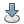 Guardar espacio de trabajo
: Guarda el conjunto actual de capas y sus respectivas opciones en un archivo.

 Cargar mapas al espacio de trabajo
: Carga mapas raster o vectoriales seleccionados a la actual lista de capas.

 Agregar capa de mapa raster
: Agrega un mapa raster a la lista de capas.

 Agregar varias capas de mapas raster (RGB, HIS, relieve sombreado...)
: Abre un menu desplegable que permite:

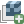 Agregar una capa de mapa raster 3D
: Agrega un mapa raster 3D a la lista de capas.

 Agregar una capa raster RGB
: Combina y despliega tres mapas raster definidos como canales rojo (Red), verde (Green) y azul (Blue) para crear un mapa de color RGB.

 Agregar una capa raster HIS
: Combina y despliega dos o tres mapas raster definidos como canales de matiz (Hue), intensidad (Intensity), y opcionalmente saturación (Saturation) para crear un mapa de color.

 Agregar una capa raster de relieve sombreado
: Agrega una capa de mapa raster de relieve sombreado.

 Agregar una capa raster de flechas
: Agrega un mapa de pixeles raster con flechas de dirección dibujadas. Las flechas de dirección y su longitud se determinan por mapas separados de aspecto/dirección, y opcionalmente pendiente/intensidad.

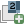 Agregar una capa raster de números
: Agrega un mapa de pixeles raster con números que representan los valores de los pixeles.

 Agregar una capa de mapa vector
: Agregar una capa de mapa vector.

 Agregar varias capas de mapas vector (temática, gráfica...)
: Abre un menu desplegable que permite:

 Agregar una capa de mapa de área temática (para todos los tipos de mapa vector)
: Agrega una capa para despliegue temático de los valores de un atributo asociado a un mapa vectorial. Las opciones incluyen: Tipo de despliegue temático (colores en gradiente o tamaños de puntos), métodos para crear intervalos de despliegue, consultas SQL para seleccionar y limitar los atributos a desplegar, control de los tipos de íconos y tamaños, control de los esquemas de color, y creación de leyenda para el mapa temático.

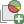 Agregar una capa de gráfica temática (para mapas vector de puntos)
: Agrega una capa en la cual se pueden crear gráficos de barra o circulares en las ubicaciones de puntos vectoriales. Los gráficos despliegan los valores de columnas seleccionadas en la tabla de atributos asociada. Las opciones incluyen: Tipo de gráfico, capa y atributos a graficar, colores del gráfico, tamaño del gráfico (fijo o basado en un atributo).

 Agregar grupo
: Agrega un grupo vacío al cual se pueden agregar capas.

 Agregar cuadrícula o etiquetas vectoriales
: Abre un menu desplegable que permite:

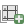 Agregar cuadrícula
: Agrega una capa para desplegar una cuadrícula de coordenadas.

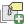 Agregar una capa de etiquetas para objetos vectoriales (a partir de un archivo de etiquetas existente)
: Agrega una capa de texto a partir de un archivo de etiquetas para objetos vectoriales creado con el módulo `v.label`.

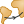 Agregar una capa de líneas geodésicas
: Agrega una capa para desplegar líneas geodésicas.

 Agregar una capa de líneas de rumbo
: Agrega una capa para desplegar líneas de rumbo.

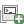 Agregar una capa de comandos
: Agrega una capa en la cual se pueden ingresar comandos para realizar el despliegue.

 Eliminar capa seleccionada
: Remueve la capa seleccionada (o el grupo) de la lista de capas.

 Mostrar tabla de atributos
: Abre el administrador de tablas de atributos para el mapa vectorial seleccionado.

 Importar datos raster o vector
: Permite importar datos raster o vector.

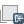 Importar datos raster
: Importa datos raster a GRASS usando el módulo `r.in.gdal` y los carga a la lista de capas.

 Importar datos vector
: Importa datos vector a GRASS usando el módulo `v.in.ogr` y carga a la lista de capas.

 Calculadora de mapas raster
: Abre la interfaz gráfica de la calculadora de mapas raster `r.mapcalc`.

 Modelador gráfico
: Abre el modelador gráfico para crear modelos y ejecutarlos.

 Herramienta de georectificación
: Abre el administrador de puntos de control terrestre para crear, editar y administrar puntos de amarre.

 Compositor cartográfico
: Abre el compositor cartográfico para crear mapas imprimibles de forma interactiva.

 Configuración
: Abre un diálogo para modificar la configuración de la interfaz gráfica.

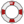 Ayuda
: Abre la documentación de GRASS en un navegador web.

<!--

:
-->

#### Atajos de teclado claves

`Ctrl+Q`
: Salir de la interfaz gráfica.

`Ctrl+N`
: Crear un nuevo espacio de trabajo.

`Ctrl+O`
: Cargar un espacio de trabajo de un archivo.

`Ctrl+S`
: Guardar el espacio de trabajo actual a un archivo.

`Ctrl+Shift+L`
: Agregar múltiples capas de mapas raster o vector al monitor actual.

`Ctrl+Shift+R`
: Agrega una capa de mapa raster al monitor actual.

`Ctrl+Shift+V`
: Agrega una capa de mapa vector al monitor actual.

`Ctrl+W`
: Cierra el monitor actual.

<!--
`Tab`
: Muestra una guía rápida del comando.

`Esc`
: Esconde la guía rápida del comando.

`Ctrl+Space`
: Permite autocompletar los nombres de los comandos, los parámetros y los mapas.

`Arriba/Abajo`
: Navega por el historial de comandos.

`Enter`
: Ejecuta el comando.
-->

### Visualizador de Mapas

La ventana de visualización de mapas incluye una barra de herramientas, un espacio en donde se despliegan los mapas, y una barra de estado con información de la región geográfica de los mapas desplegados.

{: .img-responsive}

Cada ventana de visualización de mapas tiene una lista de capas independiente en el administrador de capas.

En la parte superior de la ventana se encuentra una barra de herramientas con botones para manipular el mapa desplegado (ampliación, vista panorámica), consulta y análisis (medir distancia, creación de perfiles e histogramas, agregar elementos al mapa (escala, flecha de norte, leyenda y etiquetas de texto personalizadas), y para exportar o imprimir el monitor.

En la parte inferior de la ventana se encuentra la barra de estado, en ella se puede elegir si presentar las coordenadas bajo el cursor, la extensión de la región actual, la región de cálculo (incluyendo visualización gráfica), la geometría del mapa desplegado (número de fílas, columnas y resolución), y la escala. Marcar la opción de **renderizar** hace que la ventana se actualice automáticamente cada que se añade un mapa, se borra, o se cambia en la lista de capas.

El nivel de acercamiento o "zoom", no incide sobre la región de cálculo (establecida mediante `g.region`).

#### Barra de herramientas del visualizador de mapas

 Desplegar mapa
: Despliega todas las capas activas de la lista de capas y renderiza las capas que hayan cambiado, agregado o eliminado.

 Renderizar el mapa
: Renderiza nuevamente todas las capas activas.

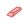 Borrar monitor
: Borra el contenido del monitor, dejando el fondo blanco.

 Puntero
: Selecciona el puntero como cursor para el monitor.

 Consulta de mapas
: Consulta la capa seleccionada usando el ratón. El mapa a consultar se debe seleccionar previamente en la lista de capas. Los mapas vectoriales temáticos y de gráficas no pueden ser consultados. Los resultados de la consulta se mostrarán en la consola.

 Vista panorámica
: Permite seleccionar el centro de la vista en el monitor de forma interactiva usando el ratón, arrastrándo el cursor haciendo click con el botón izquierdo. Cambia la ubicación de la región desplegada pero no el tamaño del área o la resolución. _**NO**_ afecta la región de cálculo para los procesamientos.

 Acercar
: Permite acercar la vista de manera interactiva usando el mouse, dibujando un recuadro para que el área seleccionada ocupe completamente el monitor. Hacer click con el cursor de acercar hace que el monitor se acerque 30%, centrándose en el punto donde se hizo click. La resolución del mapa no cambia al acercar pero si se restablece la extensión de la región desplegada. _**NO**_ afecta la región de cálculo para los procesamientos.

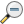 Alejar
: Permite alejar la vista de manera interactiva usando el mouse, dibujando un recuadro para que el área desplegada se reduzca hasta ocupar el recuadro dibujado. Hacer click con el cursor de alejar hace que el monitor se aleje 30%, centrándose en el punto donde se hizo click.  La resolución del mapa no cambia pero si se restablece la extensión de la región desplegada. _**NO**_ afecta la región de cálculo para los procesamientos.

 Acercar al mapa seleccionado
: Establece la extensión del monitor basándose en el mapa seleccionado. La resolución del mapa no cambia pero si se restablece la extensión de la región desplegada. _**NO**_ afecta la región de cálculo para los procesamientos.

 Volver al acercamiento anterior
: Vuelve a la extensión de acercamiento anterior. Se mantienen hasta 10 niveles anteriores de acercamiento.

 Opciones de acercamiento
: Abre un menú desplegable que permite elegir una opción:

* Acercamiento que coincida con la extensión de un mapa seleccionado.
* Acercamiento a la región de cálculo (establecida con `g.region`.
* Acercamiento a la región de cálculo predeterminada.
* Acercamiento a una región guardada.
* Establecer región de cálculo a la extensión de la vista actual (sin cambiar la resolución).
* Guardar la geometría de la vista actual a una región.

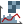 Menú de análisis
: Abre un menú desplegable con las siguientes herramientas:

 Herramienta de medir distancia
: Medición interactiva de longitudes definidas con el mouse. La longitud de cada segmento y la longitud acumulada se despliega en la consola. Las longitudes se miden en la unidad de medida actual.

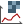 Herramienta de perfil
: Creación de perfil de un mapa raster de forma interactiva. El transecto del perfil se dibuja con el mouse en el monitor. El perfil puede ser del mapa desplegado o de un mapa diferente. Se pueden perfilar hasta tres mapas de manera simultánea.

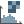 Herramienta de histograma
: Despliega un histograma del mapa raster seleccionado en una nueva ventana.

 Agregar elementos
: Abre un menú desplegable que permite:

 Agregar escala y flecha norte
: Agrega una capa para desplegar una escala y una flecha norte. Las opciones incluyen la ubicación (usando coordenadas o el mouse), el formato y los colores de la escala.

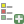 Agregar leyenda de mapa raster
: Agrega una capa para desplegar una leyenda del mapa raster seleccionado.

 Agregar texto
: Agrega una capa para desplegar una línea de texto utilizando el tipo de letra predeterminado de GRASS. Las opciones incluyen la ubicación (coordenadas), el tamaño, el formato y el color del texto.

 Guardar el monitor a un archivo
: Guarda la imágen visible en el monitor a diferentes formatos de gráficos raster.

 Imprimir mapa
: Imprime el mapa en la impresora nativa del sistema, o en un dispositivo PostScript; guarda el mapa visible (incluyendo texto y etiquetas) en archivos PDF o EPS.

Modo de despliegue de mapas
: Menú desplegable donde se elige si se quieren visualizar los mapas en 2D o 3D. También da la opción de digitalizar mapas vectoriales agregando una barra de herramientas para la digitalización. Permite digitalizar un nuevo mapa o editar uno existente.

<!--

:
-->

La terminal de comandos
-----------------------

{: .img-responsive}

Observar como ahora en la terminal aparece el siguiente prompt de GRASS:

~~~
GRASS 6.4.3 (CursoGrass):~ >
~~~

La terminal de comandos en GRASS funciona con el mismo intérprete que la terminal de GNU/Linux, por lo que todos los comandos de GNU/Linux (como por ejemplo los vistos en la clase anterior) funcionan dentro de GRASS, y además, los comandos propios de GRASS conservan una [sintaxis muy similar a la de los comandos GNU/Linux](../clase-01/#sintxis-bsica-de-los-comandos-en-la-terminal-de-gnulinux):

~~~
> x.comando -opciones parametro1=mapa1 parametro2=mapa2
~~~

De manera que `x` indica el tipo de comando que será utilizado.

### La taxonomía de comandos

Los comandos en GRASS se organizan de acuerdo con la función que realizan:

g.*
: Comandos **generales**, con ellos se realizan operaciones generales a los archivos.

r.*
: Comandos de procesamiento 2D en archivos de tipo **raster**.

v.*
: Comandos de procesamiento de archivos de tipo **vectorial**.

i.*
: Comandos de procesamiento de **imágenes**.

db.*
: Comandos para el manejo de **bases de datos**.

### ¿Cuáles serían los comandos mas básicos?

- Conocer que archivos raster hay en el sistema para trabajar.

~~~
g.list type=rast
~~~

~~~
----------------------------------------------

Archivos raster disponibles en el directorio de mapas de usuario (Mapset)<PERMANENT>:
ituango         porcecito       riogrande_sup

----------------------------------------------
~~~
{: .output}

- Copiar un archivo que se encuentra en el mapset `PERMANENT` para tenerlo disponible en el mapset donde se encuentra el usuario.

~~~
g.copy rast=porcecito@PERMANENT,porcecito
~~~

~~~
Copy raster <porcecito@PERMANENT> to current mapset as <porcecito>
~~~
{: .output}

- Cambiarle el nombre a un archivo raster (un mapa).

~~~
g.rename rast=porcecito,porcecito_copia
~~~

~~~
Rename raster <porcecito> to <porcecito_copia>
ADVERTENCIA: 'cell / porcecito' fue encontrado en mas directorios de mapas
             (mapsets) (también fue hallado en <PERMANENT>).
ADVERTENCIA: Utilizando <porcecito@CursoGrass>.
~~~
{: .output}

- Borrar un mapa (archivo) del mapset activo.

~~~
g.remove rast=porcecito_copia
~~~

~~~
Removing raster <porcecito_copia>
~~~
{: .output}

- Ajustar la región de cálculo a un mapa raster y que la imprima en consola.

~~~
g.region -p rast=porcecito
~~~

~~~
projection: 99 (Transverse Mercator)
zone:       0
datum:      ** unknown (default: WGS84) **
ellipsoid:  international
north:      1231633.33333336
south:      1193683.33333335
west:       854822.22222223
east:       889777.77777778
nsres:      30.55555556
ewres:      30.55555556
rows:       1242
cols:       1144
cells:      1420848
~~~
{: .output}

~~~
g.region -p rast=ituango
~~~

~~~
projection: 99 (Transverse Mercator)
zone:       0
datum:      ** unknown (default: WGS84) **
ellipsoid:  international
north:      1312911.11111149
south:      1271905.55555592
west:       788822.22222209
east:       829949.99999986
nsres:      30.55555556
ewres:      30.55555556
rows:       1342
cols:       1346
cells:      1806332
~~~
{: .output}

### Consultar la documentación de los comandos

Se puede consultar la documentación de los comandos para saber qué parámetros requieren y cuales son opcionales, así como sus funciones.

~~~
g.copy help
~~~

~~~
Descripción:
 Copia archivos de datos disponibles en la ruta de búsqueda del directorio de datos y localización actuales del usuario a los directorios de elementos adecuados bajo el directorio de mapas actual de usuario.

Palabras clave:
 general, gestión de mapas

Uso:
 g.copy [rast=from,to] [rast3d=from,to] [vect=from,to]
   [oldvect=from,to] [asciivect=from,to] [icon=from,to] [labels=from,to]
   [sites=from,to] [region=from,to] [region3d=from,to] [group=from,to]
   [3dview=from,to] [--verbose] [--quiet]

Identificadores:
 --v   Salida detallada del módulo.
 --q   Salida "silenciosa" del módulo.

Parámetros:
       rast   rast archivo(s) a copiar
     rast3d   rast3d archivo(s) a copiar
       vect   vect archivo(s) a copiar
    oldvect   oldvect archivo(s) a copiar
  asciivect   asciivect archivo(s) a copiar
       icon   icon archivo(s) a copiar
     labels   labels archivo(s) a copiar
      sites   sites archivo(s) a copiar
     region   region archivo(s) a copiar
   region3d   region3d archivo(s) a copiar
      group   group archivo(s) a copiar
     3dview   3dview archivo(s) a copiar
~~~
{: .output}

De igual manera se puede abrir una documentación más completa en el
navegador web con el comando `g.manual`:

~~~
g.manual -i
~~~

~~~
Starting browser <xdg-open> for module index...
~~~
{: .output}

Esto abre el índice (parámetro `-i`) de la documentación, el ampersand "&" se utiliza para poder continuar escribiendo comandos sin que se cierre el navegador.

También se pueden abrir directamente los manuales de comandos específicos:

~~~
g.manual g.copy
~~~

~~~
Starting browser <xdg-open> for module g.copy...
~~~
{: .output}

### Consulta del historial de los comandos usados

El historial no se conserva cuando se trabaja con la interfaz gráfica. Desde la terminal se puede consultar con el siguiente comando:

~~~
history
~~~

Y si se quiere almacenar en un archivo de texto para su posterior consulta:

~~~
history > clase1.txt
~~~

**Advertencia:** El nombre del archivo destino no debe contener espacios.
{: .alert .alert-warning}

<!--
### La región de trabajo

Teniendo la región predeterminada que se define para el location **CursoGrass**, utilizando la opción `-d`, desplegar los tres mapas que se tienen en el mapset `PERMANENT`:

~~~
g.region -d
d.rast porcecito
d.rast -o ituango
d.rast -o riogrande_sup
~~~

{: .img-responsive}

La opción `-o` se utiliza para desplegar mapas superpuestos en el monitor activo.

Los tres mapas o archivos se pueden desplegar en el monitor y pueden salir porque la región con que se define el location "CursoGrass" abarca una región mas amplia.

Ahora vamos a modificar la región de trabajo para que todo el espacio del monitor de visualización esté ocupado por uno de los mapas que se seleccione.

~~~
g.region rast=porcecito
d.rast porcecito
~~~

{: .img-responsive}

~~~
g.region rast=ituango
d.rast ituango
~~~

{: .img-responsive}

Iniciamos trabajo
-----------------

- Abrir la maquina virtual.
- Iniciar el GIS GRASS.
- Ubicarse en el mapset *CursoGrass*
- ¿Existen mapas en este lugar de almacenamiento? ¿SI? ¿NO?
- Evitar la realización de operaciones con los archivos almacenados en el mapset `PERMANENT`.

### Crear una copia de un archivo que se encuentra en el mapset PERMANENT

Se crean dos mapas (solamente como procedimiento de aprendizaje).

Un primer mapa lo vamos a denominar `porcecito1` y el otro como `porcecito_temp`.

~~~
g.copy rast=porcecito,porcecito1
g.copy rast=porcecito,porcecito_temp
~~~

### Borrar un mapa del mapset activo

~~~
g.remove porcecito_temp
~~~

Comprobar si se removió el archivo no deseado. ¿Cómo hacerlo?

### Cambiarle el nombre a un archivo raster (un mapa)

El archivo que se encuentra en el mapset `CursoGrass` se llama `porcecito1` pero quisiera ponerle otro nombre cualquiera. Por ejemplo añadirle ese "1" para diferenciarlo del mapa que se encuentra en el mapset `PERMANENT`. Son dos mapas ubicados en dos sitios diferentes. También podría denominarlo `porcecito_copia`.

Si se le asigna el mismo nombre que se tiene en `PERMANENT`, el sistema envía una advertencia subrayando este hecho: similitud de nombres.

~~~
g.rename rast=porcecito1,porcecito
~~~

Cambiemos el nombre y luego lo recuperamos.

~~~
g.rename rast=porcecito1,porcecito_copia
~~~

Comprobar:

~~~
g.list rast
~~~

Volvamos al nombre inicial para economizar tiempo de escritura.

~~~
g.rename rast=porcecito_copia,porcecito1
~~~

El uso de ayudas
----------------

De manera intuitiva ya sabemos que escribimos la orden `d.mon x0` se despliega el monitor identificado con el nombre `x0`. Existen 8 monitores disponibles, desde el `x0` hasta el `x7`.

### El contenido de un comando

Si escribimos la siguiente orden, vamos a recibir información resumida acerca de lo que se puede hacer con este comando.

~~~
d.mon help
~~~

Colocando al final de cada comando de GRASS la palabra "help", obtenemos información acerca de lo que puede realizar cada comando.

La ayuda incluye:

**Descripción:** En pocas palabras dice lo que se puede hacer con el comando.

**Palabras claves:** Palabras indicadoras de la operación que realiza el comando.

**Uso:** Indica la manera como se debe escribir la orden para que el computador la comprenda y la pueda llevar a cabo. El uso es por lo tanto la sintaxis del comando: La manera como deben ir las letras, las palabras, los signos y los espacios para que el mensaje pueda entenderse por el sistema GRASS.

**Opciones:** El SIG GRASS emplea el signo ‘-’ acompañado de letras como opciones para el usuario si desea que se despliegue el resultado de una acción o que no se despliegue.

**Parámetros:** Hace referencia a una acción o a un objeto (archivo) que se desea hacer o desplegar respectivamente.

Exploración de la información en el DEM
---------------------------------------

Un comando de uso intensivo en GRASS es `d.rast`. Se emplea para desplegar mapas en un monitor que se encuentre disponible para el despliegue.

Desplegar solamente los valores de altitud ubicados dentro de un rango.

~~~
d.rast map=porcecito val=1000-1500
~~~

`ADVERTENCIA: Ignorando lista de valores: el mapa es entero (por favor usar 'cat=')`

~~~
d.rast map=porcecito cat=1000-1500
~~~

{: .img-responsive}

~~~
d.rast map=porcecito cat=2000-2300
~~~

{: .img-responsive}

En este punto de la sesión de trabajo surge un interrogante: No se pueden desplegar valores (vallist), pero si se pueden desplegar categorías (catlist).

*¿Cuál es la diferencia entre "values" y "categories" en un archivo raster?*

Para desplegar el segundo rango borra el primer rango. ¿Qué hacer para tener los dos o más rangos que se desean desplegar?

~~~
d.rast map=porcecito catlist=1000-1500
d.rast map=porcecito catlist=2000-2300 -o
~~~

{: .img-responsive}

Este ejercicio tiene una limitación importante: Desconocemos en este punto cual es el valor de altitud máxima y el valor de altitud mínima para seleccionar rangos de manera adecuada.

Comandos de consulta del mapa
-----------------------------

### Conocer el valor de un píxel y sus respectivas coordenadas

Se trata de un comando interactivo: Se escribe la orden en la terminal de comandos y aparecen unas indicaciones para que se vaya al mapa desplegado en el monitor y con los botones del ratón se realice una selección y la respuesta se obtiene en la terminal de comandos.

~~~
d.what.rast porcecito
~~~

Con la ayuda de los colores del mapa trate de identificar los valores mayores y menores de altitud en el mapa desplegado.

Utilizar el botón derecho del ratón para salir de la situación interactiva y retornar a la terminal de comandos para continuar.

### Identificar las coordenadas de un punto

El siguiente comando permite identificar las coordenadas planas de un punto.

~~~
d.where
~~~

La opción `-1` se utiliza para identificar un sólo punto y salir del comando.

~~~
d.where -1
~~~

Si se agrega la opción `-l` también permite identificar las coordenadas geográficas en formato "Grados:Minutos:Segundos".

~~~
d.where -1l
~~~

Agregándole la opción `-d` muestra las coordenadas geográficas en formato decimal.

~~~
d.where -1ld
~~~

### Visualizar los valores de los píxeles de un zona determinada: Observar visualmente la estructura raster del archivo

Desplegar el mapa de interés, por ejemplo, `porcecito`.

~~~
d.rast porcecito
~~~

Hacer zoom en una zona muy pequeña.

~~~
d.zoom
~~~

Repetir la acción de zoom hasta que se logren percibir los píxeles (un aspecto de retícula grande en el monitor)

Una vez el reticulado es lo suficientemente grande, escribir el siguiente comando para ver en la retícula los valores de cada píxel:

~~~
d.rast.num porcecito
~~~

{: .img-responsive}

### Reporte de la información contenida en el mapa

El comando `r.report` permite obtener información estadística básica del mapa ráster que se consulta.

El comando `r.report` require que el usuario entre alguna información para poder realizar la tarea. Le decimos que las unidades de las estadisticas vayan en numero de píxeles `c`, en porcentaje `p` y en kilometros cuadrados `k`, y que realice la segmentacion de las altitudes en 10 rangos de altitud.

~~~
r.report -h map=porcecito units=c,p,k nsteps=10
~~~

Observar que pasa cuando los valores del mapa se encuentra en enteros.

No divide en 10 rangos como se le había programado, sino que entrega la información para píxeles que van variando metro a metro, es decir, como enteros.

Al final dice que el archivo contiene 1420848 píxeles que corresponde al 100% y que la extensión del mapa es de 1326.56 km2.

El tipo de dato del mapa o archivo vuelve a presentarnos un problema: sabemos que los valores de altitud están en enteros.

Para continuar y superar el problema de la naturaleza de los datos consultemos la información que contiene el archivo.

#### Los metadatos del archivo porcecito

Vamos a consultar cual es la información del mapa (metadatos).

~~~
r.info porcecito1
~~~

La información recibida indica que el tipo de dato es `CELL` que en otros términos quiere decir que los valores de altitud del mapa `porcecito` se encuentran en números enteros. Para trabajar adecuadamente necesitamos transformar estos datos a números decimales para realizar operaciones con el comando `r.report` y otras operaciones posteriores.

#### Transformar los datos de números enteros a números decimales sin alterar los valores del archivo

Pasar el mapa de integer a double precision:

~~~
r.mapcalc 'porcecito1=porcecito*1.0'
~~~

Consultar nuevamente la información del mapa

~~~
r.info porcecito1
~~~

Observar que los datos del archivo se transformaron de `CELL` a `DCELL`.

#### Volver a consultar la información contenida en el mapa porcecito

Reporte con el mapa ya en double precision:

~~~
r.report -h map=porcecito1 units=c,p,k nsteps=10
~~~

*¿Qué información importante obtenemos con el comando `r.report`?*

- Seleccionar a voluntad del usuario el número de rangos altitudinales para obtener los estadísticos del archivo.
- Conocemos los valores mínimo y máximo de la altitud para el archivo en estudio.
- Utilizando el N° de píxeles, el porcentaje y la extensión podemos tener una idea adecuada de la distribución altitudinal en la región que representa el mapa.

Representación gráfica de la distribución altitudinal
-----------------------------------------------------

Una representación gráfica de los valores de altitud en el mapa `porcecito`.

~~~
d.histogram map=porcecito1 nsteps=10
~~~

{: .img-responsive}

Para obtener la imagen en formato PNG, se puede utilizar el comando `d.out.file`.

~~~
d.out.file porcecito_histogram
~~~

Este comando genera el archivo `porcecito_histogram.png` en el directorio actual, con los contenidos del monitor activo.

Presentación de la tabla que se obtiene con r.report
----------------------------------------------------

Guardamos la salida del comando a un archivo de texto utilizando el parámetro "`output`" e indicando el nombre del archivo con la extensión ".csv" para poderlo importar a una hoja de cálculo, y la abrimos en gedit para arreglarla:

~~~
r.report -h map=porcecito1 units=c,p,k nsteps=10 output=porcecito.csv
gedit porcecito.csv
~~~

Borramos las líneas con guiones y organizamos bien las columnas para que sólo queden separadas por el símbolo `|`:

### porcecito.csv

~~~
|           |   Category Information                |   cell|   %  |    square|
|          #|description                            |  count| cover|kilometers|
| 958-1149.5|from  to . . . . . . . . . . . . . . . | 116302|  8.19| 108.58443|
|1149.5-1341|from  to . . . . . . . . . . . . . . . | 138526|  9.75| 129.33369|
|1341-1532.5|from  to . . . . . . . . . . . . . . . | 148585| 10.46| 138.72519|
|1532.5-1724|from  to . . . . . . . . . . . . . . . | 199335| 14.03| 186.10752|
|1724-1915.5|from  to . . . . . . . . . . . . . . . | 219269| 15.43| 204.71874|
|1915.5-2107|from  to . . . . . . . . . . . . . . . | 234964| 16.54| 219.37225|
|2107-2298.5|from  to . . . . . . . . . . . . . . . | 192389| 13.54| 179.62245|
|2298.5-2490|from  to . . . . . . . . . . . . . . . | 131903|  9.28| 123.15018|
|2490-2681.5|from  to . . . . . . . . . . . . . . . |  36297|  2.55|  33.88840|
|2681.5-2873|from  to . . . . . . . . . . . . . . . |   3278|  0.23|   3.06048|
|TOTAL      |                                       |1420848|100.00|1326.56333|
~~~

Abrimos la carpeta personal y abrimos el archivo csv que creamos.

{: .img-responsive}

En el diálogo que se abre, configuramos las opciones como se ve en la imagen: en las opciones de separador seleccionamos "Separado por" y "Otros" y escribimos el símbolo `|`, seleccionamos las columnas primera y tercera y seleccionamos "Ocultar" en "Tipo de columna".

Organizamos los encabezados y le damos un poco de formato a la tabla, de manera que nos queda algo como en la siguiente tabla:

| Rango altitudinal | No. Píxeles | Porcentaje | Área (km2) |
|:-----------------:|:-----------:|:----------:|:----------:|
|    958   - 1149.5 |      116302 |       8.19 |  108.58443 |
|   1149.5 - 1341   |      138526 |       9.75 |  129.33369 |
|   1341   - 1532.5 |      148585 |      10.46 |  138.72519 |
|   1532.5 - 1724   |      199335 |      14.03 |  186.10752 |
|   1724   - 1915.5 |      219269 |      15.43 |  204.71874 |
|   1915.5 - 2107   |      234964 |      16.54 |  219.37225 |
|   2107   - 2298.5 |      192389 |      13.54 |  179.62245 |
|   2298.5 - 2490   |      131903 |       9.28 |  123.15018 |
|   2490   - 2681.5 |       36297 |       2.55 |   33.88840 |
|   2681.5 - 2873   |        3278 |       0.23 |    3.06048 |
|===================|=============|============|============|
|             TOTAL |     1420848 |     100.00 | 1326.56333 |
{: .table .table-hover}
-->
