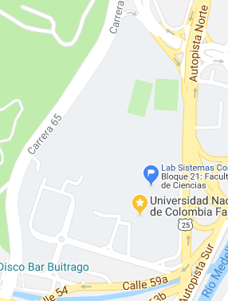

## Contenido

{: .no_toc}

* ToC
{: toc}

## Objetivo.

Realizar una recolección de datos, análisis descriptivo y
exploratorio, redactar conclusiones y realizar recomendaciones en
cuanto al ruido en los alrededores del campus de
la Universidad Nacional de Colombia, Sede Medellín, campus
El Volador.

## Mapa.

## Actividades.

  + Se conformarán grupos de máximo cinco (5) personas.
    La lista de los integrantes definitivos del grupo se enviará al
    correo **krcabrer@unal.edu.co** el viernes 13
    de abril de 2018 antes de las 23:59 hora de Colombia.

    Se hace con el fin de asignar la identificación y le sección
    que le corresponde a cada grupo de trabajo.

  + Se instalará en los celulares Android la aplicación
    [Science Journal](https://play.google.com/store/apps/details?id=com.google.android.apps.forscience.whistlepunk).

  + Se calibrarán los celulares para determinar las diferencias
    y las correcciones que deban realizarse a cada celular.

    Se realizará la calibración de la siguiente manera:
    - Se toman los datos de manera simultánea en un mismo sito de muestreo
      en donde cada celular no esté a más de 20 centímetros de distancia
      el uno del otro.
    - Se toma como mínimo durante cinco (5) minutos.
    - Se llevan los resultados al paquete estadístico R y
      se realiza el análisis descriptivo del resultado de cada
      uno de los celulares y se compara las distribuciones y
      el grado de correlación para determinar la corrección
      de cada celular con respecto a un celular de referencia.
    - Realizar la calibración sin y con micrófono o "manos libres",
      determinar la mejor manera de tomar los datos de acuerdo
      a los resultados obtenidos.

    + Los factores principales para tomar los datos serán:

      - Sitio.
        Se asignará a cada grupo una sección de los límites
        del campus universitario que no excede los 120 metros.
        Y una longitud hacia el interior no inferior a los
        20 metros.   

      - Período.
        Se determinará tres periodos del día.
          * Mañana [8:00 am a 10:00 am].
          * Medio día [11:00 a 1:00].
          * Tarde [4:00 pm a 6:00 pm].

      - Se tomará como unidad de muestreo o unidad experimental un
        cuadrado de 5 metros por 5 metros.

    + Se deberá elaborar un cronograma para tomar por cada combinación
      de unidad experimental y perido un mínimo de cinco (5) minutos
      cinco (5) veces.

## Recursos.

 - [Manual breve sobre cómo hacer un estudio de ruido](https://www.melissaconsultoria.com/2012/09/24/medici%C3%B3n-del-ruido/).
 - [Contaminación acústica](http://contaminacionacustica.net/como-medir-el-ruido-con-sonometros/)
 - [Ruido en el trabajo](http://www.construmatica.com/construpedia/El_Ruido_en_el_Trabajo._Alcance_de_un_Problema_Global)

## Ejemplo de calibración de celulares

- [Calibración de celulares](./guiones/trabajo_final_4.html)
- [Celular 1](.basededatos/celular1.csv)
- [Celular 2](.basededatos/celular2.csv)
- [Celular 3](.basededatos/celular3.csv)

## Fecha de entrega y presentación.

  - Póster o cartel en físico (mínimo en tamaño 70 cm x 100 cm o
    100 cm x 70 cm y en papel bond).
    Jueves, 31 de mayo de 2018 en horas de clase.
  - Archivos de datos y análisis.
    Jueves, 31 de mayo de 2018 antes de las 23:59
    [hora de Colombia](http://horalegal.inm.gov.co/),
    al correo **krcabrer@unal.edu.co** y no olvidar la sigla
    **[EDAED]**

<!---

## Estimación de la estatura mediante el celular

### Objetivo

Mostrar mediante la toma de datos la posibilidad de
estimar la estatura de una persona mediante las medidas
de aceleración que se toman del celular.

### Actividades

+ En grupos de máximo cinco personas se toma como mínimo
  a cuarenta personas los datos de aceleración mediante la aplicación
  *[Science Journal](https://play.google.com/store/apps/details?id=com.google.android.apps.forscience.whistlepunk&hl=es)* en una distancia mayor de cuarenta metros.
  También se mide el número de pasos en la distancia dada,
  como también se registra el género y se le mide a cada persona
  la estatura.
+ Una vez tomados los datos se procede a analizar para establecer
  la longitud del paso de la persona y comparar la longitud
  calculada a partir del número de pasos contados durante el
  experimento.
+ Luego se compara la longitud de paso calculada a partir de
   los datos tomados del celular con la estatura de la persona.
+ Se hallan razones o tasa de relación entre la estatura de la
  persona y la longitud de su respectivo paso discriminado por género.
+ Elaborar un póster científico en donde se muestren los resultados
  obtenidos con gráficas y tablas asociadas.
+ Realizar una discusión sobre los problemas y dificultades
  que se tuvieron durante el desarrollo del experimento.

###  Documentos a entregar.

+ Póster en tamaño mínimo de 100 cm por 70 cm en papel para exhibirlo
  el día 23 de noviembre de 2017 en el salón de clase y luego el
  "hall" del tercer piso del bloque 43.

+ Póster en formato ".pdf".
+ Archivos con los datos crudos de las aceleraciones medidas a cada persona.
+ Archivo con los datos individuales de las personas.
+ Archivo en formato ".Rmd" con el procesamiento de la información
  con los códigos respectivos.
+ Archivo en formato ".html" con los resultados obtendios.

### Requisitos mínimo del contenido del póster.

- Título.
- Nombre completo de los integrantes del grupo.
- Corta introducción.
- Descripción del experimento y de la estimación del tamaño de muestra.
- Descripción de la estimación de la longitud del paso a partir de
  los datos de acelaración.
- Descripción de resultados:
  * Comparativo de la longitud del paso calculada con el conteo de paso
    con el resultado de la medición del celular.
  * Relación entre la estatura de la persona y la longitud del paso
    a partir de la medición realizada con el celular.
- Gráficos y tablas pertinentes.
- Conclusiones.
- Recomendaciones.
- Bibliografía.   

El texto deberá ser lo más corto, claro y completo posible.

### Elementos a evaluar:

- Forma:
  * Distribución del texto y gráficas. (Uso del espacio en el póster).
  * Uso de colores.
  * Tipo de letra utilizado que sea legible.
  * Ortografía.
  * Uso adecuado de gráficas.

- Fondo:
  * Descripciones cortas y concisas.
  * Presentación de resultados claros.  
  * Redacción clara.
  * Conclusiones y recomendaciones claras.  

### Fecha de entrega.

El póster físico se entrega el día jueves, 23 de noviembre de 2017 en la hora de clase.
Los archivos se envían al correo *krcabrer@unal.edu.co*, no olvidar
en asunto la sigla **[EDAED]**, el día jueves, 23 de noviembre 2017 antes de las 23:59 horas.

### Consideraciones.

- Los nombres de los integrantes del grupo en el póster deben estar completos.
  No solo las iniciales.
- Se debe incluir bibliografía o cibergrafía pertinente a la estimación
  realizada en otras investigaciones entre la longitud del paso y la estatura
  por género.
- Directrices del [uso de logo institucional](http://identidad.unal.edu.co/guia-de-identidad-visual/b-directrices-y-especificaciones/b1-elementos-de-identidad-visual/)
  de la Universidad Nacional
  de Colombia.

### Evaluación del póster.

Cada estudiante enviará de manera individual al correo **krcabrer@unal.edu.co**
en asunto la sigla **[EDAED]** el ranqueo de los póster desde el primer
lugar hasta el último, incluyendo el póster propio.

NO SE ADMITEN EMPATES.

Se penalizará si el ranqueo difiere en más de tres posiciones con respecto
al ranqueo promedio dado por los profesores evaluadores (No se tendrá acceso a esa información)

Por ejemplo:

12, 2, 5, 7, 3, 10, 9, 1, 4, 6, 8, 11

Significa que el póster del grupo número 12 ocupó el primer lugar,
el grupo número 2 el segundo, y así sucesivamente hasta el póster
del grupo 11 que ocupó el último lugar.

-->
