## Contenido
{: .no_toc}

* ToC
{: toc}

## Elaboración de gráficos estadísticos.

El proceso de hacer una útil y buena gráfica no puede
ser limitada a una lista de reglas simples que debieran
seguirse sin ninguna excepción en todas las situaciones.

Sin embargo existen algunos principios que hacen
unas representaciones gráficas mejores que otras.

## Elementos de un gráfico.

   - Título principal.
   - Título secundario o subtítulo (opcional).
   - Descripción del gráfico.
   - Región de datos y símbolos.
   - Eje horizontal y escala.
   - Eje vertical y escala.
   - Apuntadores o señaladores (opcional).
   - Descriptores de señales o marcas (leyenda).

## Pasos para la construcción de una gráfica.

  * Analice su audiencia.
  * [Escoja la gráfica adecuada](https://depictdatastudio.com/charts/).
  * Haga un esquema a mano alzada de la gráfica que considere adecuada.
  * Construya su gráfica en el computador.
  * Refine su gráfica.
  * Defina si utilizará color o no.
  * Añada el texto a la gráfica.
  * Pruebe su gráfica. ¿Es clara para otros observadores desprevenidos?
  * Publique su gráfica.

## Guía de elaboración de gráficos en R.

  - [Guía de gráficos en R](https://bogota-r.github.io/graficas/)

## Problemas en gráficos estadísticos.

### Mal gusto o problemas estéticos.

{: .img-responsive}

### Datos incorrectos.

{: .img-responsive}

{: .img-responsive}

### Percepción incorrecta.

{: .img-responsive}

{: .img-responsive}

{: .img-responsive}

### Contrastes.

{: .img-responsive}

{: .img-responsive}

## Guía de colores.

En [esta página](http://colorbrewer2.org/) se encuentra una guía de colores
que pueden ser útiles a la hora de utilizarlos
en gráficas científicas.

## Casos específicos.

{: .img-responsive}

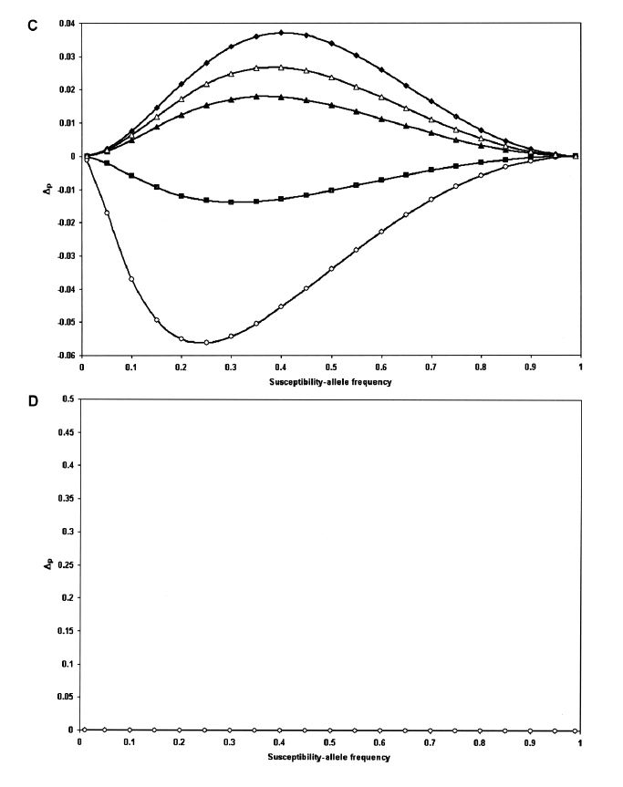{: .img-responsive}

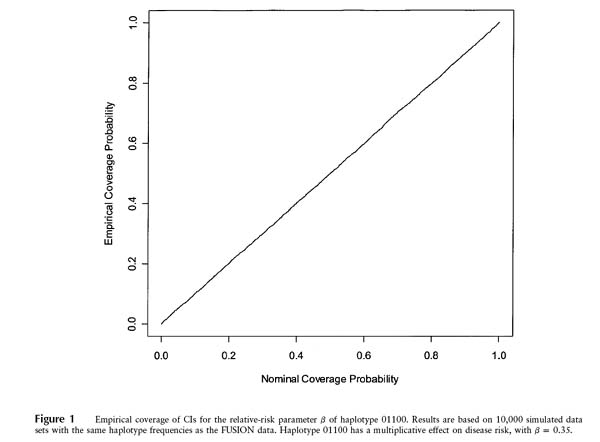{: .img-responsive }

{: .img-responsive }

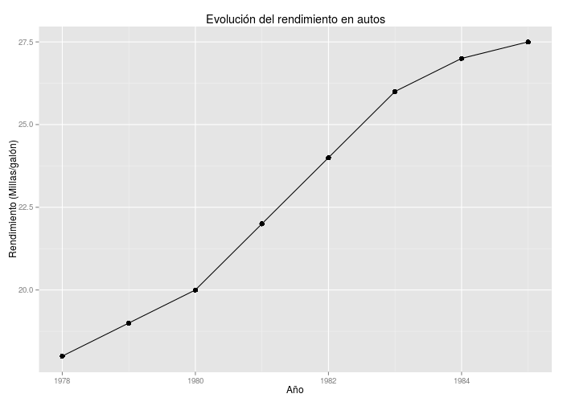{: .img-responsive }

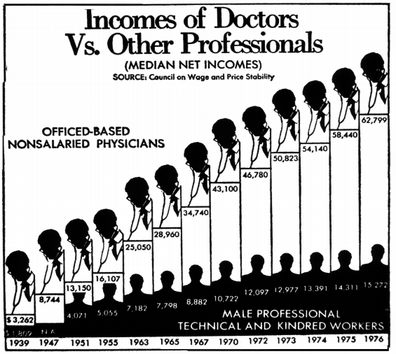{: .img-responsive }

{: .img-responsive }

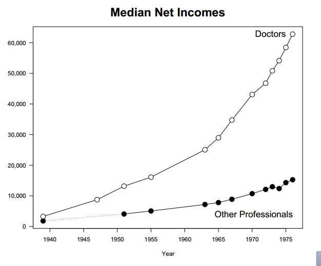{: .img-responsive }

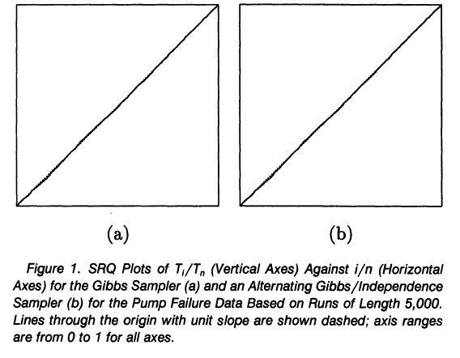{: .img-responsive }

{: .img-responsive }

{: .img-responsive }

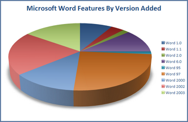{: .img-responsive }

{: .img-responsive }

{: .img-responsive }

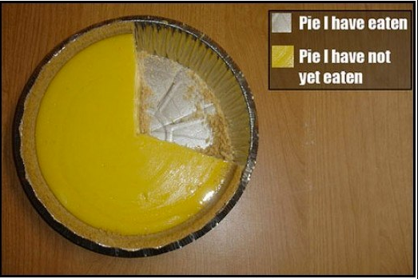{: .img-responsive }

{: .img-responsive }

{: .img-responsive }

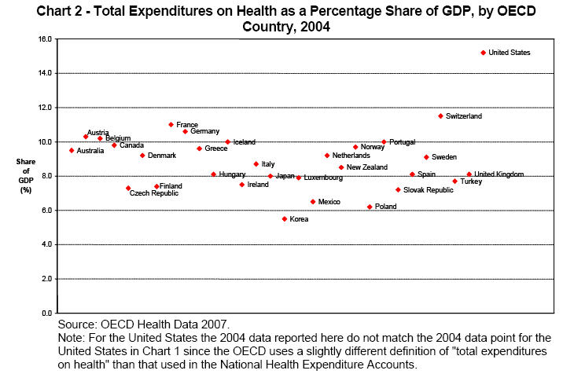{: .img-responsive }

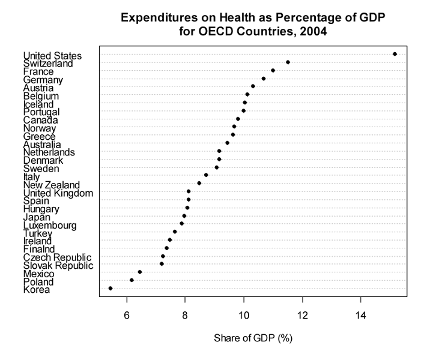{: .img-responsive }

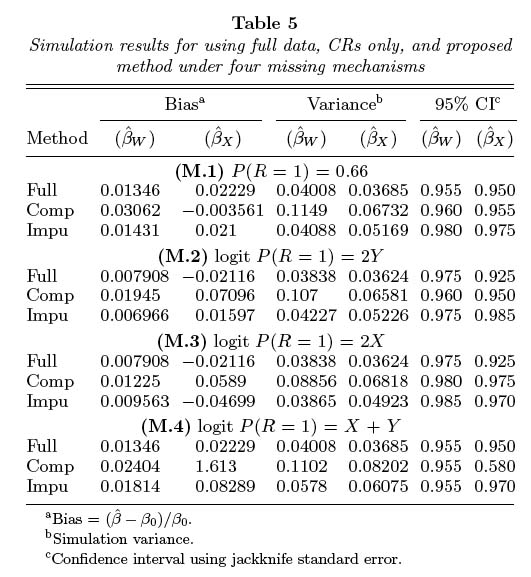{: .img-responsive }

{: .img-responsive }

{: .img-responsive }

{: .img-responsive }

{: .img-responsive }

{: .img-responsive }

{: .img-responsive }

{: .img-responsive }

{: .img-responsive }

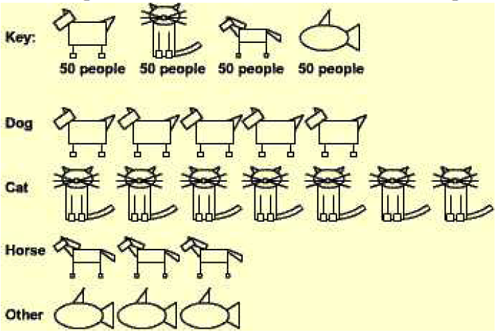{: .img-responsive }

{: .img-responsive }

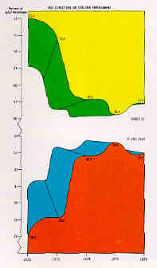{: .img-responsive }

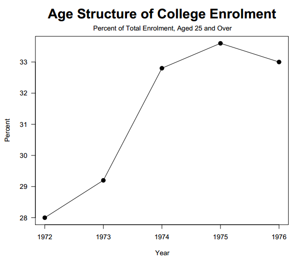{: .img-responsive }

{: .img-responsive }

{: .img-responsive }
