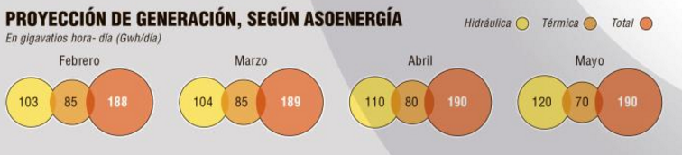

```{r setup, include=FALSE}
knitr::opts_chunk$set(echo = TRUE)
```

De acuerdo al artículo de el periódico El Colombiano de día 9 de marzo de
2016 en las páginas 2 y 3, bajo el titual "Si urge ahorrar energía,
pero va más allá de apagar un bombillo" se tienen las siguientes gráficas:

## Proyección de generación de energía



```{r}
proyEner <- read.csv2("ejemplo1.csv")
proyEner$mes <- factor(proyEner$mes, 
                       levels = c("Febrero", "Marzo", "Abril", "Mayo"))


barplot(t(as.matrix(proyEner[,c(2,3)])),
        names.arg = levels(proyEner$mes),
        col = c("blue","gold"),
        legend.text = names(proyEner[,c(2,3)]),
        xlim = c(0, 7),
        ylim = c(0, 200), 
        main = "Proyección de generación\n según Asoenergía",
        ylab = "Gigavatios hora-dia (Gwh/día)",
        las = 1)
```

## Reservas de embalse por región a febrero 


```{r, fig.height=8, fig.width=8}
reservEmb <- read.csv2("reservasEmbalses.csv")
reservEmb$actual <- with(reservEmb, Capacidad*Porcentaje/100)
reservEmb$vacio  <- with(reservEmb, Capacidad - actual)


def.par <- par(no.readonly = TRUE)
par(mar = def.par$mar + c(6,0,0,0))
with(reservEmb, barplot(t(as.matrix(reservEmb[, c("actual","vacio")])),
                        main = "Nivel de los embalses en Colombia",
                        ylim = c(0,5000),
                        col = c("darkblue","gray"),
                        names.arg = reservEmb$Embalse, las = 2))
par(def.par)
```


## Consumo de electrodomésticos


```{r, fig.height=8, fig.width=8}
consElect <- read.csv2("consumoElectrodomesticos.csv")
consElect$KwhXmesC <-
  with(consElect, (Consumo * HxDia * DiaxMes)/1000)
consElect$HxMes <- with(consElect, HxDia * DiaxMes)

consElect


op <- par(no.readonly = TRUE)
par(oma = op$oma + c(4,0,0,0))
with(consElect, barplot(Consumo,
        names.arg = Eletrodoméstico, las = 2,
     main = "Consumo de Electrodomésticos",
     ylab = "Potencia en vatios (wats/h)",
     col = "#E8855D",
     cex.names = 0.8,
     ylim = c(0,3500)))
par(op)
```

```{r}

consElect <- consElect[order(consElect$KwhXmesC, decreasing = TRUE), ]
consElect


```


```{r}
consElect[consElect$Eletrodoméstico == "TV plasma 20”", ]$Consumo <- 175
consElect$KwhXmesC <-
  with(consElect, (Consumo * HxDia * DiaxMes)/1000)
consElect$HxMes <- with(consElect, HxDia * DiaxMes)

consElect <- consElect[order(consElect$KwhXmesC, decreasing = TRUE), ]
consElect
```


```{r, fig.height=8, fig.width=8}
op <- par(no.readonly = TRUE)
par(oma = op$oma + c(4,0,0,0))
with(consElect, barplot(KwhXmesC,
        names.arg = Eletrodoméstico, las = 2,
     main = "Consumo de Electrodomésticos",
     ylab = "Consumo de Kwh por mes",
     col = "tomato",
     ylim = c(0,70),
     cex.names = 0.8))
par(op)

```

