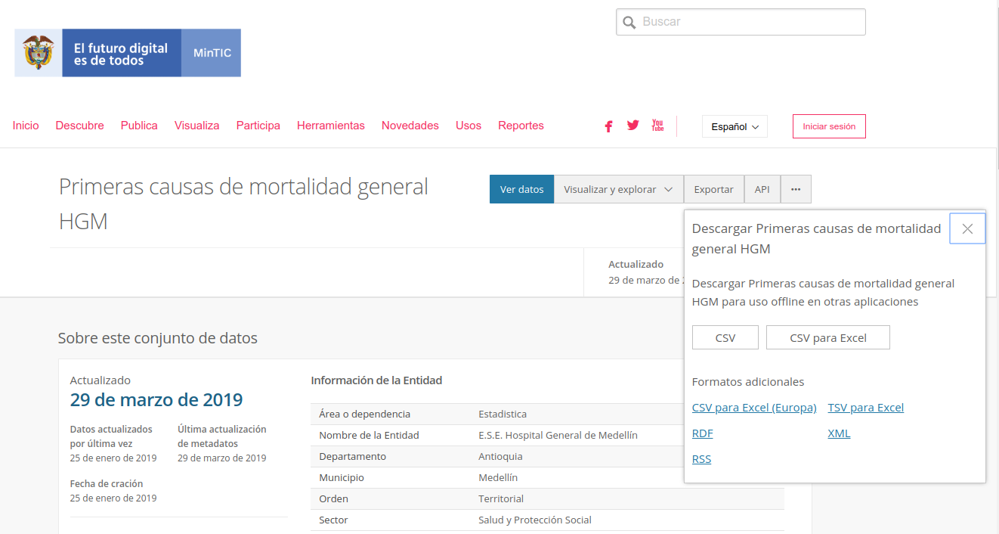

```{r setup, include=FALSE}
knitr::opts_chunk$set(echo = TRUE)
```


En el [siguiente enlace](https://www.datos.gov.co/dataset/Primeras-causas-de-mortalidad-general-HGM/d8vs-nd7k) se pude descargar una base de datos 
sobre las principales causas de mortalidad en el Hospital 
General de Medellín.

https://www.datos.gov.co/dataset/Primeras-causas-de-mortalidad-general-HGM/d8vs-nd7k



```{r}
muertes_HGM <- read.csv("Primeras_causas_de_mortalidad_general_HGM.csv")
```

```{r}
with(muertes_HGM, barplot(No.Casos))
```

```{r}
with(muertes_HGM, barplot(No.Casos, names.arg = Primeras.Causas))
```

```{r}
with(muertes_HGM, barplot(No.Casos, names.arg = Primeras.Causas, las = 2))
```

```{r, fig.width=7, fig.height=15}
op <- par(no.readonly = TRUE)
par(mar = op$mar + c(45, 0, 0, 0))
with(muertes_HGM, barplot(No.Casos, names.arg = Primeras.Causas, las = 2))
par(op)
```

```{r, fig.width=9, fig.height=15}
op <- par(no.readonly = TRUE)
par(mar = op$mar + c(33, 0, 0, 0))
bp1 <- with(muertes_HGM, barplot(No.Casos, ylim = c(0, 280), las = 1, col = "chocolate",
                                 main = "Principales causas de muerte en 2018 en el HGM",
                                 ylab = "Frecuencia"))
text(bp1, -4, labels = muertes_HGM$Primeras.Causas, srt = 70, adj = 1, xpd = TRUE,
     cex = 0.8)
mtext("Causas", side = 1, line = 30, adj = 0)
grid()
par(op)
```

