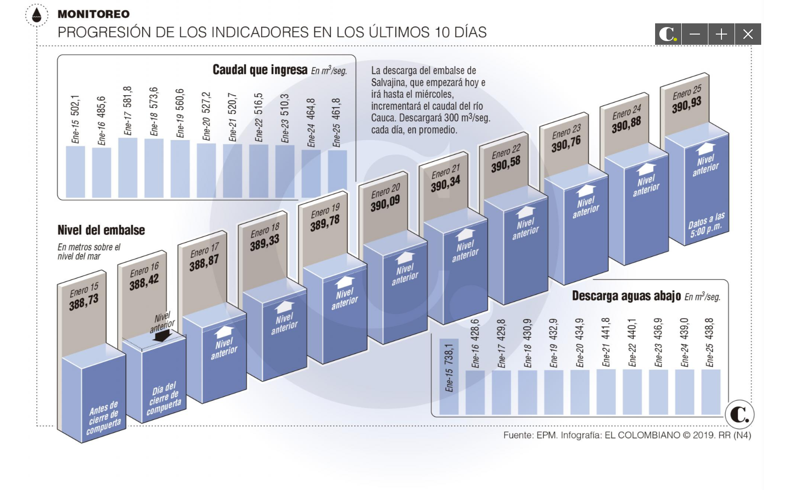

<style type="text/css">

body{ /* Normal  */
      font-size: 16px;
      text-align: justify;
  }
td {  /* Table  */
  font-size: 8px;
}
h1.title {
  font-size: 38px;
  color: DarkRed;
}
h1 { /* Header 1 */
  font-size: 28px;
  color: DarkBlue;
}
h2 { /* Header 2 */
    font-size: 22px;
  color: DarkBlue;
}
h3 { /* Header 3 */
  font-size: 18px;
  font-family: "Times New Roman", Times, serif;
  color: DarkBlue;
}
code.r{ /* Code block */
    font-size: 12px;
}
pre { /* Code block - determines code spacing between lines */
    font-size: 14px;
}
</style>

```{r setup, include=FALSE}
knitr::opts_chunk$set(echo = FALSE, message = FALSE, warning = FALSE)
```


## "Así será la ayuda que recibirá Hidroituango de una represa del Cauca".

En el periódico El Colombiano del día 26 de enero de 2019, en la 
página 12, bajo el título de "Represa del Cauca liberará agua para 
el embalse de Hidroituango", se muestra la siguiente gráfica:




La gráfica muestra un aumento lineal de la cota o nivel del embalse,
debido a la perspectiva de los rectángulos que representan los valores.

Esta ilusión óptica distorsiona la presentación de los datos, ya que
si se grafican a la escala correcta el incremento de los niveles
del embalse se va disminuyendo en los últimos días.


```{r}
library(readxl)
library(tidyverse)
```

```{r}
nivel_hidro <- read_excel("nivel_hidroituango.xlsx")
```

## Evolución del nivel del embalse de Hidroituango.

```{r}
g1 <- ggplot(nivel_hidro, aes(fecha, msnm)) +
  geom_line(color = "#6E7FB5", size = 1.5) +
  labs(title = "Nivel del embalse de Hidroituango",
       subtitle = "De los últimos 10 días",
      x = "Fecha",
      y = "Metros sobre el nivel del mar") +
  scale_x_datetime(date_breaks = "1 day", 
                   date_labels = "%b %d") +
  scale_y_continuous(breaks = seq(388, 391, 0.5),
                     limits = c(388, 391))
g1
```

La gráfica muesta ahor que el aumento de la cota no es de manera lineal, 
ni mantiene constante ese aumento, por el contrario se nota que en los 
últimos días casi no es significativo el aumento del embalse.


```{r}
nivel_hidro_2 <- nivel_hidro %>%
  gather(key = tipo_caudal, value = caudal, -c(fecha, msnm))
```

## Gráfica de los caudales entrantes y salientes.

```{r}
g2 <- ggplot(nivel_hidro_2, aes(fecha, caudal, col = tipo_caudal)) +
 geom_line(size = 1.5) +
 labs(title = "Caudales entrantes y salientes de Hidroituango",
      y = expression(Caudal~(m^3/seg)),
      x = "Fecha") +
  theme(legend.position="bottom") +
  scale_x_datetime(date_breaks = "1 day", 
                   date_labels = "%b %d")  +
  scale_y_continuous(breaks = seq(400, 800, 50),
                     limits = c(400, 800)) +
  geom_hline(yintercept = 450, color = "darkgreen") +
  annotate(geom = "text", x = as.POSIXct("2019/01/19"), y = 470,
           label = "Caudal ecológico")
g2
```

Aunque los diagramas de barras están bien construidos,
es más favorable observar las fluctuaciones y comportamientos con el
tiempo de los caudales entrantes y salientes y además facilita la
comparación de los dos tipos de caudales y explica el comportamiento 
del nivel o cota del embalse, debido a que el caudal de ingreso ha disminuido
con el tiempo, razón por la cual se necesita la ayuda de la represa
Salvajina ubidada en el Cauca.


## Comparación de las dos gráficas de nivel de embalse y caudales.

```{r, fig.height=8, fig.width=7}
library(gridExtra)
grid.arrange(g1, g2, ncol=1)
```

Se compara las dos gráficas de tal manera que se observa la relación
entre los comportamientos de los caudales y el nivel o cota del embalse.


