## Contenido
{: .no_toc}

* ToC
{: toc}

Es siguente conjunto de imágenes muestra de manera
resumida el modo de utilizar el RStudio para ejecutar
resultados de código y generar archivos ".html".

## Puesta a punto el espacio de trabajo.

### Descargar archivo de trabajo.

- [Salario mínimo e IPC desde 1984](./basesdedatos/salario_minimo_IPC_Colombia.xlsx)

### Creación de la carpeta de trabajo.

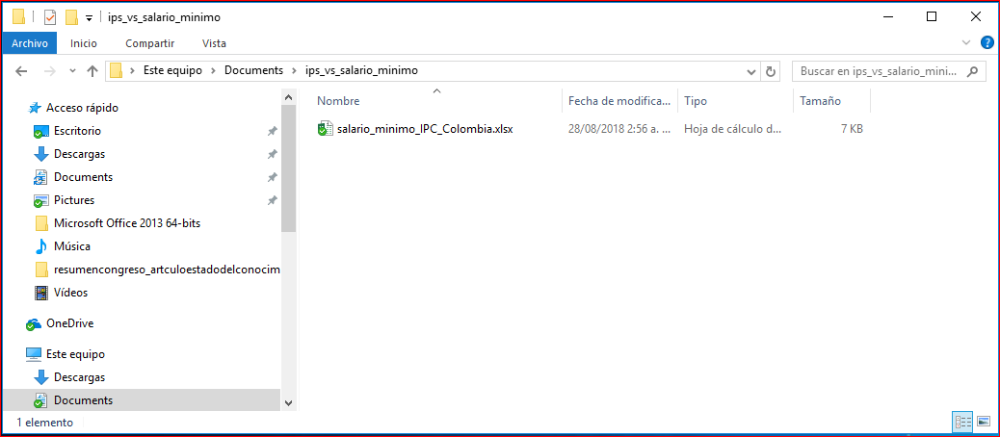

## Apertura de un projecto en RStudio.

### Inicio de RStudio.

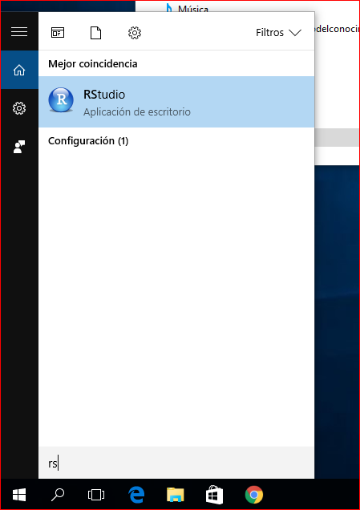

### Pantalla de inicio de RStudio.

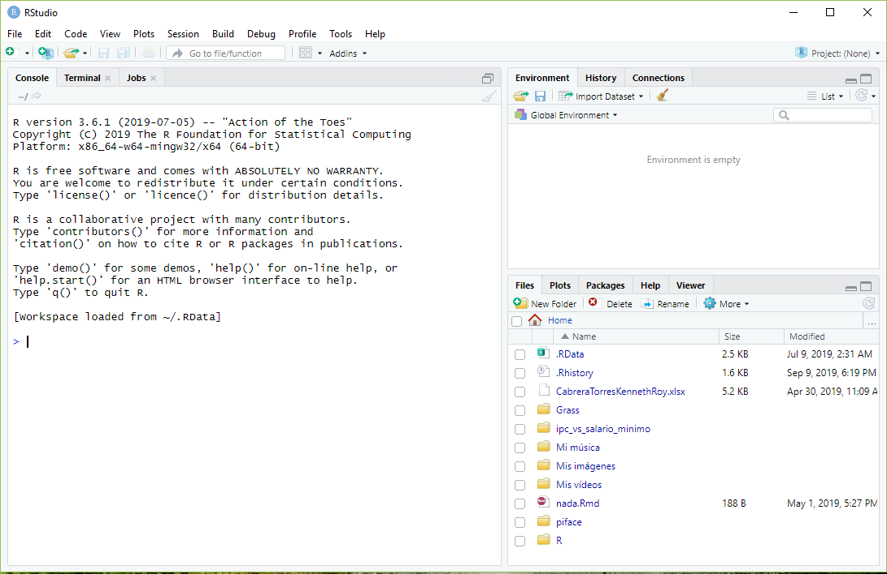

### Inicio de un nuevo proyecto.

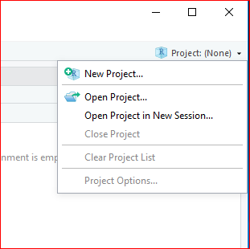

### Ventana del nuevo proyecto.

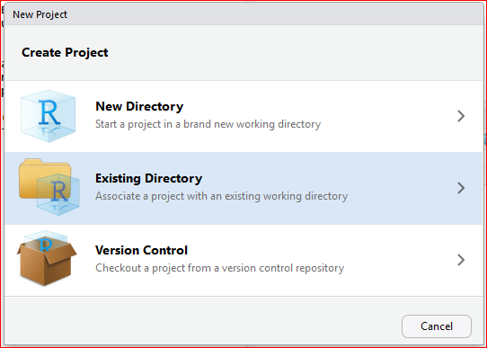

### Carpeta del proyecto nuevo.

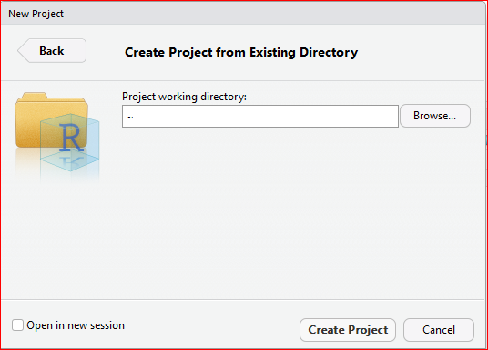

### Ubicación del proyecto nuevo.

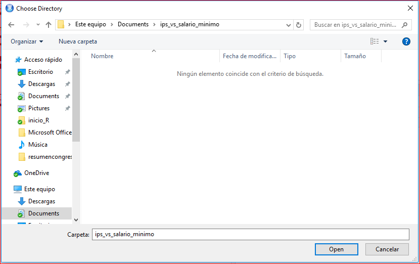

### Crea el proyecto nuevo.

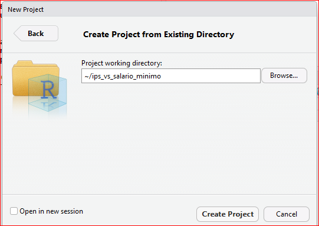

### Pantalla de inicio del proyecto nuevo.

## Codificación en R

### Incio del código en R Markdown.

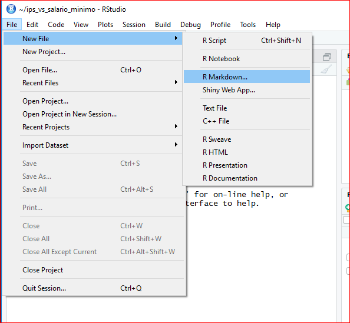

#### Instalación de paquetes para el R Markdown por primera vez.

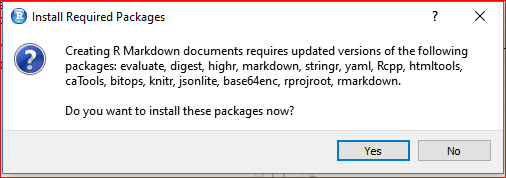

### Pantalla inicial de R Markdown.

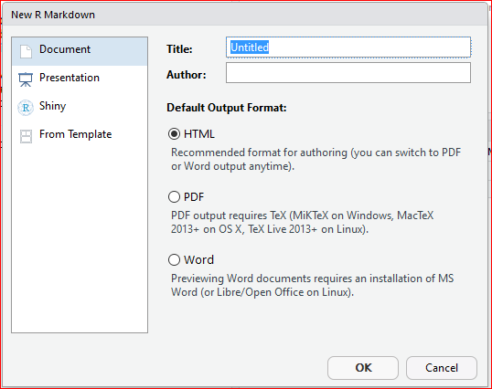

### Escribir el título y autor del archivo R Markdown.

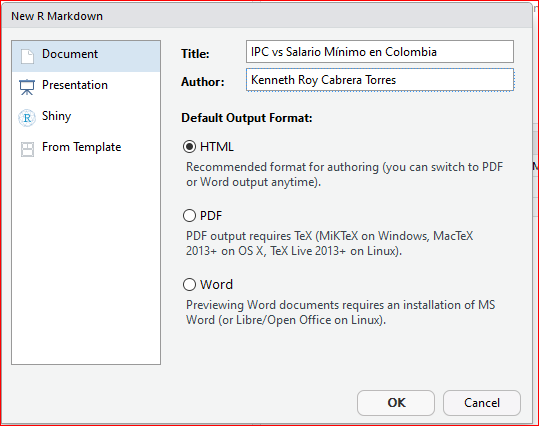

### Pantalla inicial del R Markdown.

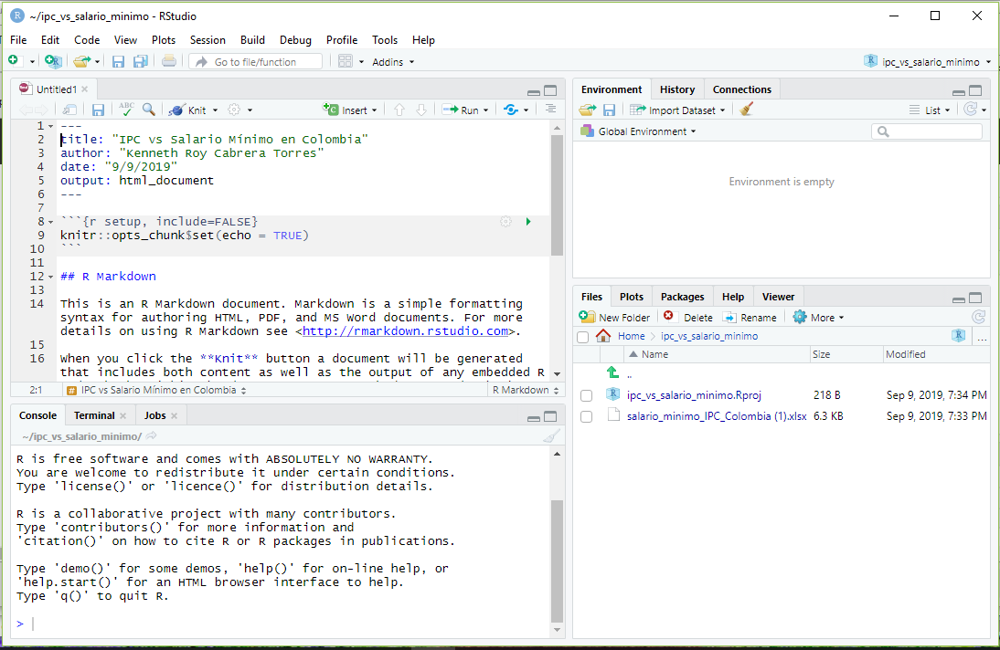

### Quitar la plantilla de ejemplo del R Markdown.

### Guardar el archivo en R Markdown.

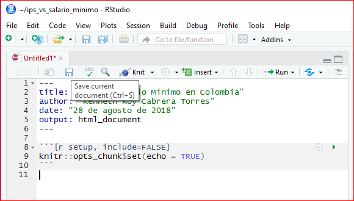

### Guardar y nombrar el archivo de R Markdown.

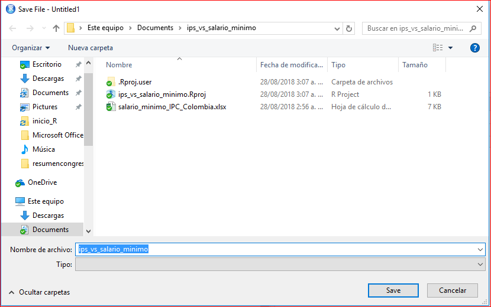

### Pantalla inicial para escribir código y documento.

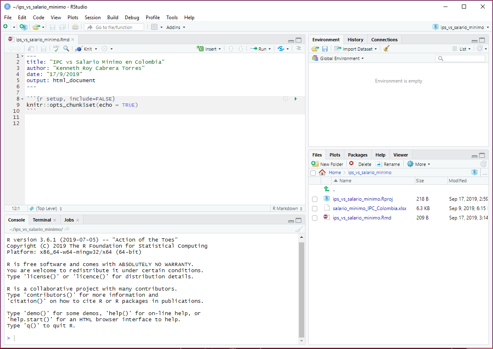

### Código inicial para la lectura y gráfica preliminar.

### Opciones de ejecución de código.

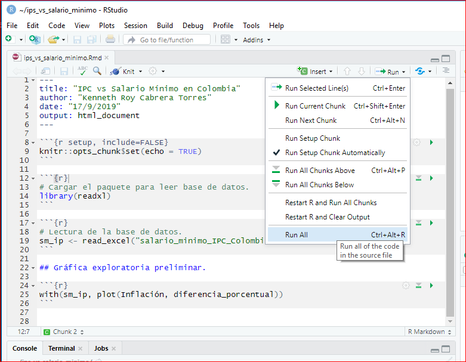

### Resultado de ejecutar el código en el R Markdown.

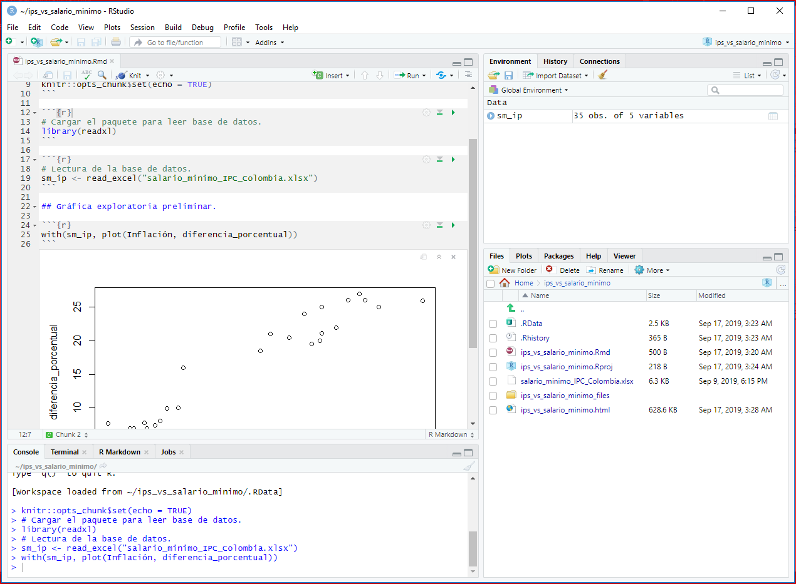

## Creación del archivo ".html".

### "Tejer" un documento a formato html.

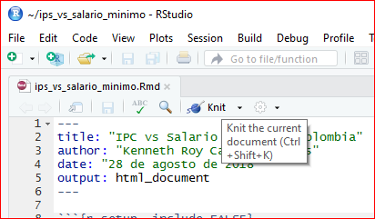

### Resultado de "tejer" un documento a html.

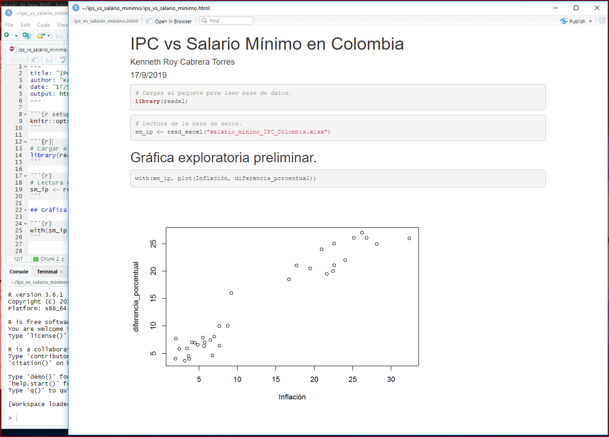

## Finalización de una sesión en RStudio.

### Cerrar el proyecto.

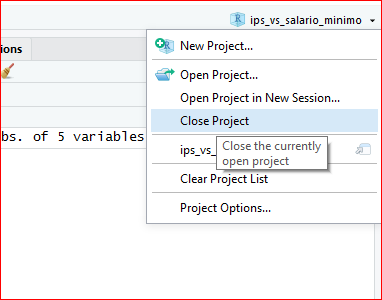

### Ventaja para cerrar el proyecto.
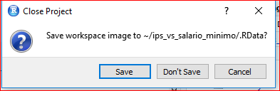

### Salir del RStudio.

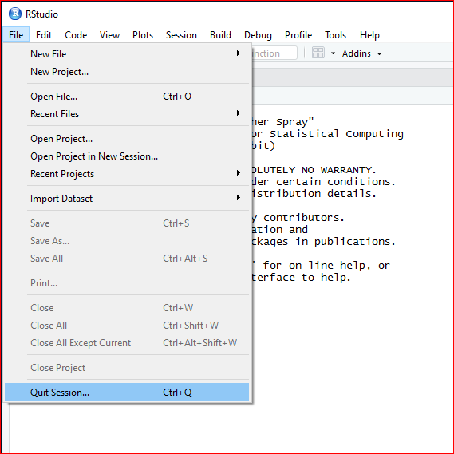

### Carpeta con los archivos nuevos.

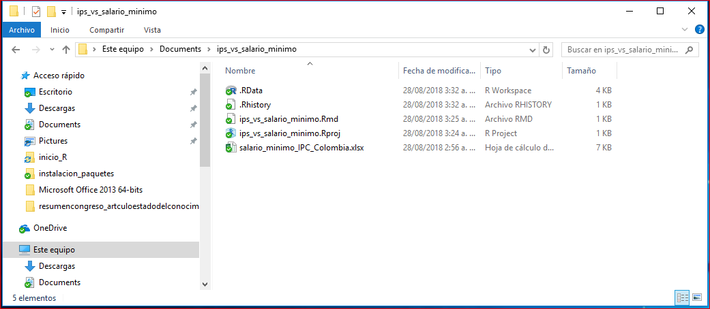

<!---

## Preparar una base de datos para leer en el R.

Se realizará el ejemplo del uso del R, utilizando una base de datos externa. En esta caso una base de datos en donde se registra por grupo de edad y género el número de homicidios en Colombia durante el 2014.

Inicialmente se toma el archivo en formato .xlsx o .xls y se ubica en una carpeta nueva. La premisa es que se debe ubicar la base de datos en el mismo lugar en donde se grabará el guión o código de R.

### Base de datos.

- [Homicidios en Colombia (xlsx)](./basesdedatos/HomicidiosColombia2014.xlsx)

### Crear una carpeta para la base de datos.

En este caso se creó una carpeta con el nombre de `practica1`. Y
en ese lugar se ubicó el archivo `HomicidiosColombia.xlsx`, como se muestra a continuación:

{: width="700"}

Seguidamente se abre en Excel como se muestra en la siguiente imagen:

{: width="700"}

### Guardarla en formato .csv

Se debe guardar con el formato `.csv` siguiendo la ruta de `guardar como ...` en la misma carpeta en donde está el archivo `.xlsx` y seleccionando la opción de `CSV (delimitado por comas) `, como se muestra a continuación:

{: width="700"}

En la carpeta deberán entonces mostrarse dos archivos, uno con formato `.xlsx`y otra con formato `.csv` como se muestra en la siguiente imagen. Note que ahora existe dos archivos con el mismo nombre pero tienen diferente icono (el uno representa el formato `.xlsx` y el otro `.csv`).

{: width="700"}

### Verificación del formato

Para verificar el formato en el cual está codificado el archivo `.csv` se abre con el programa `bloc de notas` y se debe mostrar como la siguiente imagen:

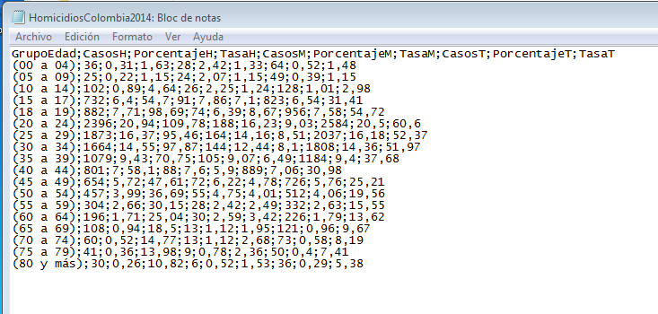{: width="700"}

Note que los campos están separado por un punto y coma `(;)` y los puntos decimales se identifican por coma `(,)` (Este formato es el usual para la configuración *latinoamericana*). Si el archivo tiene un formato diferente, es decir los campos están separados por coma `(,)` y los puntos decimales se identifican por punto `(.)` entonces se deberá tener en cuenta a la hora de leer en R la base de datos (este formato se configura como un formato *aglosajón*), debido a que se requiere un cambio en el comando de lectura.

## Inicio de R

### Abrir el programa RStudio

Ya se por un enlace directo en el escritorio o por el menú de programas se puede iniciar el programa RStudio.

{: width="700"}

Aparece la pantalla del R studio.

{: width="700"}

### Crear un guión en R.

Para crear un nuevo guión o script se sigue la ruta `File > New File > R Script`

Y ahora la apariencia es la siguiente:

{: width="700"}

### Guardar un guión de R.
A continuación se sigue la ruta `File > Save as` y se graba con un nombre como `guion_homicidios_Colombia` en el mismo lugar en donde se encuentran ubicadas las bases de datos. Así como se muestra a continuación:

{: width="700"}

Entonces ahora la interfaz RStudio deberá quedar de la siguiente manera:

{: width="700"}

### Verificar la ruta el RStudio.

En la ventana de `console` de digita el siguiente comando `dir()` y luego la tecla `enter` y se mostrarán algunos nombres de archivos. En este caso **no** aparecen los nombres de los archivos de las bases de datos que se quieren leer.

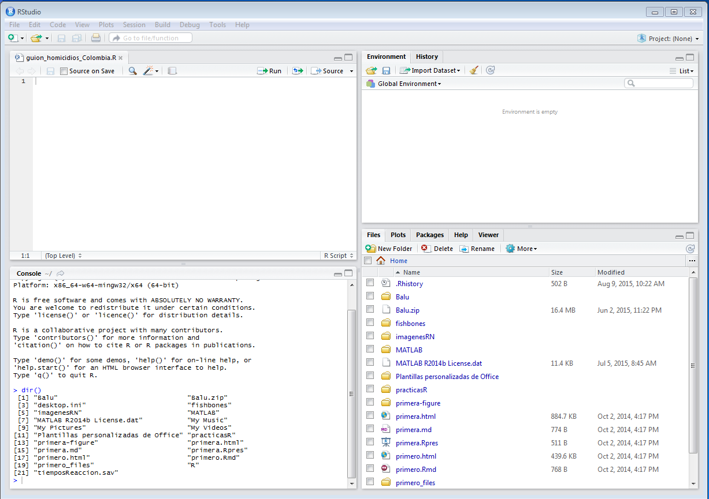{: width="700"}

### Cambiar la ruta del RStudio.
Se sigue la siguiente ruta para cambiar de carpeta o directorio de trabajo: `Session > Set Working Directory > To Source File Location` y se deberá mostar algo similar a la siguiente imagen:

{: width="700"}

### Verificar la ruta correcta en el RStudio.

De nuevo se digita en la consola el comando o instrucción `dir()` y ahora aparecerán los nombres de los archivos de las bases de datos, junto con el nombre del script como se muestra a continuación:

{: width="700"}

### Lectura de la base de datos en R.

En la ventana del guión o script se escribe el siguiente código:


# Lectura de la base de datos de homicidios en Colombia en el 2014
homCol <- read.csv2("HomicidiosColombia2014.csv")
# Muestra la base de datos de homicidios en Colombia en el 2014
homCol


**Nota:** En el caso de que el formato sea el *anglosajón* en lugar de `read.csv2()` se utiliza la función `read.csv()`.

Para ejecutar el código se ubica en cada renglón y se presiona `Ctrl-Enter` y así cada línea se ejecutará una a una repitiendo la teclas `Ctrl-Enter`.

Para ejecutar **todo** el código se presiona las tecla `Ctrl-Alt-R`.

El resultado de la ejecución del código es:

{: width="700"}

### Código en el script del R.

Para realizar otras actividades, ya sean de cálcuo o gráficas se añade el código correspondiente como se muestra a continuación:

No olvidar grabar frecuentemente el código para no perder las acciones realizadas.


# Cálculo de estadísticos de tasa de homicidios totales
with(homCol, summary(TasaT))
# Gráfica sencilla con las tasas de homicidios totales por grupo de edad
with(homCol, barplot(TasaT))


El resultado final se muestra en la siguiente imagen:

{: width="700"}

Si se desea terminar la sesión se procede a cerrar el programa el cual mostrará una pantalla como la siguiente:

{: width="400"}

En este caso se elige la opción `Save` para guardar el espacio de trabajo o `workspace`.

--->
