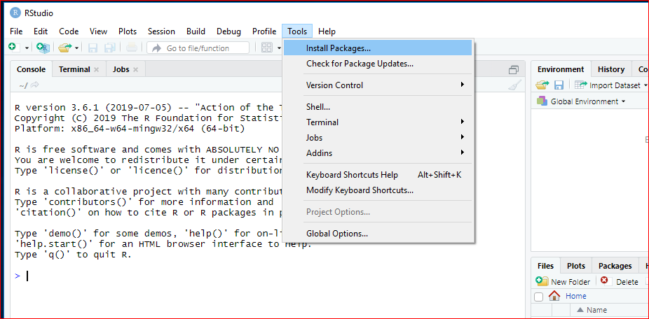
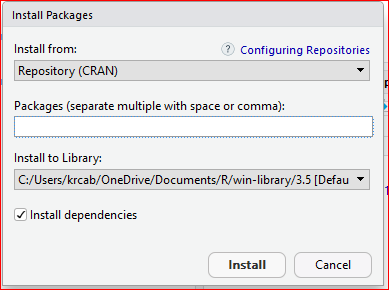
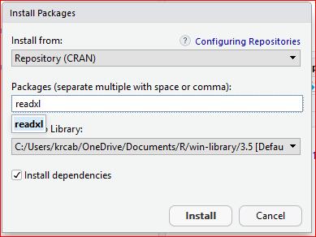
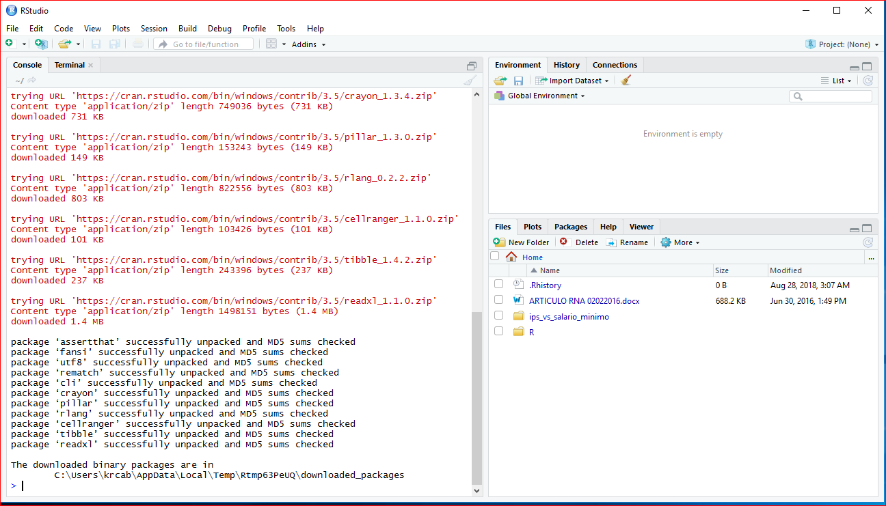

## Contenido
{: .no_toc}

* ToC
{: toc}

## Menú para instalar paquetes.

## Pantalla inicial para instalar paquetes.

## Indicar paquete o paquetes a instalar.

## Resultado de la instalación de paquetes.

