## Listado de póster y código QR de los grupos del trabajo final

- [Poster Grupo 01](./posters/grupo01.pdf){:target="_blank"}

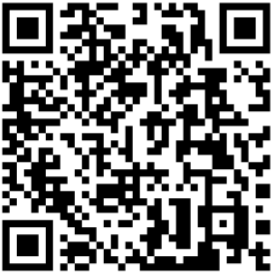

- [Poster Grupo 02](./posters/grupo02.pdf){:target="_blank"}

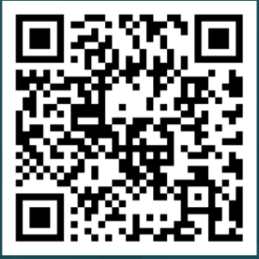

- [Poster Grupo 03](./posters/grupo03.pdf){:target="_blank"}

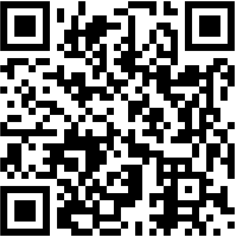

- [Poster Grupo 04](./posters/grupo04.pdf){:target="_blank"}

No presentó código QR

- [Poster Grupo 05](./posters/grupo05.pdf){:target="_blank"}

- [Poster Grupo 06](./posters/grupo06.pdf){:target="_blank"}

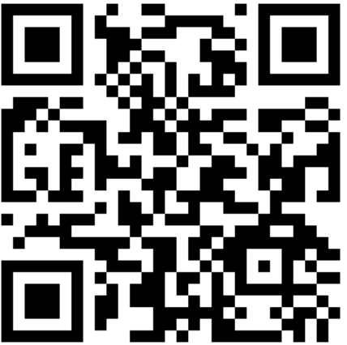

- [Poster Grupo 07](./posters/grupo07.pdf){:target="_blank"}

- [Poster Grupo 08](./posters/grupo08.pdf){:target="_blank"}

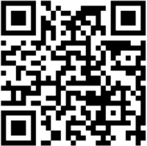

- [Poster Grupo 09](./posters/grupo09.pdf){:target="_blank"}

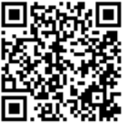

- [Poster Grupo 10](./posters/grupo10.pdf){:target="_blank"}

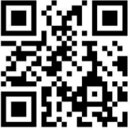

- [Poster Grupo 11](./posters/grupo11.pdf){:target="_blank"}

No presentó código QR

- [Poster Grupo 12](./posters/grupo12.pdf){:target="_blank"}

- [Poster Grupo 13](./posters/grupo13.pdf){:target="_blank"}

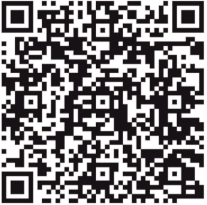

- [Poster Grupo 14](./posters/grupo14.pdf){:target="_blank"}

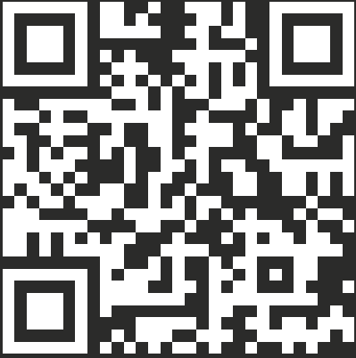

- [Poster Grupo 15](./posters/grupo15.pdf){:target="_blank"}

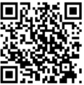

- [Poster Grupo 16](./posters/grupo16.pdf){:target="_blank"}

- [Poster Grupo 17](./posters/grupo17.pdf){:target="_blank"}

No presentó código QR

- [Poster Grupo 18](./posters/grupo18.pdf){:target="_blank"}

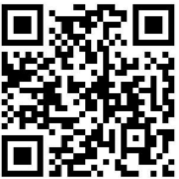

- [Poster Grupo 19](./posters/grupo19.pdf){:target="_blank"}

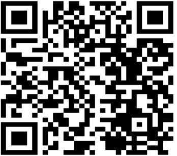

- [Poster Grupo 20](./posters/grupo20.pdf){:target="_blank"}

No presentó código QR

- [Poster Grupo 21](./posters/grupo21.pdf){:target="_blank"}

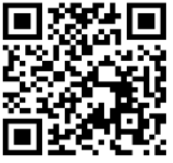
