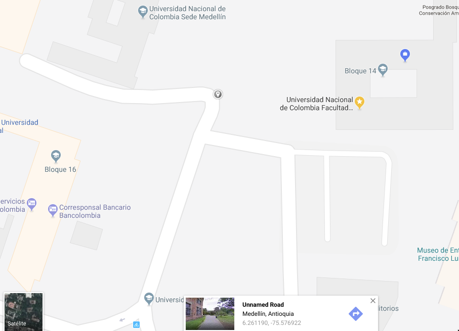
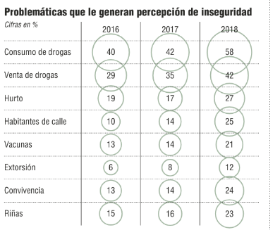

## Contenido
{: .no_toc}

* ToC
{: toc}

## Actividades.

1. Inscribirse al [foro del curso](https://labscn-unalmed.github.io/estadistica-descriptiva/foro.html).
1. Instalar [el software R](https://cran.r-project.org/bin/windows/base/).
2. Instalar [el software RStudio](https://www.rstudio.com/products/rstudio/download/).
3. Seguir y replicar los siguientes tutoriales que se encuentran en la sección de "Documentos":

   - Tutorial de instalación de un paquete en R.
   - Tutorial de inicio de RStudio.

   Se debe instalar el paquete "readxl" para que el tutorial de inicio de R
   funcione adecuadamente.
4. Reproducir los resultados del análisis exploratorio de las biblitecas públicas de Medellín.

## Taller individual 1.

### Objetivo.

Responder a la encuesta hecha en la primera clase.

### Fecha de entrega:
 16 de septiembre de 2019.

## Taller individual 2:

### Objetivo.

Evaluar el resultado de ver el [episodio 1](https://drive.google.com/open?id=0B06ZL2OVQg3deU9rRE92MG5JNEU) de la primera temporada de
la serie Numb3rs.

### Fecha de evaluación.

Martes primero (1ro) de octubre de 2019 a la hora de la clase se realizará un quiz.

A continuación se muestra la ecuación básica que utilizó Charlie para construir los mapas.

$$p_{ij}$$ es la probabilidad de que el punto $$(i, j)$$ sea el punto de base dado los puntos de ataque.

$$
p_{ij} = k \sum_{n = 1}^C\left[ \frac{\phi}{(|x_i-x_n|+|y_j-y_n|)^f}  +
(1-\phi)\frac{B^{g-f}}{(2B-|x_i-x_n|-|y_j-y_n|)^g} \right]
$$

Donde $$\phi$$ es un factor de ponderación que toma el valor de $$0$$ para los sitios dentro de la zona buffer y
$$1$$ por fuera de esta, $$k$$ es una constante empírica, $$B$$ es el radio de la zona buffer, $$C$$ son los sitios de observación, $$f$$ y $$g$$ son exponentes empíricos. $$(x_i, y_i)$$ con las coordenadas del punto $$(i,j)$$ y $$(x_n, y_n)$$ con las coordenadas del $$n$$-ésimo sitio. $$B$$ es el radio de la zona cerca a la base en donde no ataca.

## Taller individual 3:

### Objetivo.

Realizar una toma de datos con la aplicación [Science Journal](https://play.google.com/store/apps/details?id=com.google.android.apps.forscience.whistlepunk&hl=en)
para celular, con el propósito de familiarizarse con el uso de la aplicación.

### Consideraciones.

1. Tomar los datos de aceleración (X, Y y Z) de cuatro (4) actividades diferentes:
   1. Caminando normalmente (mínimo dos (2) minutos).
   2. Caminando rápidamente (no corriendo o ni trotando) (mínimo dos (2) minutos).
   3. Caminando lentamente (mínimo dos (2) minutos).
   4. Viajando en un medio de transporte (bus, metro, metroplus, motocicleta, bicicleta, carro particular, etc) (mínimo dos (2) minutos).

2. Descargar y enviar cada uno de los cuatro (4) archivos en formato ".csv" en su respectivo correo. Descargar los archivo **sin marcar** la opción "Tiempo relativo".
3. Enviar los cuatro (4) archivos al profesor (krcabrer@unal.edu.co) con la adición de los siguientes datos en el cuerpo del correo: medio de transporte utilizado, edad, estatura, peso y género.
4. Leer los cuatro (4) archivos en R y realizar un análisis exploratorio del comportamiento
   de la acelaración total de los cuatro archivos. Se envía tanto el archivo ".html", como el archivo ".Rmd".

### Fecha de entrega.

Jueves 3 de octubre de 2019 antes de las 23:59 hora de Colombia, no olvidar la etiqueta [EDAED]. En el mismo correo se envían los archivos ".csv", el archivo ".Rmd" y el archivo ".html" sin olvidar los datos en el cuerpo del programa.

<!---
## Taller individual 1

1.

## Contenido
{: .no_toc}

* ToC
{: toc}

1. Instalar [el software R](https://cran.r-project.org/bin/windows/base/).
2. Instalar [el software RStudio](https://www.rstudio.com/products/rstudio/download/).
3. Seguir y replicar los siguientes tutoriales que se encuentran en la sección
   de "Documentos":
   - Tutorial de instalación de un paquete en R.
   - Tutorial de inicio de RStudio.

   Se debe instalar el paquete "readxl" para que el tutorial de inicio de R
   funcione adecuadamente.

4. Replicar el guión de las causas de mortalidad en el Hospital General de Medellín en 2018 pero con la base de datos del
número de miembros de los [semilleros de investigación
de la Institución Universitaria Pascul Bravo](https://www.datos.gov.co/Ciencia-Tecnolog-a-e-Innovaci-n/Semilleros-Investigaci-n/pi6r-ajh6).

## Talleres individuales.

### Taller individual 1.

#### Noticias falsas (fake new) ¿Control o libertad de expresión?

1. Registrarse en el foro del curso.
2. Entrar al tema de debate y escribir una posición
   u opinión en cuanto al tema en cuestión.

   - ¿Qué es preferible y por qué?
     * No restringir la libertad de expresión.
     * Crear controles de lo que se publica en internet y
       en particular en las redes sociales.

   Recordemos el respeto y el debate de altura,
   así tengamos opiniones diametralmente opuesta a
   la mayoría.

3. Fecha de entrega domingo 05 de mayo de 2019 antes
    de las 23:59 [hora de Colombia](http://horalegal.inm.gov.co/).

### Taller individual 2.

1. Instalar una aplicación en el "smartphone" que muestre las coordenadas
de ubicación actual (cualquiera).
2. En un computador localizar tres puntos de referencia
del campus de la Universidad (también puede utilizar
  el Núcleo de Minas o el Núcleo de Mecánica)
y anotar las coordenadas en grados decimales (si se toman
  los grados, minutos y segundos, entonces convertirlos
  a grados decimales).
3. Ir a los lugares de referencia y tomar las coordenadas
con la apliación del "smartphone" cuatro veces.
Anotar la hora y la fecha que se toma. Cada medida deberá estar
separada por mínimo de 2 horas.

4. LLenar una hoja en Excel con los datos tomados como se
  [muestra el ejemplo](./basesdedatos/CabreraTorresKennethRoy.xlsx),
  enviar el archivo con los Apellidos y Nombres de cada
  persona al correo **krcabrer@unal.edu.co**  adicionalmente
  una imagen por cada punto de referencia en donde se
  muestre las coordenadas de referencia antes
  del lunes 6 de mayo a las 23:59
  [hora de Colombia](http://horalegal.inm.gov.co/),
  sin olvidar escribir en asunto **[EDAED]**.

### Taller individual 3.

De acuerdo a la asignación del archivo compartido
mediante Google Drive
de municipios de Colombia completar la información utilizando la página
de los [municipios de Colombia](https://www.municipio.com.co/).

La información debe quedar en línea para que quede un solo archivo.

Por favor tener cuidado de **NO BORRAR** la información que haya sido entrada por otro compañero. (Recuerden que toda actividad queda registrada en el sistema y por lo tanto se podría saber la persona que borró información
  de los compañeros).

Fechas de entrega: Martes, 21 de Mayo de 2019 antes de las 23:59 hora de Colombia.

### Taller individual 4.

Taller en grupo en donde se hizo toma de datos para determinar
diferencias entre tipos de percepción de diferentes tipos de gráficas.

## Talleres en grupo.

### Taller en grupo 1.

1. Organizar grupos de no más de cinco (5) personas.
2. Plantear un índice que muestre la gráfica de mejor desempeño
   teniendo en cuenta los resultados de todas las farmacias.
   El índice debe ser por persona y que permita comparar el
   valor de índice entre los tipos de gráficas.
3. Proponer una gráfica a mano alzada que tenga en cuenta el
   índice propuesto anteriormente y que permita visualizar
   el desempeño y comparar los distintos tipos de gráficas.
   La gráfica **no** debe utilizar diagramas de caja-bigotes
   o box-plot.
3. Escribir el nombre completo de los integrantes del grupo y
   entréguelo al profesor en clase.

### Taller en grupo 2.

1. Organizar grupos de no más de cinco (5) personas.
2. Escribir tres (3) preguntas a la base de datos
   del
   [Índice Sintético de Calidad Educativa](https://www.datos.gov.co/Educaci-n/-ndice-Sint-tico-de-Calidad-Educativa-ISCE-Municip/uc7t-jc5u) del 2016.
   Las tres preguntas sólo deben tener en cuenta
   la información contenida en esa base de datos.
3. Entregar en una hoja junto con los integrantes
    al comenzar la clase el día martes 18 de junio
    de 2019.

El problema de movilidad en Medellín tiene muchos aspectos a
considerar. Uno de ellos es el tiempo de viaje del lugar de
residencia al lugar de estudio o trabajo.

Para realizar un análisis exploratorio de datos que
tengan que ver con movilidad se realizará una encuesta
a cada estudiante de la asignatura.

Traer para la clase del 16 agosto de 2018 la siguiente información
con el fin de responder a la encuesta que se realizará en clase:

  1. Coordenadas del lugar de residencia u origen del viaje.
     latitud y longitud con
     la aplicación [google maps](https://www.google.com/maps).
  2. Coordenadas del lugar en la Universidad del destino.
     latitud y longitud con
     la aplicación [google maps](https://www.google.com/maps).
  3. Hora y minutos de salida del lugar de residencia.
  4. Hora y minutos de llegada al destino en la Universidad.

Para las personas que no hayan podido entregar esta información
el día 16 se tomará de nuevo el día 21 de agosto de 2018.s

### Taller individual 2.

Inscribirse al foro del curso [localizado en la página del curso](https://labscn-unalmed.github.io/estadistica-descriptiva/foro.html),
utilizando en correo institucional.

Se realizará un corte el día 25 de agosto a las 17:00 horas.
Toda inscripción que se haga después de esta fecha límite se tomará
como entrega tarde del taller individual 2.

### Taller individual 3.

1. Reclamar en la oficina 14-214 de acuerdo al grupo a que pertenezca.

   a. **Grupo 1**: Personas que no pueden ir el día 21 de agosto a otra hora
      que no sea la hora de clase.

   b. **Grupo 2**: Personas que pueden ir a otra hora distinta de la hora de clase.

   El **grupo 1** reclama un póster a las 9:15 am en la oficina 14-214
    y el **grupo 2** reclama el póster a las 12:00 meridiano en la misma oficina.

2. De acuerdo a los elementos que se mencionan en los [documentos
   que se muestran en la página](https://labscn-unalmed.github.io/estadistica-descriptiva/documentos.html#guias-para-presentaci%C3%B3n-de-p%C3%B3sters), evalúe el póster entregado,
   considerando los siguientes items:

   a. Forma:
      + Distribución o diagramación del póster..
      + Ortografía.
      + Tipo y tamaño de letra.
      + Uso de colores.
      + Presentación de las gráficas.

   b. Fondo:
      + Claridad en los integrantes del grupo.
      + Claridad en el objetivo.
      + Redacción clara de los párrafos o frases.
      + Claridad en la metodología utilizada.
      + Claridad en los gráficos presentados.
      + Redacción de las conclusiones.
      + Redacción de las recomendaciones.
      + Mención de la bibliografía y/o cibergrafía.

3. Se elabora un documento en formato ".pdf" que incluya:
     - Portada.
     - Corta introducción a la presentación de pósters
       de carácter científico.
     - Una fotografía del póster analizado.
     - Calificación de 0 a 5 cada uno de los items de forma.
     - Calificación de 0 a 5 cada un de los items de fondo.
     - Y una observación sobre aspectos positivos o
       destacables del póster y sobre los aspectos
       a mejorar.

4.  Fecha de entrega: martes 28 de agosto de 2018
    antes de las 23:59 [hora de Colombia](http://horalegal.inm.gov.co/) enviar
    el archivo ".pdf" a la dirección **krcabrer@unal.edu.co**
    y no olvidar en asunto **[EDAED]**.

## Talleres en grupo.

### Taller en grupo 1.
<!---
1. En grupo de máximo tres personas.
2. La siguiente gráfica es tomada de "El Colombiano",
    del 15 de enero de 2019. Páginas 2 y 3. bajo el título:
    **¿Qué tan segura se siente la gente en Medellín?**.

   
3. Elaborar una gráfica que mejore la presentación de los datos.
    - Utilizando las gáficas básica del R (*plot()* o *barplot()*, etc.).
    - Utilizando el paquete ggplot2 del R (*ggplot()*).
4. Presentar el informe en formato ".html".
5. Enviar el archivo ".Rmd" correspondiente.
6. Enviar la base de datos construida para la elaboración del gráfico.
7. Fecha de envío: Martes 5 de febrero de 2019, antes de las 23:59 hora de Colombia al correo **krcaber@unal.edu.co** y en asundo no olvidar **[EDAED]**.

### Taller en grupo 2.

#### Objetivo.

Plantear dos preguntas a una base de datos y mostrar un posible
resultado gráfico o de tabla para cada pregunta propuesta.

#### Fecha de entrega.

Martes, 5 de febrero de 2019 en horas de clase.

## Contenido
{: .no_toc}

* ToC
{: toc}

## Talleres individuales

### Taller individual 1

 - Entrar al foro y realizar la primera actividad descrita en el mismo.

 - Recuerde utilizar el correo de la universidad para entrar al foro.

 - Cualquier dificultad para entrar al foro,
   por favor enviar el comentario al correo **krcabrer@unal.edu.co**
   y no olvidar escribir
   en asunto la sigla (incluido los corchetes) **[EDAED]**.

### Taller individual 2

  - Contestar la [encuesta realizada](./basesdedatos/preguntas.jpg)
   el primer día de clase.

### Taller individual 3
   - Llevar a clase en un papel el perímetro en metros hasta
     precisión de centímetros de la Universidad
      Nacional de Colombia, Núcleo el Volador.

### Taller individual 4
   - Estimar los valores dada la figura entregada en clase
     sobre el número de establecimientos de diferentes
     compañías de farmacia en el país.

## Talleres en grupo.

### Taller en grupo 1.

#### Objetivo:

 - Redactar cuatro preguntas a la base de datos contraloría de Antioquia
   que se respondan ya sea con una tabla o un gráfica o
   ambas y mostrar un esquema del resultado esperado pensando en
   mostrar los resultados a la opinón pública sobre el desempeño
   de las contrataciones del departamento de Antioquia.

#### Documentos esperados:

Durante la clase el grupo de máximo cinco personas (sólo los que están presentes)
realizarán la propuestas en un papel y las entregarán al finalizar la clase el
día martes, 27 de febrero de 2018 a las 11:30 am al profesor junto con
la identificación de los integrantes.

## Contenido
{: .no_toc}

* ToC
{: toc}

## Talleres individuales

### Taller individual 1

- Responder la [encuesta](./documentos/Encuesta201702.pdf) del primer día de clase.

### Taller individual 2

- Estimar el promedio de edad de los estudiantes del curso de
  Estadística Descriptiva y Análisis Exploratorio de Datos.
- Proponer un rango de "confianza" para la estimación del promedio de edad.

## Talleres en grupo

-->
