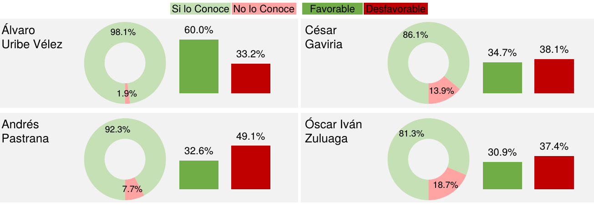

## Trabajos individuales

## Trabajos en grupo

### Primer trabajo en grupo.

En las páginas 18 y 19 del informe de
[la encuesta sobre el plebiscito](./documentos/ENCUESTAPLEBISCITO.pdf)
realizada por le empresa Invamer Gallup publicada
el día 17 de agosto de 2016 se muestra unas gráficas como las siguientes:

Se sugiere proponer una sola gráfica que muestra la misma información sobre
los quince (15) personajes que se muestran en la dos páginas del
informe de Invamer Gallup.

### Actividades
1. Conformar grupo de máximo cinco (5) estudiantes.
2. Dibujar (con cualquier software o un dibujo escaneado) una sola
   gráfica que muestre la misma información sobre la favorabilidad y
   el conocimiento que la gente tiene del personaje en cuestión.
3. Realizar un informe sobre la gráfica propuesta en formato ".pdf".   

### Documentos a entregar.
Documento en formato ".pdf" en donde se muestra la gráfica propuesta
y una breve explicación de la misma así como un análisis de los
resultados obtenidos.

### Fecha de entrega.
Viernes 26 de agosto de 2016 antes de las 23:59 hora de Colombia al
correo **krcabrer@unal.edu.co** y en asunto no olvidar **[EDAED]**.
