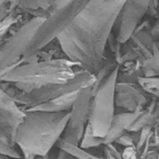
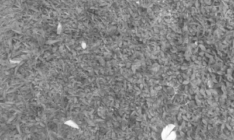

## Tablas guías para parámetros gráficos.
- [Tabla de colores](./docs/ColorChart.pdf){:target="_blank"}
- [Tabla de símbolos](./docs/points.png){:target="_blank"}
- [Tabla de líneas](./docs/lines.png){:target="_blank"}

## Imágenes de campos aleatorios reales

- [Hojas](./docs/hojas1.png){:target="_blank"}

- [Pasto](./docs/pasto1.png){:target="_blank"}

