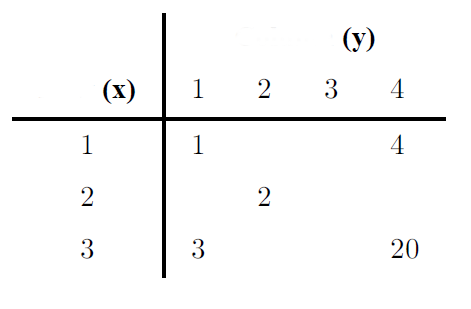

## Taller individual 1

Utilizando los siguientes datos.

   - [Croquis de municipios de Colombia (shp)](./datos/COL_adm2.shp){:target="_blank"}
   - [Croquis de municipios de Colombia (proj)](./datos/COL_adm2.prj){:target="_blank"}
   - [Croquis de municipios de Colombia (dbf)](./datos/COL_adm2.dbf){:target="_blank"}
   - [Croquis de municipios de Colombia (sbn)](./datos/COL_adm2.sbn){:target="_blank"}
   - [Croquis de municipios de Colombia (sbx)](./datos/COL_adm2.sbx){:target="_blank"}
   - [Croquis de municipios de Colombia (shx)](./datos/COL_adm2.shx){:target="_blank"}

Enviar un mapa con el croquis de los municipios de Colombia y superponer los puntos.

Fecha de entrega 17 de febrero de 2016 antes de las 10:00 am. al correo 
**krcabrer@unal.edu.co**, no olvidar escribir en asunto **[EE]**.

Documentos a entregar:

 - Mapa de municipios, superpuestos los puntos de referencia.
 - Archivo del código en R.
 
## Taller individual 2

### Actividades
Códigos realizados por los estudiantes:
 
 - [Código 1](./datos/cristian_matern.R){:target="_blank"}
 - [Código 2](./datos/función_matern.R){:target="_blank"}
 - [Código 3](./datos/JPVA_Clase6EstEsp_GrafExpGaus_19Feb2016.R){:target="_blank"}
 - [Código 4](./datos/modelos_exp_gauss.R){:target="_blank"} 
 - [Código en Python](./datos/matern.py){:target="_blank"}

 
1. Elaborar un código (puede utilizar como base los código de los compañeros)
   que muestre curvas para:

   - Función de correlación exponencial con $$\phi$$ = 1, 3, 5 y 10.
   - Función de correlación gauss con $$\phi$$ = 1, 3, 5 y 10.
   
   Estimen el rango práctico para cada caso.
   Es decir halle el valor de $$u$$ para cuando $$\rho(u)=0.05$$.
   
2. Nombre de la variable que ha pensado como ejemplo, la justificación
   del posible modelo y el rango práctico.

3. Graficar el modelo de la variable propuesta.

### Documentos a entregar

   - Archivo del código en R, debidamente documentado.
   - Archivo con las gráficas pedidas en las actividades.

### Fecha de entrega

   Viernes 26 de Febrero de 2016 antes de las 23:59 hora de Colombia
   al correo **krcabrer@unal.edu.co** y  no olvidar escribir en asunto: **[EE]**.
   
## Taller individual 3

## Actividades

Realizar "manualmente", la construcción de un semivariograma empírico
utilizando los siguientes datos:

### Documentos a entegar

- Enviar el procedimiento mediante el cual se calculó el semivariograma empírico.
- Enviar la gráfica del semivariograma obtenido.

### Fecha de entrega   

24 de febrero de 2016 antes de las 23:59 hora de Colombia al correo
 **krcabrer@unal.edu.co** y  no olvidar escribir en asunto: **[EE]**.

## Taller individual 4

### Actividades

Estimar los parámetros de la variable propia pero siguiendo un
modelo Matérn.

Simular una realización de un campo aleatorio siguiendo los parámetros
de un modelo Matérn para la variable propia.

Graficar el variograma empírico y el teórico para esta variable.

### Documentos a entregar

- Enviar el código en R para desarrollar las actividades propuestas.
  El código deberá estar documentado.
- Enviar la gráfica del la simulación de una realización del campo aleatorio.
- Enviar la gráfica de comparación del variograma empírico y 
  teórico par esta simulación.
  
### Fecha de entrega

Viernes 4 de marzo de 2016 antes de las 23:59 hora de Colombia al correo
 **krcabrer@unal.edu.co** y  no olvidar escribir en asunto: **[EE]**.

## Taller individual 5

### Actividades

Tomar una foto desde celular de un ejemplo real de campo aleatorio.
Constuir variograma empírico del campo aleatorio real.
"Ajustar a ojo" un modelo Matérn para el campo aleatorio obtenido.
Mostrar la gráfica de comparación entre el campo aleatorio real y
el "ajustado a ojo".

### Documentos a a entregar
- Documento en ".pdf" con la foto y un comentario sobre el campo
  aleatorio utilizado. El documento deberá contener:
  * Portada.
  * Foto del campo aleatorio real.
  * Variograma empírico.
  * Variograma teórico Matérn "ajustado a ojo".
  * Conlusiones y recomendaciones.
  
- Archivo en formato ".R" con el código utilzado para obtener los resultados.

### Fecha de entrega

Miércoles 9 de marzo de 2016 antes de las 23:59 hora de Colombia al correo
 **krcabrer@unal.edu.co** y  no olvidar escribir en asunto: **[EE]**.

 
      
      
