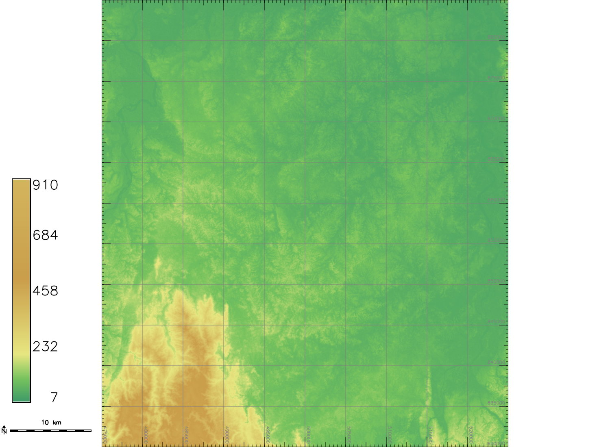
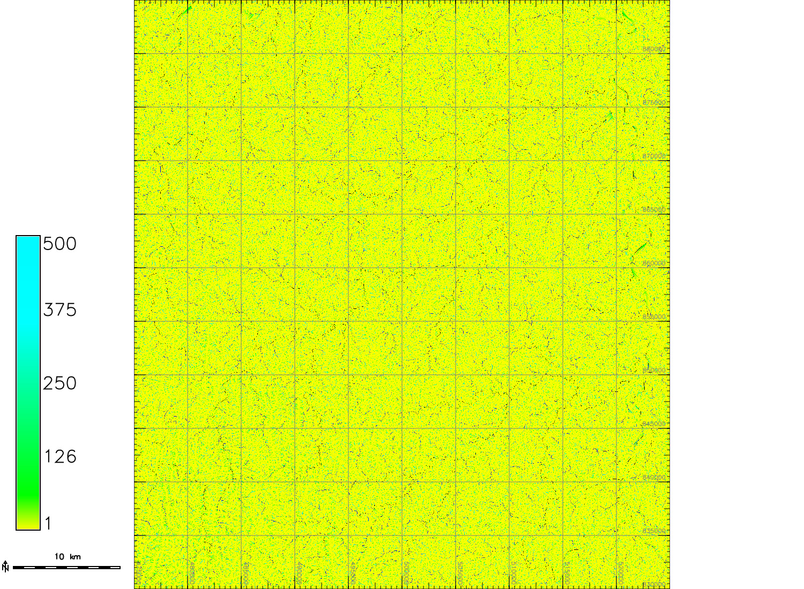
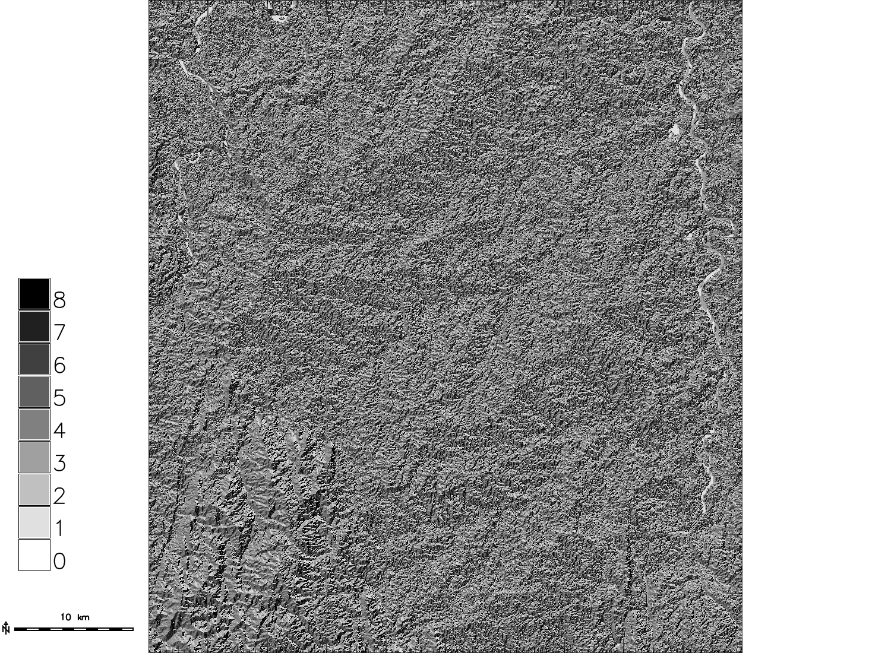
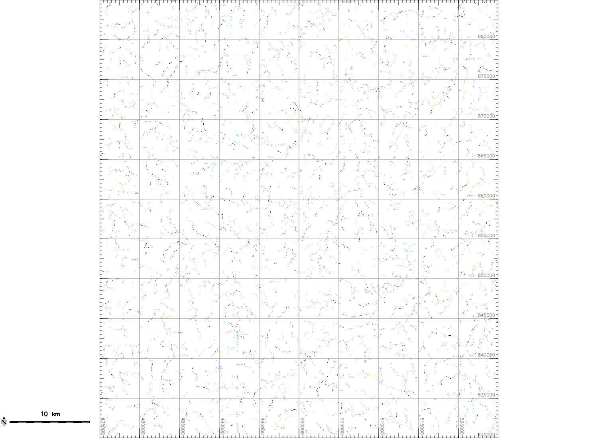
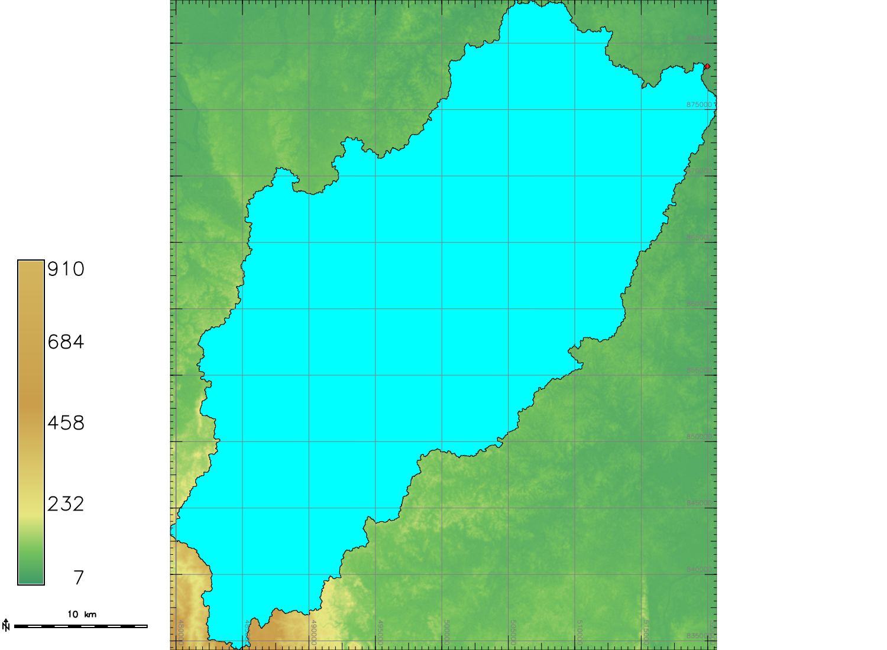
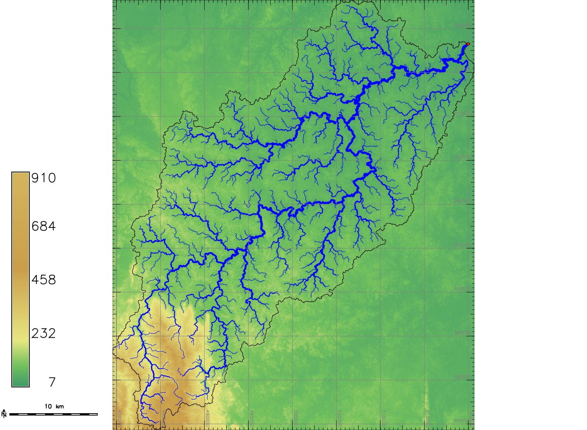
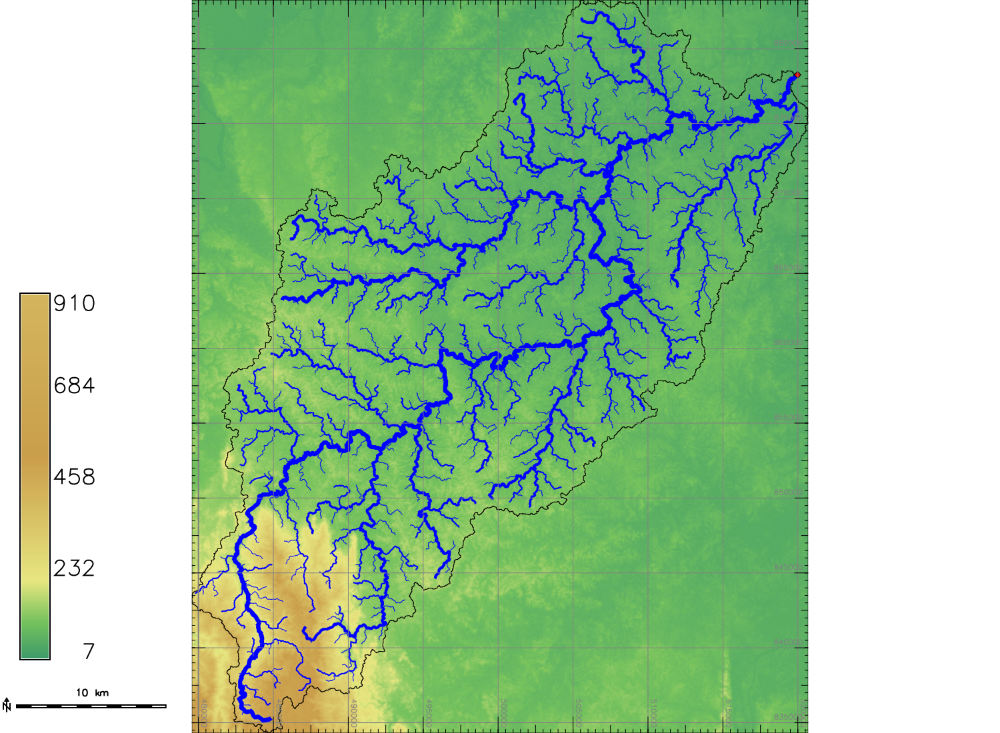

## Introducción

La información será extraída a partir del DEM obtenido de [ALOS PALSAR](https://www.asf.alaska.edu/sar-data/palsar/){:target="blank"}.

## Procedimiento en GRASS GIS

### Procesamiento inicial

Definir la región.

~~~
g.region -p n=885000 s=830000 w=475000 e=525000
~~~

~~~
projection: 1 (UTM)
zone:       18
datum:      wgs84
ellipsoid:  wgs84
north:      885000
south:      830000
west:       475000
east:       525000
nsres:      12.5
ewres:      12.5
rows:       4400
cols:       4000
cells:      17600000
~~~
{: .output}

Guardar la región con un nombre dentro del espacio de trabajo para poder acceder a ella rápidamente.

~~~
g.region save=caceri
~~~

Debido a que la zona de estudio no está contenida completamente dentro de un sólo archivo sino que corresponde al intercepto de 3 archivos, se debe realizar un mosaico de ellos.

~~~
r.patch input=AP_08170_FBD_F0140_RT1,AP_07747_FBD_F0140_RT1,AP_23180_FBD_F0130_RT1 output=caceri_raw
~~~

El DEM crudo se debe corregir hidrológicamente. Inicialmente se verifica si existen pixeles nulos en el mapa.

~~~
r.univar map=caceri_raw
~~~

~~~
total null and non-null cells: 17600000
total null cells: 0

Of the non-null cells:
----------------------
n: 17600000
minimum: 6
maximum: 910
range: 904
mean: 106.426
mean of absolute values: 106.426
standard deviation: 94.3355
variance: 8899.19
variation coefficient: 88.6395 %
sum: 1873097796
~~~
{: .output}

Al no tener pixeles nulos, se utiliza el módulo [`r.hydrodem`](https://grass.osgeo.org/grass70/manuals/addons/r.hydrodem.html){:target="blank"} para obtener un DEM hidrológicamente corregido.

~~~
r.hydrodem input=caceri_raw output=caceri_dem
~~~

~~~
Load elevation map
 100%
Remove one cell extremas
 100%
Set edge points
 100%
A* Buscar...
 100%
Processing 162721 sinks
 100%
Write conditioned DEM
 100%
~~~
{: .output}

Para visualizar la distribución espacial de altitudes se debe asignar una tabla de colores que varíe gradualmente para percibir los patrones de esta variable en la zona de estudio.

~~~
r.colors map=caceri_raw,caceri_dem color=srtm
~~~

{: .img-responsive}

### Extracción de la red de drenaje

A partir de este mapa de elevación, se obtienen los siguientes mapas:

~~~
r.watershed -s elevation=caceri_dem threshold=3200 accumulation=caceri_accum drainage=caceri_drain stream=caceri_streams
~~~

Acumulación (accumulation)
: Mapa accum

{: .img-responsive}

Drenaje (drainage)
: Mapa drain

{: .img-responsive}

Corrientes (streams)
: Mapa streams

{: .img-responsive}

Se define un punto en el pixel de desembocadura del río Cacerí al río Nechí.

Utilizando las coordenadas del centro del pixel se crea un mapa vectorial de puntos que contiene esta desembocadura.

~~~
echo "519981.25|878256.25" | v.in.ascii input=- output=caceri_outlet
~~~

Se delimita la cuenca calculando su divisioria de aguas, a partir de la desembocadura (representada por un punto vectorial), y el mapa de la dirección de drenaje.

~~~
r.stream.basins direction=caceri_drain points=caceri_outlet basins=caceri_basin
~~~

Se crea un polígono vectorial transformando el mapa ráster de la cuenca.

~~~
r.to.vect -v input=caceri_basin output=caceri_basin type=area
~~~

Se ajusta la región al rectángulo externo que contenga exactamente la cuenca usando su mapa en formato ráster.

~~~
g.region zoom=caceri_basin
~~~

{: .img-responsive}

### Jerarquía de las corrientes

Se utiliza el ráster de la cuenca como máscara para restringir los cálculos posteriores a los pixeles que pertenecen a la cuenca.

~~~
r.mask raster=caceri_basin
~~~

Se procesan las corrientes en formato ráster, para obtener un mapa vectorial de líneas ordenadas jerárquicamente.

~~~
r.stream.order stream_rast=caceri_streams direction=caceri_drain elevation=caceri_dem accumulation=caceri_accum stream_vect=caceri_streams
~~~

Se elimina la máscara

~~~
r.mask -r
~~~

#### Strahler

Diferenciando por el grosor de la línea

{: .img-responsive}

Diferenciando por color

{: .img-responsive}

#### Horton

Diferenciando por el grosor de la línea

{: .img-responsive}

Diferenciando por color

{: .img-responsive}

### Distancia y desnivel altitudinal con respecto a la desembocadura

Se convierte el punto de la desembocadura a formato ráster para calcular las distancias y diferencias de elevación de toda la cuenca con respecto a ese punto.

~~~
v.to.rast input=caceri_outlet output=caceri_outlet use=cat

r.stream.distance -o stream_rast=caceri_outlet direction=caceri_drain elevation=caceri_dem method=downstream distance=caceri_distance difference=caceri_elev_diff
~~~

## Procedimiento en el lenguaje estadístico R

Utilizando RStudio...

*[DEM]: Digital Elevation Model
