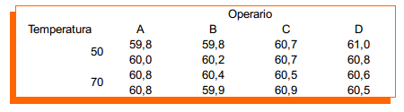

## Brillo en la fabricación de papel

Se sospecha que la temperatura está influyendo en la blancura
del papel producido en una planta de producción.

Algunos supervisores de la planta, sinembargo, consideran
que el operario que realiza la medición tienen diferentes maneras
de tomar del dato de brillo y por lo tanto ese es motivo de
la variación de la blancuara del papel.

A continuación se muestra los resultados de realizar un
experimento con el fin de despejar dudas en cuanto a
el o los factores que influencian las medidas de la
blancura del papel.




## Lectura de la base de datos

```{r}
reflect <- read.csv2("brillo_papel.csv")

reflect
```


## Resumen de la base de datos

```{r}
summary(reflect)
```

## Estructura de la base de datos

```{r}
str(reflect)
```

## Especificar una variable como de tipo "factor"

```{r}
reflect$temperatura <- factor(reflect$temperatura)
```

## Estructura de la base de datos reformada
```{r}
str(reflect)
```

## Resumen de la base de datos adecuada
```{r}
summary(reflect)
```

## Estadísticos por cada operador
```{r}
# Medias
tapply(reflect$reflectancia,
       reflect$operador,
       mean)

# Desviaciones estándar
tapply(reflect$reflectancia,
       reflect$operador,
       sd)
```

## Estadísticos por cada temperatura
```{r}
# Medias
tapply(reflect$reflectancia,
       reflect$temperatura,
       mean)

# Desviaciones estándar
tapply(reflect$reflectancia,
       reflect$temperatura,
       sd)
```

## Estadísticos por cada combinación de operario y temperatura
```{r}
# Medias
tapply(reflect$reflectancia,
       list(reflect$operador, reflect$temperatura),
       mean)

# Desviaciones estándar
tapply(reflect$reflectancia,
       list(reflect$operador, reflect$temperatura),
       sd)
```

## Gráfica por temperatura

```{r}
library(ggplot2)
g1 <- ggplot(reflect, aes(temperatura, reflectancia))
g1 + geom_point()
```

## Gráfica por operador

```{r}
library(ggplot2)
g1 <- ggplot(reflect, aes(operador, reflectancia))
g1 + geom_point()
```
## Gráfica por operador y temperatura

```{r}
library(ggplot2)
g1 <- ggplot(reflect, aes(operador, reflectancia, col = temperatura))
g1 + geom_point()

g1 <- ggplot(reflect, aes(temperatura, reflectancia, col = operador))
g1 + geom_point()
```

## Gráfica por operador y temperatura con promedios

```{r}
library(ggplot2)
g1 <- ggplot(reflect, aes(operador, reflectancia, col = temperatura))
g1 + geom_point() +
     stat_summary(aes(group = temperatura), fun.y = mean, geom="line")
    

g1 <- ggplot(reflect, aes(temperatura, reflectancia, col = operador))
g1 + geom_point() +
  stat_summary(aes(group = operador), fun.y = mean, geom="line")
```
## Gráfica por operador y temperatura con promedios
```{r}
library(ggplot2)
g1 <- ggplot(reflect, aes(operador, reflectancia, col = temperatura))
g1 + geom_jitter(width = 0.05, height = 0) +
     stat_summary(aes(group = temperatura), fun.y = mean, geom="line")
    

g1 <- ggplot(reflect, aes(temperatura, reflectancia, col = operador))
g1 + geom_jitter(width = 0.05, height = 0) +
  stat_summary(aes(group = operador), fun.y = mean, geom="line")
```


