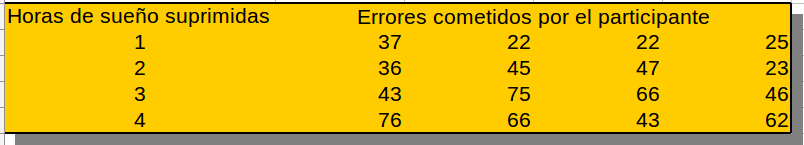

## Contenido
{: .no_toc}

* ToC
{: toc}

## Taller individual 1

Se realizó un experimento en donde a un grupo de 16 personas se les
asignó al azar suprimir, 1, 2, 3 y 4 horas de sueño.

Luego se les realizó la misma prueba de desempeño de atención y 
vigilancia a todos los participantes y se contabilizó el 
número de errores cometidos por cada persona.

Los resultados de las 16 personas se muestra en la siguiente tabla:

### Actividades:

1. Construir una base de datos en excel apropiada para ser leída por el R.
2. Convertir al formato ".csv".
3. Constuir un guión o script en donde:
  - Se lea la base de datos
  - Se muestre una resumen numérico de los resutados.
  - Se muestre una gráfica de los resultados del experimento.
4. Realizar un informe en formato ".pdf" que muestre y comente los
   resultados obtenidos.
   
### Documentos a entregar:
1. Archivo en formato ".csv" para la lectura en R.
2. Archivo ".R" con las instrucciones de R comentadas.
3. Archivo en formato ".pdf" con el informe que incluya los resultados
   numéricos y la gráfica obtenida, además del las conlusiones y
   recomendaciones.

### Fecha de entrega:
Jueves 11 de Febrero de 2016 antes de las 23:59 hora de Colombia,
al correo **krcabrer@unal.edu.co** en asunto colocar **[MEDE]**.

## Taller individual 2

- [Taller individual 2](./talleres/horas_sueño.html){:target="_blank"}

