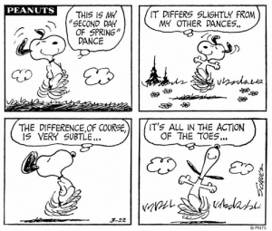

Introducción al R (Parte I)
========================================================
author: Kenneth Cabrera
date: miércoles, 18 de septiembre de 2019
height: 800


Breve historia
========================================================
- El R es un dialecto del lenguaje S.
- El S fue desarrollado por John Chambers.
- El S fue hecho incialmente para las bibliotecas en Frotran.
- En 1988 el sistema se reescribió en C
  y es la base o núcleo del R actual
  (se denomina versión 3 del lenguaje). El libro asociado
  es el "libro blanco" (white book) "Statistical Models in S".
- La versión 4 se liberó en 1998. El libro asociado es
  es el "libro verde" (green book) "Programming with Data" y
  es la versión sobre el cual R ha construido las modificaciones.

Notas históricas del S
========================================================
* En 1993 los laboratorios Bell le otorgó a StatSci (ahora
  la empresa se llama Insightful Corp.) una licencia para desarrollar
  y vender el S.
* En el 2004 Insightful le compró el lenguaje S a Lucent por
  dos millones de dólares.
* Insightful construyó una plataforma GUI y actualmente el producto
  se denomina S-PLUS, y el "PLUS" es por esta plataforma.
* En el 2008 Insightful fue comprada por TIBCO por 25 millones de dólares.
* El el 2018 TIBCO lanza TERR, un intérprete de R.

Notas históricas del R
========================================================
- 1991: Creado en Nueva Zelandia or Ross Ihaka y Robert Gentleman.
  Publica el artículo en 1996 en la revista JCGS (Journal of
  Computational and Graphical Statistics).
- 1993: Anuncio del R al público.
- 1995: Martin Mächler convenció a Ross y a Robert pasarlo a GNU.
- 1997: Se formó el grupo núcleo del R (The R Core Group).
  Administra el código fuente del R.
- 2000: Versión 1.0.0, 2004: Versión 2.0.0., 2013: Versión 3.0.0.
- Se liberó la versión 3.6.1 el viernes 5 de julio de 2019,
  denominada "Action of the Toes".

Sobrenombre de versiones del R (3.4.3)
========================================================

"Kite-Eating Tree" (R version 3.4.3.)


Sobrenombre de versiones del R (3.4.4)
========================================================
"Someone to Lean On" (R version 3.4.4)


Sobrenombre de versiones del R (3.5.0)
========================================================
"Joy in Playing" (R version 3.5.0)


Sobrenombre de versiones del R (3.5.2)
========================================================
"Eggshell Igloo" (R version 3.5.2)


Sobrenombre de versiones del R (3.6.1)
========================================================
"Action of the Toes" (R version 3.6.1)




Descarga del R
========================================================

La versión para windows se puede descargar de este
enlace: [Lenguaje estadístico R](http://cran.r-project.org/bin/windows/base/)

Es altamente recomendable integrarlo con la interfaz
RStudio que se puede descargar de:
[RStudio](http://www.rstudio.com/products/rstudio/download/)

Características principales del R
========================================================
- Sintaxis similar al S.
- Semántica superficialmente simila al S.
- Ejecuta casi en toda plataforma.
- Desarrollo en constante actividad.
- Útil para trabajo interactivo.
- Es libre (gratis y abierto).

Desventajas
========================================================
- Basado en tecnología de hace 40 años.
- No soporta muy bien gráficas 3D. (Aunque tiene paquetes que
  maneja de manera aceptable gráficas 3D).
- La funcionalidad se base en la demanda del consumidor.
  Usted necesita hacer lo que otros no hacen.
- Los objetos se almacenan en memoria, por lo tanto
  demanda mucha memoria RAM.
- No sirve para todo.


Náufrago I
========================================================


Náufrago II
========================================================


Náufrago III
========================================================


Paquetes princiales
========================================================

- El sistema básico o base el el paquete **base**.
- El sistema básico incluye paquetes como el **utils**,
  **stats**, **datasets**, **graphics**, **parallel** y otros.
- Paquete de paquetes de utilidades complementarias **tidyverse**.
- Paquetes recomendados  **boot**, **class**, **cluster**,
  **ggplot2**, **KernSmooth**, **nlme**, **nnet**, y otros.

Paquetes adicionales
========================================================
* Existen a la fecha más o menos 14589
  [paquetes](https://cran.r-project.org/web/packages/index.html)
  en el CRAN y contando.
  
  Esta instrucción en R permite mostar el número de paquetes
  diponibles a la fecha. 
  
```
   nrow(available.packages())
```
  
* Hay proyectos independientes pero basados en R, como el Bioconductor
  (http://bioconductor.org).
* Algunos tienen desarrollos en su propia página por lo
  tanto es más difícil de seguirles el rastro.


