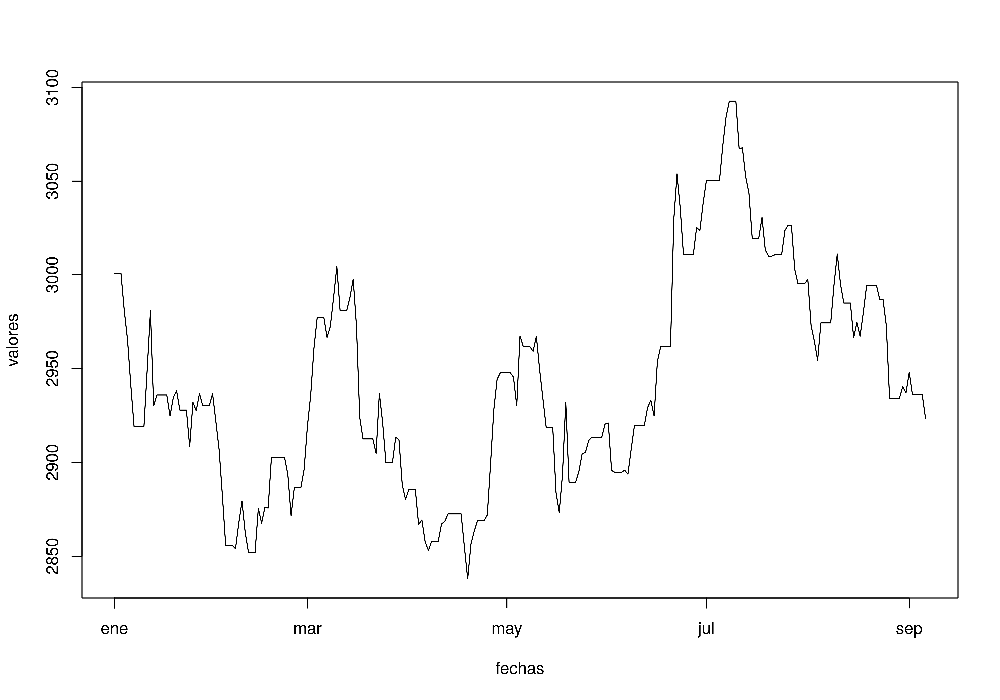
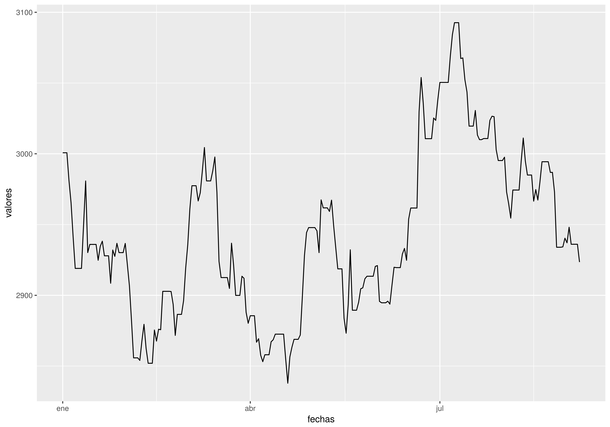

Lectura/Escritura en R
========================================================
author: Kenneth Cabrera
date: 06 septiembre, 2017
transition: rotate
width: 1440
height: 900


Modos de texto I
========================================================
- `dumping` y `dputing` son útiles porque el archivo que resulta es en
   un formato que se puede corregir, y en caso de que el archivo se
   degrade, potencialmente se puede recuperar.
- A diferencia de escribir los resultados en una tabla o en un formato
  `csv`, `dump` y `dput` mantiene la información de `metadatos`
  (sacrificando algo de legibilidad), de tal manera que otro usuario no
  tendría que reconstruir el objeto de nuevo.

Modos de texto II
========================================================
- Los modos de texto funcionan mejor para interactuar con programas que
  llevan el seguimiento de cambios de archivo tipo texto.
- Este modo sigue la "filosofía linux" en lo que respecta a archivos.
- Desventaja: No es eficiente en el uso del espacio.

Ejemplo I
========================================================

```r
lista1 <- list(sarta = "Hola, buen día", matriz = matrix(1:6, 2, 3))
dput(lista1, file = "archivoLista.R")
lista2 <- dget("archivoLista.R")
lista2
```

```
$sarta
[1] "Hola, buen día"

$matriz
     [,1] [,2] [,3]
[1,]    1    3    5
[2,]    2    4    6
```

Ejemplo II
========================================================

```r
x <- "un objeto"
y <- data.frame(a = 6:1, b = letters[6:1])
dump(c("x", "y"), file = "datos.R")
rm(x, y)
source("datos.R")
y
```

```
  a b
1 6 f
2 5 e
3 4 d
4 3 c
5 2 b
6 1 a
```

```r
x
```

```
[1] "un objeto"
```

Interfaces al mundo exterior
========================================================
- `file`, abre una conexión a algún archivo.
- `gzfile`, abre una conexión a un archivo comprimido con gzip.
- `bzfile`, abre una conexión a un archivo comprimido con bzip2.
- `url`, abre una conexión a una página web.

Conexión tipo "file"
========================================================
```
str(file)
```
- `description` es el nombre del archivo.
- `open` es un código que indica
   * `r` solo lectura.
   * `w` escritura (inicia un nuevo archivo).
   * `a` adición a un archivo.
   * `rb`, `rb`, `ab`, lectura, escritura y adición en modo binario
     (únicamente en `windows`)

Conexiones
========================================================
```
con <- file("foo.txt", "r")
datos <- read.csv(con)
close(con)
```

equivale a:
```
datos <- read.table("foo.txt")
```

Lectura de una página web.
========================================================

```r
urlbTRM <- readLines("url_banrep_trm.txt")
urlbTRM
```

```
[1] "http://obiee.banrep.gov.co/analytics/saw.dll?Go&NQUser=publico&NQPassword=publico&Path=/shared/Consulta%20Series%20Estadisticas%20desde%20Excel/1.%20Tasa%20de%20Cambio%20Peso%20Colombiano/1.1%20TRM%20-%20Disponible%20desde%20el%2027%20de%20noviembre%20de%201991/1.1.1%20Serie%20historica&Options=rdf"
```

```r
con <- url(urlbTRM, "r")
x <- readLines(con)
close(con)
```

```
head(x, 200)
tail(x, 200)
```


Recuperar el valor de la TRM desde enero 1 hasta hoy
========================================================

```r
require(stringr)
fechas <- str_extract(x, "[0-9]{2}/[0-9]{2}/[0-9]{4}")
valores <- str_extract(x, "[0-9]\\.[0-9]{3}\\,[0-9]{2}")
fechas <- fechas[!is.na(fechas)]
fechas <- as.POSIXct(strptime(fechas, format = "%d/%m/%Y"))
valores <- valores[!is.na(valores)]
valores <- str_replace(valores, "[.]","")
valores <- as.numeric(str_replace(valores, "[,]","."))
trm <- data.frame(fechas, valores)
```


```r
head(trm)
```

```
      fechas valores
1 2017-01-01 3000.71
2 2017-01-02 3000.71
3 2017-01-03 3000.71
4 2017-01-04 2981.06
5 2017-01-05 2965.36
6 2017-01-06 2941.08
```


Gráfica de la TRM hasta hoy I
========================================================
Con graficación básica

```r
plot(trm, type = "l")
```



Gráfica de la TRM hasta hoy II
========================================================
Con ggplot2

```r
require(ggplot2)
g1 <- ggplot(trm, aes(fechas, valores)) + geom_line()
g1
```




