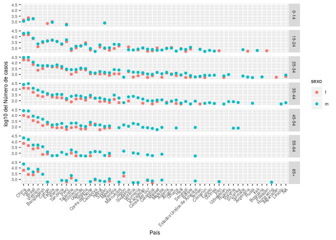

### Conjunto de biblotecas de funciones.


```r
library(tidyverse)
```

```
## ── Attaching packages ────────────────────────────────────────────────────────────────────────────────────── tidyverse 1.2.1 ──
```

```
## ✔ ggplot2 3.1.0     ✔ purrr   0.3.0
## ✔ tibble  2.0.1     ✔ dplyr   0.7.8
## ✔ tidyr   0.8.2     ✔ stringr 1.3.1
## ✔ readr   1.3.1     ✔ forcats 0.3.0
```

```
## ── Conflicts ───────────────────────────────────────────────────────────────────────────────────────── tidyverse_conflicts() ──
## ✖ dplyr::filter() masks stats::filter()
## ✖ dplyr::lag()    masks stats::lag()
```


### ¿Qué son datos ordenados ("tidy data")?

- Tener datos que faciliten el análisis.
- Es parte de la depuración o puesta a punto de las bases de datos.
- Los datos deberán facilitar la visualización, agregación y
  la modelación (por ejemplo, facilitar el uso de las funciones
  `lm()`, `ggplot()`, y `ddply()`).
- Es la teoría de bases de datos relacionales para estadísticos.

### Tabla de frecuencias

¿Cuántas variables hay en este conjunto de datos?

 | Genero / Estado | Embarazadas | No embarazada |
 | --- | --- |--- |
 | Masculino |  0 | 5 |
 | Femenino  |  1 | 4 |


### Base de datos

Estado | Género | Frecuencia
--- | --- | ---
no | Femenino | 4
no | Masculino | 5
si | Femenino | 1
si | Masculino | 0

### Convención 

Almacenamiento | Significado
--- | ---
Tabla / Archivo | Base de datos 
Filas | Observaciones
Columnas | Variables

### Causas base de datos no adecuadas

- Los encabezados de las columnas, son valores, no variables.
- Varias variables se almacenas en una columna.
- Las variables se almacenas tanto en filas como columnas.
- Múltiples tipos de unidades experimentales se almacenas en las misma tabla.
- Un tipo de unidad experimental se almacena en multiples tablas.


### Ejemplo de una base de datos con problemas

![alt text][id1]


```r
relig <- read.delim("religions.csv", check.names = F, sep = ";",
                    stringsAsFactors = F)
relig
```

```
##                   religion <$10k $10-20k $20-30k $30-40k $40-50k $50-75k
## 1                 Agnostic    27      34      60      81      76     137
## 2                  Atheist    12      27      37      52      35      70
## 3                 Buddhist    27      21      30      34      33      58
## 4                 Catholic   418     617     732     670     638    1116
## 5       Don’t know/refused    15      14      15      11      10      35
## 6         Evangelical Prot   575     869    1064     982     881    1486
## 7                    Hindu     1       9       7       9      11      34
## 8  Historically Black Prot   228     244     236     238     197     223
## 9        Jehovah's Witness    20      27      24      24      21      30
## 10                  Jewish    19      19      25      25      30      95
## 11           Mainline Prot   289     495     619     655     651    1107
## 12                  Mormon    29      40      48      51      56     112
## 13                  Muslim     6       7       9      10       9      23
## 14                Orthodox    13      17      23      32      32      47
## 15         Other Christian     9       7      11      13      13      14
## 16            Other Faiths    20      33      40      46      49      63
## 17   Other World Religions     5       2       3       4       2       7
## 18            Unaffiliated   217     299     374     365     341     528
```

Ordenar la base de datos.


```r
#library(tidyr)
relig2 <- relig %>% 
  gather(key = ingresos, value = frecuencia, -religion)
head(relig2)
```

```
##             religion ingresos frecuencia
## 1           Agnostic    <$10k         27
## 2            Atheist    <$10k         12
## 3           Buddhist    <$10k         27
## 4           Catholic    <$10k        418
## 5 Don’t know/refused    <$10k         15
## 6   Evangelical Prot    <$10k        575
```

### Otro caso más elaborado

Lectura de la base de datos original.

Se trata de una base de datos de la OMS, sobre
casos de un nuevo brote de tuberculosis en el mundo.

En este caso:
- *iso2*: Sigla del país.
- *year*: Año.
- *new_sp*: Total de caso de la nueva especie.
- *m*: Género masculino.
- *f*: Género femenino.
- *04*: Rango de edad 0-4 años.
- *65*: Mayor de 65 años.
- *u*: Desconocido.


```r
crudo <- read.csv("tb.csv", na.strings = "",
                    stringsAsFactors = F)
head(crudo,20)
```

```
##    iso2 year new_sp new_sp_m04 new_sp_m514 new_sp_m014 new_sp_m1524
## 1    AD 1989     NA         NA          NA          NA           NA
## 2    AD 1990     NA         NA          NA          NA           NA
## 3    AD 1991     NA         NA          NA          NA           NA
## 4    AD 1992     NA         NA          NA          NA           NA
## 5    AD 1993     15         NA          NA          NA           NA
## 6    AD 1994     24         NA          NA          NA           NA
## 7    AD 1996      8         NA          NA           0            0
## 8    AD 1997     17         NA          NA           0            0
## 9    AD 1998      1         NA          NA           0            0
## 10   AD 1999      4         NA          NA           0            0
## 11   AD 2000      1         NA          NA           0            0
## 12   AD 2001      3         NA          NA           0           NA
## 13   AD 2002      2         NA          NA           0            0
## 14   AD 2003      7         NA          NA           0            0
## 15   AD 2004      3         NA          NA           0            0
## 16   AD 2005      5          0           0           0            0
## 17   AD 2006      8          0           0           0            1
## 18   AD 2007      2         NA          NA          NA           NA
## 19   AD 2008      3          0           0           0            0
## 20   AE 1980     NA         NA          NA          NA           NA
##    new_sp_m2534 new_sp_m3544 new_sp_m4554 new_sp_m5564 new_sp_m65
## 1            NA           NA           NA           NA         NA
## 2            NA           NA           NA           NA         NA
## 3            NA           NA           NA           NA         NA
## 4            NA           NA           NA           NA         NA
## 5            NA           NA           NA           NA         NA
## 6            NA           NA           NA           NA         NA
## 7             0            4            1            0          0
## 8             1            2            2            1          6
## 9             0            1            0            0          0
## 10            0            1            1            0          0
## 11            1            0            0            0          0
## 12           NA            2            1           NA         NA
## 13            0            1            0            0          0
## 14            0            1            2            0          0
## 15            0            1            1            0          0
## 16            1            1            0            0          0
## 17            1            2            0            1          1
## 18           NA           NA           NA           NA         NA
## 19            0            0            1            0          0
## 20           NA           NA           NA           NA         NA
##    new_sp_mu new_sp_f04 new_sp_f514 new_sp_f014 new_sp_f1524 new_sp_f2534
## 1         NA         NA          NA          NA           NA           NA
## 2         NA         NA          NA          NA           NA           NA
## 3         NA         NA          NA          NA           NA           NA
## 4         NA         NA          NA          NA           NA           NA
## 5         NA         NA          NA          NA           NA           NA
## 6         NA         NA          NA          NA           NA           NA
## 7         NA         NA          NA           0            1            1
## 8         NA         NA          NA           0            1            2
## 9         NA         NA          NA          NA           NA           NA
## 10        NA         NA          NA           0            0            0
## 11        NA         NA          NA          NA           NA           NA
## 12        NA         NA          NA          NA           NA           NA
## 13        NA         NA          NA           0            1            0
## 14        NA         NA          NA           0            1            1
## 15        NA         NA          NA           0            0            1
## 16         0          0           0           0            1            1
## 17         0          0           0           0            0            1
## 18        NA         NA          NA          NA           NA            1
## 19         0          0           0           0            0            0
## 20        NA         NA          NA          NA           NA           NA
##    new_sp_f3544 new_sp_f4554 new_sp_f5564 new_sp_f65 new_sp_fu
## 1            NA           NA           NA         NA        NA
## 2            NA           NA           NA         NA        NA
## 3            NA           NA           NA         NA        NA
## 4            NA           NA           NA         NA        NA
## 5            NA           NA           NA         NA        NA
## 6            NA           NA           NA         NA        NA
## 7             0            0            1          0        NA
## 8             3            0            0          1        NA
## 9            NA           NA           NA         NA        NA
## 10            1            0            0          0        NA
## 11           NA           NA           NA         NA        NA
## 12           NA           NA           NA         NA        NA
## 13            0            0            0          0        NA
## 14            1            0            0          0        NA
## 15            0            0            0          0        NA
## 16            1            0            0          0         0
## 17            0            1            0          0         0
## 18           NA            1           NA         NA        NA
## 19            1            1            0          0         0
## 20           NA           NA           NA         NA        NA
```

Una primera depuración para mejorar la presentación de la base de datos
y seleccionar sólo un año.


```r
crudo <- crudo %>%
  select(-new_sp)

crudo <- crudo %>%
  filter(year == 2000)

crudo <- crudo %>%
  rename(pais = iso2)

names(crudo) <- str_replace(names(crudo), "new_sp_", "")

crudo <- crudo %>%
  select(-one_of("m04", "m514", "f04", "f514"))

head(crudo, 20)
```

```
##    pais year m014 m1524 m2534 m3544 m4554 m5564  m65 mu f014 f1524 f2534
## 1    AD 2000    0     0     1     0     0     0    0 NA   NA    NA    NA
## 2    AE 2000    2     4     4     6     5    12   10 NA    3    16     1
## 3    AF 2000   52   228   183   149   129    94   80 NA   93   414   565
## 4    AG 2000    0     0     0     0     0     0    1 NA    1     1     1
## 5    AL 2000    2    19    21    14    24    19   16 NA    3    11    10
## 6    AM 2000    2   152   130   131    63    26   21 NA    1    24    27
## 7    AN 2000    0     0     1     2     0     0    0 NA    0     0     1
## 8    AO 2000  186   999  1003   912   482   312  194 NA  247  1142  1091
## 9    AR 2000   97   278   594   402   419   368  330 NA  121   544   479
## 10   AS 2000   NA    NA    NA    NA     1     1   NA NA   NA    NA    NA
## 11   AT 2000    1    17    30    59    42    23   41 NA    1    11    22
## 12   AU 2000    3    16    35    25    24    19   49 NA    0    15    19
## 13   AZ 2000    0     9    24    33    42    30    0 NA    0     3     3
## 14   BA 2000    4    56    82    99    66    58   77 NA    4    30    46
## 15   BB 2000    0     0     0     2     0     0    0 NA    0     0     1
## 16   BD 2000  256  3640  5643  5750  4718  3667 2837 NA  495  3029  3238
## 17   BE 2000    3    20    57    39    55    32   56 NA    6    15    15
## 18   BF 2000   12    91   274   252   133    68   65 NA    7    59   128
## 19   BG 2000    0    13    16    20     3     9   10 NA    0    11    14
## 20   BH 2000    0     0     3     2     5     3    4 NA    0     1     2
##    f3544 f4554 f5564 f65 fu
## 1     NA    NA    NA  NA NA
## 2      3     0     0   4 NA
## 3    339   205    99  36 NA
## 4      0     0     0   0 NA
## 5      8     8     5  11 NA
## 6     24     8     8   4 NA
## 7      0     0     1   0 NA
## 8    844   417   200 120 NA
## 9    262   230   179 216 NA
## 10    NA     1    NA  NA NA
## 11    12    11     6  22 NA
## 12    12    15     5  14 NA
## 13     6     3     0   0 NA
## 14    29    29    48 124 NA
## 15     0     0     0   0 NA
## 16  2247  1315   778 370 NA
## 17    19     4    13  27 NA
## 18   101    45    38  14 NA
## 19     7     3     4   6 NA
## 20     0     1     1   1 NA
```

Adecuación de la base de datos con respecto a las variables
que se quieren determinar.


```r
limpio <- crudo %>%
  gather(key = columna, value = casos, m014:fu) %>%
  rename(año = year)
  

head(limpio,20)
```

```
##    pais  año columna casos
## 1    AD 2000    m014     0
## 2    AE 2000    m014     2
## 3    AF 2000    m014    52
## 4    AG 2000    m014     0
## 5    AL 2000    m014     2
## 6    AM 2000    m014     2
## 7    AN 2000    m014     0
## 8    AO 2000    m014   186
## 9    AR 2000    m014    97
## 10   AS 2000    m014    NA
## 11   AT 2000    m014     1
## 12   AU 2000    m014     3
## 13   AZ 2000    m014     0
## 14   BA 2000    m014     4
## 15   BB 2000    m014     0
## 16   BD 2000    m014   256
## 17   BE 2000    m014     3
## 18   BF 2000    m014    12
## 19   BG 2000    m014     0
## 20   BH 2000    m014     0
```


```r
limpio <- limpio %>% 
  arrange(pais, columna, año)
head(limpio,20)
```

```
##    pais  año columna casos
## 1    AD 2000    f014    NA
## 2    AD 2000   f1524    NA
## 3    AD 2000   f2534    NA
## 4    AD 2000   f3544    NA
## 5    AD 2000   f4554    NA
## 6    AD 2000   f5564    NA
## 7    AD 2000     f65    NA
## 8    AD 2000      fu    NA
## 9    AD 2000    m014     0
## 10   AD 2000   m1524     0
## 11   AD 2000   m2534     1
## 12   AD 2000   m3544     0
## 13   AD 2000   m4554     0
## 14   AD 2000   m5564     0
## 15   AD 2000     m65     0
## 16   AD 2000      mu    NA
## 17   AE 2000    f014     3
## 18   AE 2000   f1524    16
## 19   AE 2000   f2534     1
## 20   AE 2000   f3544     3
```

Separación de la información contenida en una columna


```r
limpio <- limpio %>%
  mutate(sexo = str_sub(columna, 1, 1))

edades <- c("04"   = "0-4",    "514" = "5-14", 
            "014"  = "0-14",  "1524" = "15-24", 
            "2534" = "25-34", "3544" = "35-44", 
            "4554" = "45-54", "5564" = "55-64", 
            "65"   = "65+",      "u" = NA)

limpio <- limpio %>%
  mutate(edad = factor(edades[str_sub(columna, 2)], levels = edades))

limpio <- limpio %>%
  select(pais, año, sexo, edad, casos)

head(limpio, 20)
```

```
##    pais  año sexo  edad casos
## 1    AD 2000    f  0-14    NA
## 2    AD 2000    f 15-24    NA
## 3    AD 2000    f 25-34    NA
## 4    AD 2000    f 35-44    NA
## 5    AD 2000    f 45-54    NA
## 6    AD 2000    f 55-64    NA
## 7    AD 2000    f   65+    NA
## 8    AD 2000    f  <NA>    NA
## 9    AD 2000    m  0-14     0
## 10   AD 2000    m 15-24     0
## 11   AD 2000    m 25-34     1
## 12   AD 2000    m 35-44     0
## 13   AD 2000    m 45-54     0
## 14   AD 2000    m 55-64     0
## 15   AD 2000    m   65+     0
## 16   AD 2000    m  <NA>    NA
## 17   AE 2000    f  0-14     3
## 18   AE 2000    f 15-24    16
## 19   AE 2000    f 25-34     1
## 20   AE 2000    f 35-44     3
```

Lectura de la base de datos con los códigos de los paises.

```r
CodPaises <- read.csv("paises.csv", enc = "utf8")
head(CodPaises)
```

```
##       nombre        name         nom iso2 iso3 phone_code
## 1 Afganistán Afghanistan Afghanistan   AF  AFG         93
## 2    Albania     Albania     Albanie   AL  ALB        355
## 3   Alemania     Germany   Allemagne   DE  DEU         49
## 4    Algeria     Algeria     Algérie   DZ  DZA        213
## 5    Andorra     Andorra     Andorra   AD  AND        376
## 6     Angola      Angola      Angola   AO  AGO        244
```

Agregar el nombre del país a la base de datos


```r
limpio <- limpio %>%
  full_join(CodPaises, by = c("pais" = "iso2"))
```

```
## Warning: Column `pais`/`iso2` joining character vector and factor, coercing
## into character vector
```

```r
#limpio <- merge(limpio, CodPaises, by.x = "pais", by.y = "iso2")
```


```r
limpio2 <- limpio %>%
  filter(casos > 500)

CasosTotales <- limpio2 %>%
  group_by(nombre) %>%
  summarise(ncasos = sum(casos)) %>%
  arrange(desc(ncasos))

limpio2 <- limpio2 %>%
  mutate(nombre = factor(nombre, levels = as.character(CasosTotales$nombre)))

#limpio2$nombre <- factor(limpio2$nombre, levels = PaisXCasosTot)
```


```r
library(ggplot2)

# Gráfica de puntos
g1 <- ggplot(limpio2, aes(nombre, log10(casos), col = sexo))
g1 + geom_point() + facet_grid(edad ~ .) +
  theme(text = element_text(size = 8),
        axis.text.x = element_text(angle = 45, hjust = 1))+
  ylab("log10 del Número de casos") + xlab("País")
```

<!-- -->


```r
library(ggplot2)
# Gráfica de barras
g2 <- ggplot(limpio2, aes(nombre, log10(casos), fill = sexo))
g2 + geom_bar(stat = "identity", position = "dodge") + facet_grid(edad ~ .) +
  theme(text = element_text(size = 8),
        axis.text.x = element_text(angle = 45, hjust = 1)) +
  ylab("log10 del Número de casos") + xlab("País")
```

<!-- -->


[id1]: religiones.png "Religiones"
