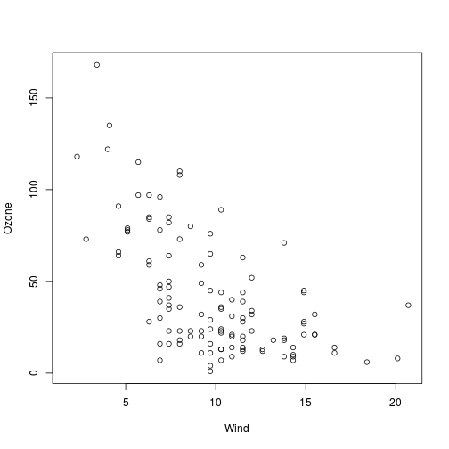
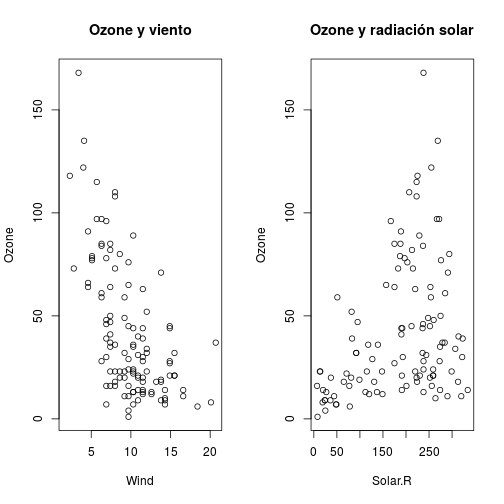
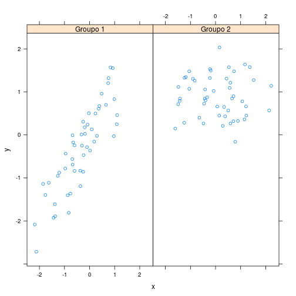
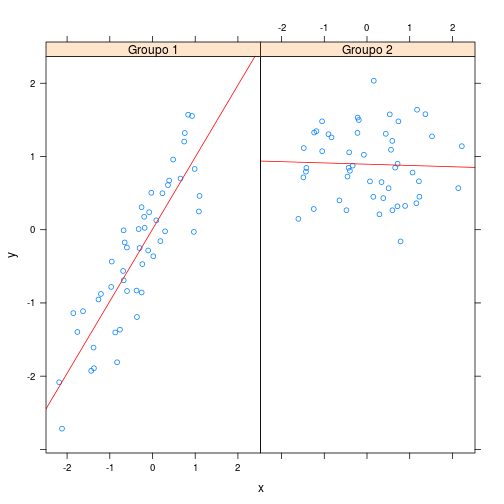

Graficación
========================================================
author: Kenneth Roy Cabrera Torres
date: miércoles, 04 de abril de 2018
width: 1440
height: 1000


Sistema de graficación básico
========================================================
Se ecapsula en los siguientes paquetes:
- *graphics*: `plot`, `hist`, `boxplot`, etc.
- *grDevices*: `X11`, `PDF`, `PostScript`, `PNG`, etc.

Realización de una gráfica I
========================================================
 Considere:
- ¿Donde se hará la gráfica?, ¿en la pantalla o en un archivo?
- ¿Cómo se usará la gráfica?
  + ¿Es la gráfica temporal para mostrar en pantalla?
  + ¿Será presentada en una página web?
  + ¿Será una gráfica para una publicación? ¿Será impresa?
  + ¿La usará en una presentación?

Realización de una gráfica II
========================================================
- ¿Son muchos los datos que se mostrarán en la gráfica?
  o ¿sólo unos pocos puntos?
- ¿Necesita que la gráfica cambie de tamaño dinámicamente?


Realización de una gráfica III
========================================================
- ¿Qué sistema de gráficas va a utilizar? básico, `lattice` o `ggplot2`.
  En general no se pueden mezclar estos sitemas.
  + El sistema básico construye la gráfica paso a paso, cada
    aspecto se contruye separademente.
  + El sistema `lattice` sólo usa una función donde se
    especifican todos los parámetros.
  + El sistema  `ggplot2` combina conceptos tanto del básico
    como del `lattice`.

Sistema básico I
========================================================
Es la forma más común.
- Se reliza median dos fases:
  + Se inicia una nueva gráfica.
  + Se le adiciona las anotaciones a una gráfica existente.
- Por ejemplo usando `plot(x, y)` o `hist(x)`, simpre abre
  una nueva gráfica. Y funciones como `lines(x, y)` o
  `points(x)` se adicionan a una gráfica ya existente.

Sistema básico II
========================================================
  - Si el `plot(x,y)` no es de una clase especial, se
    usa el plot por omisión. Tiene muchos argumentos,
    como título, etiqueta del eje `x`, etiqueta del eje `y`.
  - El sistema básico tiene mucho argumentos que se pueden
    cambiar o establecer. Véase `?par`.

Ejemplo I
========================================================


```r
require(datasets)
hist(airquality$Ozone)
```


Ejemplo II
========================================================

```r
require(datasets)
with(airquality, plot(Wind, Ozone))
```



Ejemplo III
========================================================

```r
require(datasets)
airquality <- transform(airquality, Month2 = factor(Month))
boxplot(Ozone ~ Month2, airquality, xlab = "Mes", ylab = "Ozono (ppmm)")
```


Parámetros importantes I
========================================================
Algunos parámetros los comparten varias funciones:
+ `pch`: El símbolo de la gráfica (por omisión un círculo abierto).
+ `lty`: Tipo de línea (por omisión sólida, punteada, etc.).
+ `lwd`: Grosor de la línea. Como un entero.
+ `col`: Color. Puede ser con un número, una sarta,
   un código hexadesimal. La función `colors()` muestra los
   nombres de los colores.
+ `xlab`, `ylab` y `main`: Etiqueta `x`, `y` y título.


Parámetros importantes II
========================================================
En la función `par()` se indican parámetros globales que afectan
una sesión de R. Algunos comunes son:
- `las`: La orientación de las etiquetas con respecto al eje
   de la gráfica.
- `bg`: El color de fondo.
- `mar`: Tamaño de la márgen.
- `oma`: Tamaños de la márgen exterior.
- `mfrow` `mfcol`: Número de gráfica por fila y columa.

Parámetros importantes III
========================================================
Valores por omisión de algunos parámetros

```r
par("lty")
```

```
[1] "solid"
```

```r
par("col")
```

```
[1] "black"
```

```r
par("pch")
```

```
[1] 1
```

Parámetros importantes III
========================================================

```r
par("bg")
```

```
[1] "white"
```

```r
par("mar")
```

```
[1] 5.1 4.1 4.1 2.1
```

```r
par("mfrow")
```

```
[1] 1 1
```

Funciones de graficación básicas
========================================================

+ `plot`: Diagrma de dispersión.
+ `lines`: Adiciona líneas. Conecta puntos.
+ `points`: Adiciona puntos.
+ `text`: Adiciona texto en coordenadas `x`, `y`.
+ `title`: Adiciona título, subtítulo, etiquetas.
+ `mtext`: Adiciona téxto a las márgenes (interiores y exteriores)
+ `axis`: Adciciona aspectos a los ejes.


Gráfica con "anotación" I
========================================================

```r
require(datasets)
with(airquality, plot(Wind, Ozone))
title(main = "Ozono y viento en la ciudad de Nueva York")
```


Gráfica con "anotación" II
========================================================

```r
require(datasets)
with(airquality, plot(Wind, Ozone, main = "Ozono y viento en la ciudad de Nueva York"))
with(subset(airquality, Month == 5), points(Wind, Ozone, col = "blue"))
```


Gráfica con "anotación" III
========================================================

```r
with(airquality, plot(Wind, Ozone, main = "Ozono y viento en la ciudad de Nueva York", xlab = "Velocidad del viento (Mph)", ylab = "Ozono (ppmm)",
type = "n"))
with(subset(airquality, Month == 5), points(Wind, Ozone, col
 = "blue"))
with(subset(airquality, Month != 5), points(Wind, Ozone, col
 = "red"))
legend("topright", pch = 1, col = c("blue", "red"), legend =
 c("Mayo", "Demás meses"))
```


Con una recta de regresión
========================================================

```r
with(airquality, plot(Wind, Ozone, main = "Ozono y viento en la ciudad de Nueva York",
pch = 20))
modelo <- lm(Ozone ~ Wind, airquality)
abline(modelo, lwd = 2)
```


Múltiples gráficas I
========================================================

```r
op <- par(no.readonly = TRUE)
par(mfrow = c(1, 2))
with(airquality, {
plot(Wind, Ozone, main = "Ozone y viento")
plot(Solar.R, Ozone, main = "Ozone y radiación solar")
})
```



```r
par(op)
```

Múltiples gráficas II
========================================================

```r
op <- par(no.readonly = TRUE)
par(mfrow = c(1, 3), mar = c(4, 4, 2, 1), oma = c(0, 0, 2, 0))
with(airquality, {
plot(Wind, Ozone, main = "Ozone y viento")
plot(Solar.R, Ozone, main = "Ozone y radiación solar")
plot(Temp, Ozone, main = "Ozone y temperatura")
mtext("Ozono y clima en la ciudad de Nueva York", outer = TRUE)
})
```


```r
par(op)
```

Graficación con "lattice"
========================================================
Se utilizan los siguientes paquetes:
- `lattice`: Produce gráficas tipo Trellis, que son
  independientes del modo básico. Ejemplo `xyplot`,
  `bwplot`, `levelplot`.
- `grid`: Es el sistema sobre el cual el lattice
  se construye. Ráramente se utilizan sus funciones.
- No tiene la forma de "dos fases".
- Las anotaciones se hacen al mismo tiempo al llamar
  la gráfica.

Funciones de "lattice" I
========================================================
- `xyplot`: Esta es la función principal.
- `bwplot`: Caja y bigotes.
- `histogram`:
- `stripplot`: Como uno de caja y bigotes pero con puntos.
- `dotplot`: Diagrama de puntos.
- `splom`: Una matriz de gráficas.
- `levelplot`, `countourplot`: Para datos de imágenes.

Funciones de "lattice" II
========================================================

```r
xyplot(y ~ x | f * g, data)
```
- Se usa la notación de fórmula, por eso la `~`.
- En el lado izquierdo el eje `y` y en el lado
  derecho el eje `x`.
- `f` y `g` son variables condicionales (generalmente factores).
- `data` Es la base de datos en donde están las variables.


Ejemplo "lattice" I
========================================================

```r
require(lattice)
require(datasets)
xyplot(Ozone ~ Wind, data = airquality)
```


Ejemplo "lattice" II
========================================================

```r
require(datasets)
require(lattice)
airquality <- transform(airquality, Month2 = factor(Month))
xyplot(Ozone ~ Wind | Month2, data = airquality, layout = c(5, 1))
```


Comportamiento de "lattice" I
========================================================
- La gráficas básicas se depliegan directamente al
  dispositivo (`device`) ya sea la pantalla, un archivo
  PDF, etc.
- Las funciones `lattice` devuelven un objeto tipo *trellis*.
- Estos objetos se pueden guardar y luego imprimir.
- Cuando se utilizan los comando `lattice` en la consola
  los resultados se "autoimprimen".

Comportamiento de "lattice" II
========================================================

```r
p <- xyplot(Ozone ~ Wind, data = airquality)
 ## No muestra nada.
print(p) ## Se muestra la gráfica.
```


========================================================

```r
xyplot(Ozone ~ Wind, data = airquality) ## Se autoimprime
```


Funciones de panel de "lattice" I
========================================================
- La función panel controla lo que pasa en cada uno
  de los páneles de la gráfica.
- El paquete `lattice` viene con funciones de panel
  por omisión, pero uno puede construir funciones propias.
- Las funciones panel reciben las coordenadas `x` y `y` junto
  con otros parámetros.

Funciones de panel de "lattice" II
========================================================

```r
set.seed(10)
x <- rnorm(100)
f <- rep(0:1, each = 50)
y <- x + f - f * x + rnorm(100, sd = 0.5)
f <- factor(f, labels = c("Groupo 1", "Groupo 2"))
xyplot(y ~ x | f, layout = c(2, 1)) ## Gráfica con dos páneles
```



Funciones de panel de "lattice" III
========================================================

```r
## Custom panel function
xyplot(y ~ x | f, panel = function(x, y, ...) {
panel.xyplot(x, y, ...) ## Llamado a la función xyplot
panel.abline(h = median(y), lty = 2) ## Adcionar una línea horizontal para la mediana
})
```


Funciones de panel de "lattice" IV
========================================================

```r
xyplot(y ~ x | f, panel = function(x, y, ...) {
panel.xyplot(x, y, ...) ## Llamado a la función xyplot
panel.lmline(x, y, col = 2) ## Una línea de regresión
})
```



