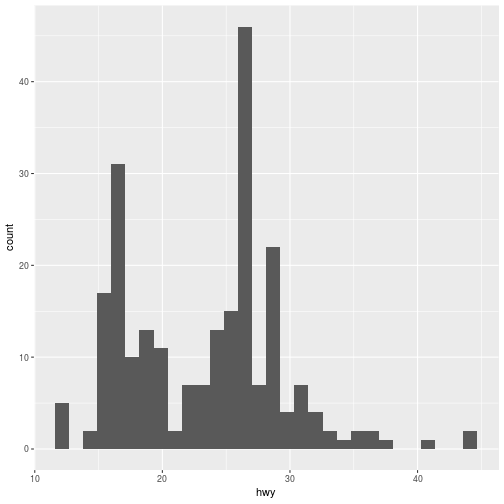
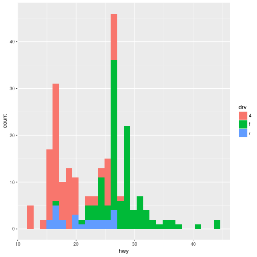
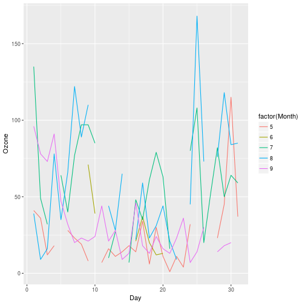

<style type="text/css">
.small-code pre code {
   font-size: 1.1em;
}
</style>

ggplot2
========================================================
author: Kenneth Roy Cabrera Torres
date: domingo, 16 de abril de 2017
width: 1500
height: 1000

¿Qué es ggplot2? I
========================================================
- Es una construcción de la "Gramática de las gráficas" (Grammar Graphics) propuesta por Leland Wilkinson.
- Escrito por Hadley Wickham (como estudiante de Iowa State).
- Está disponible en CRAN y se installa como un paquete del CRAN.

¿Qué es ggplot2? II
========================================================
* La gramática de las gráficas representa una abtracción de gráficas e ideas.
* Similar a pensar en "verbos", "sustantivos" y "adjetivos" para las gráficas.
* La teoría propone una construcción de gráficas mediante una sucesión de elementos similar a un lenguaje.
* La idea es acortar la distancia entre lo que se piensa y lo que se grafica.

¿Qué es ggplot2? III
========================================================
"En resumen, la gramática nos dice que una gráfica estadística es un mapa de los datos a unos atributos estéticos (color, forma, tamaño) de unos objetos geométricos (puntos, lineas, barras). La gráfica tendrá transformaciones estadísticas que se trazan en sistemas de coordenadas específicas"

Del libro "ggplot2"

La función qplot()
========================================================
- Trabaja similar a la función *plot* en el sistema básico.
- Se le indica una base de datos, unos elementos *estéticos* y
  una *geometría*.
- Se recomienda trabajar con la composición para tener más dominio de la gramática.

Paquete ggplot2
========================================================

```r
require(ggplot2)
```


Base de datos
========================================================

```r
help(mpg)
str(mpg)
head(mpg)
```


Primera gráfica
========================================================

```r
g1 <- ggplot(mpg, aes(displ, hwy))
g1 + geom_point()
```


Segunda gráfica
========================================================

```r
g1 <- ggplot(mpg, aes(displ, hwy, col = drv))
g1 + geom_point()
```


Adición de una "geom_"
========================================================

```r
g1 <- ggplot(mpg, aes(displ, hwy))
g1 + geom_point() + geom_smooth()
```


Histograma
========================================================

```r
g1 <- ggplot(mpg, aes(hwy))
g1 + geom_histogram()
```



Histogramas
========================================================

```r
g1 <- ggplot(mpg, aes(hwy, fill = drv))
g1 + geom_histogram()
```



Facetas (páneles) I
========================================================

```r
g1 <- ggplot(mpg, aes(displ, hwy))
g1 + geom_point() + facet_grid( . ~ drv)
```


Facetas (páneles) II
========================================================

```r
g1 <- ggplot(mpg, aes(displ, hwy))
g1 + geom_point() + facet_grid( drv ~ .)
```


Facetas (páneles) III
========================================================

```r
g1 <- ggplot(mpg, aes(hwy))
g1 + geom_histogram() + facet_grid( drv ~ .)
```


Calidad del aire
========================================================

```r
require(dataset)
require(airquality)
help(airquality)
str(airquality)
head(airquality)
```


Calidad del aire I
========================================================

```r
require(ggplot2)
g1 <- ggplot(airquality, aes(Ozone))
g1 + geom_histogram()
```


Calidad del aire II
========================================================

```r
require(ggplot2)
g1 <- ggplot(airquality, aes(Ozone, fill = factor(Month)))
g1 + geom_histogram()
```


Distribución
========================================================

```r
require(ggplot2)
g1 <- ggplot(airquality, aes(Ozone))
g1 + geom_density()
```


Distribuciones
========================================================

```r
require(ggplot2)
g1 <- ggplot(airquality, aes(Ozone, col = factor(Month)))
g1 + geom_density()
```


Diagrama de dispersión I
========================================================

```r
require(ggplot2)
g1 <- ggplot(airquality, aes(Day, Ozone))
g1 + geom_point()
```


Diagrama de dispersión II
========================================================

```r
require(ggplot2)
g1 <- ggplot(airquality, aes(Day, Ozone, shape=factor(Month)))
g1 + geom_point()
```


Series de tiempo I
========================================================

```r
require(ggplot2)
g1 <- ggplot(airquality, aes(Day, Ozone, col=factor(Month)))
g1 + geom_line()
```



Series de tiempo II
========================================================

```r
require(ggplot2)
g1 <- ggplot(subset(airquality, !is.na(Ozone)),
             aes(Day, Ozone, col=factor(Month)))
g1 + geom_line()
```


Series de tiempo III
========================================================

```r
require(ggplot2)
g1 <- ggplot(subset(airquality, !is.na(Ozone)),
             aes(Day, Ozone))
g1 + geom_line() + facet_grid(. ~ Month)
```


Series de tiempo IV
========================================================

```r
require(ggplot2)
g1 <- ggplot(subset(airquality, !is.na(Ozone)),
             aes(Day, Ozone))
g1 + geom_smooth() + facet_grid(. ~ Month) + geom_point()
```


Anotaciones I
========================================================
class: small-code

```r
require(ggplot2)
g1 <- ggplot(subset(airquality, !is.na(Ozone)),
             aes(Day, Ozone))
g1 + geom_smooth() +
     facet_grid(. ~ Month) +
     geom_point() +
     ggtitle("Comportamiento del ozono por mes") +
     xlab("Día") +
     ylab("Ozono (ppmm)")
```


Anotaciones II
========================================================
class: small-code

```r
require(ggplot2)
fecha1 <- as.Date(paste(with(airquality,seq(min(Month),max(Month))),"01"), format = "%m%d")
nombreMeses <- format(fecha1,"%B")
airquality <- transform(airquality, Mes = factor(Month, labels = nombreMeses))
g1 <- ggplot(subset(airquality, !is.na(Ozone)), aes(Day, Ozone))
g1 + geom_smooth() +
     facet_grid(. ~ Mes) +
     geom_point() +
     ggtitle(expression(paste("Comportamiento del ozono ",O[3]," por mes"))) +
     xlab("Día") + ylab(expression(paste(O[3], "(ppmm)")))
```


Anotaciones III
========================================================
class: small-code

```r
require(ggplot2)
fecha1 <- as.Date(paste(with(airquality,seq(min(Month),max(Month))),"01"), format = "%m%d")
require(Hmisc)
nombreMeses <- capitalize(format(fecha1,"%B"))
airquality <- transform(airquality, Mes = factor(Month, labels = nombreMeses))
g1 <- ggplot(subset(airquality, !is.na(Ozone)), aes(Day, Ozone))
g1 + geom_smooth() +
     facet_grid(. ~ Mes) +
     geom_point() +
     ggtitle(expression(paste("Comportamiento del ozono ",O[3]," por mes"))) +
     xlab("Día") + ylab(expression(paste(O[3], " (ppmm)")))
```


Estadísticas I
========================================================

```r
g1 <- ggplot(mtcars, aes(x = cyl, y = mpg, colour = factor(vs)))
g1 +  geom_point() +
  stat_summary(fun.y = mean, geom="line", size = 2)
```


Estadísticas II
========================================================

```r
g1 <- ggplot(mpg, aes(hwy))
g1 + stat_bin(aes(ymax = ..count..), geom = "area")
```


Estadísticas III
========================================================

```r
g1 <- ggplot(mpg, aes(hwy))
g1 + stat_bin(aes(size = ..density..), binwidth = 0.1,
              geom = "point", position = "identity")
```


Referencias
========================================================
- Página oficial del paquete (http://ggplot2.org).
- Página de recetas (http://www.cookbook-r.com/Graphs/).
- Referencia rápida (http://sape.inf.usi.ch/quick-reference/ggplot2).
- Foro de ayuda (http://groups.google.com/group/ggplot2).
- Foro de desarrollo (http://github.com/hadley/ggplot2).
