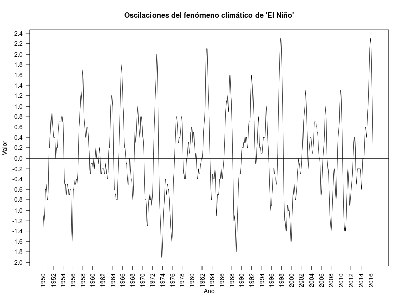

## Primer trabajo individual ("Fenómeno de El Niño")  

### Actividades
En la [página del NOAA](http://www.cpc.ncep.noaa.gov/products/analysis_monitoring/ensostuff/ensoyears.shtml)
 (National Oceanic and Atmospheric Administration) se
encuentra publicado un índice ambiental para determinar el grado de intensidad
del fenómeno de "El Niño" o de "La Niña" de acuerdo a datos atmosféricos en
el mundo.

Utilizando la [base de datos](./dbs/ENSO.csv) allí publicada mediante
sólo código en R, transformar la base de datos para mostrar una gráfica
similar a la siguiente, sólo desde el mes y año de su fecha de nacimiento:

### Documentos a entregar.
  - Documento en formato ".Rmd" con el código que realiza la lectura,
    transformación y graficación de la base de datos.
  - Informe ejecutivo en formato ".html" con únicamente la gráfica (sin código)
    y un breve comentario sobre el comportamiento del índice del fenómeno de
    "El Niño" y su impacto en Colombia.

### Fecha de entrega    

Miércoles 17 de agosto de 2016 antes de las 23:59 hora de Colombia al
correo **krcabrer@unal.edu.co** y no olvidar en asunto escribir la sigla,
entre corchetes **[ModuloR]**.

## Trabajo final ("Batalla naval").

### Objetivo
Constuir el juego de la batalla naval en el R.
En [esta página](http://es.battleship-game.org/) se puede encontrar un ejemplo del juego.

### Condiciones
En grupos de máximo seis (6) personas de debe constuir de manera que se puede
interactuar entre dos computadores conectados mediante un cable de red
tipo cruzado para conectar dos equipos directamente.

Se calificará con un ranking en orden desde el mejor juego.

Criterios de evaluación:

1. Si tiene animación.
2. Si toma tiempos de juego.
3. Dibujos y figuras interesantes.
4. Que permita armar el tablero de manera iteractiva.

#### Documentos a entregar.
 - Archivo en formato ".R" con el código del juego, junto con otros archivos
   de código en R, si son necesarios.
 - Archivo en ".pdf" donde indique cómo jugar el juego y como configurar los
   equipos y el programa para que funcione adecuadamente el juego.

### Fecha de entrega
 Viernes, 2 de septiembre en la hora de clase. Y los códigos y documentos
 a la dirección **krcabrer@unal.edu.co** antes de las 23:59 horas
 y no olvidar en asunto escribir la sigla, entre corchetes **[ModuloR]**.
