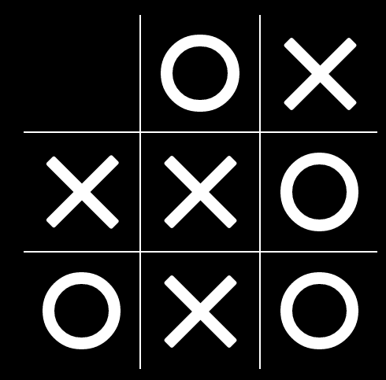

## Trabajo final (50% del módulo)

### Objetivo.
En grupo de tres o menos personas desarrollar el juego del
"triqui" o tick-tac-toe dinámico.

### Características mínimos del juego

1. Permitir que se alternen los dos jugadores.
2. Mostrar cuál jugador ganó si cumple que tienen su figura
   en línea de tres (horizontal, vertical o diagonal).
3. Una vez que los dos jugadores hayan puesto sus cuatro
   fichas, se alternan los jugadores moviendo sus fichas
   al espacio vacío hasta que alguno de los dos jugadores
   gane o hasta que el jugador oponente no pueda mover
   ninguna ficha, caso en el cual gana el jugador que logró
   bloquear al oponente o que puso tres fichas en línea.
4. El juego debe mostrar que las fichas tienen animación.

### Fecha de entrega

Jueves 14 de abril de 2016, en hora de clase en donde cada grupo
muestra al profesor el juego.

El grupo que presente el mejor programa tendrá una calificación de
5.0, y el segundo grupo será de 4.9 y así sucesivamente.

Sugerencias de mejoras al programa:

 - Que los jugadores pudena elegir tipos de fichas.
 - Que muestre una animación cuando se tengan las fichas en línea.
 - Que las fichas muestren animación junto con el movimiento.
 - Etc

Enviar el código documentado al correo **krcabrer@unal.edu.co**
