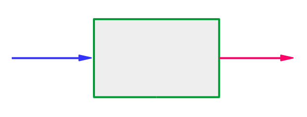
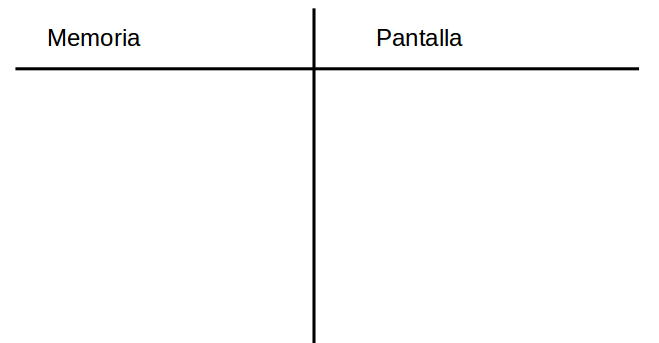
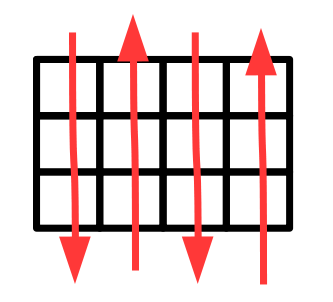
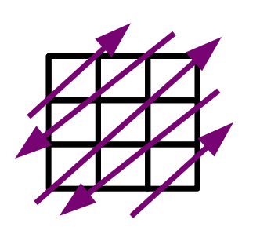

## Algoritmos

Un **algoritmo** es un conjunto finito de instrucciones que, si se
siguen rigurosamente, llevan a cabo una tarea específica.

Un algoritmo tiene las siguientes características:

  * **Entrada**: Entran cero o más valores.
  * **Salida**: Por lo menos produce un valor.
  * **Definido**: Cada instrucción es clara y no ambigua.
  * **Finito**: Si realizamos el seguimiento al algoritmo, entonces,
               en todos los casos, el algoritmo termina en un
               número finito de pasos.
  * **Efectivo**: Cada instrucción deberá ser tan básica que puede
               llevarse a cabo, en principio, por una persona, sólo
               usando lápiz y papel. No sólo la instrucción deberá
               ser definida sino también viable o factible.            



## Tipos y operaciones

1. Tipos de variables.
   - Booleano:
      * Sólo toma los valores de F o V (Falso o Verdadero)
   - Numéricos:
      * Entero.
      * Real.
   - Alfanuméricos:
      * Carácter.
      * Sarta.

2. Operaciones básicas.
   - Numéricos:
     * Enteros: +, -, * , div, mod, ^.
     * Reales: +, -, * , /, ^.

   - Alfanuméricos
     * \+ : concatenar
     * subsarta(s,ini,fin)
     * indice(s,c)

3. Relaciones de comparación:
    - \>  : mayor que
    - \>= : mayor igual que
    - <  : menor que
    - <= : menor igual que
    - == : igual
    - != : diferente

4. Conectivos lógicos:
   - Conjunción: &&
   - Disyunción: \|\|
   - Negación:   !

## Precedencia de operadores

   El orden de precedencia de mayor a menor es:

   - Potencia (^).
   - Producto, división, división entera y módulo.
   - Suma y diferencia
   - Mayor, mayor o igual, menor, menor o igual,
     igual y diferente que.
   - Conjunción (&&), disyunción (\|\|),
   - Negación (!).
   - Asignación.

   Si existen dos operadores con la misma precedencia,
   se ejecuta la operación de izquierda a derecha.

   Toda precedencia se puede modificar mediante los
   paréntesis:

   Ejemplo:

   ```
   a <- (3 ^ 2 + 100) ^ (1 / 2)
   ```

## Estructuras básicas

   - Asignación.

```   
    <var1> <- <operaciones>
```      
   - Entrada/Salida.

```   
      Lea <var1>, <var2>, ..., <varN>
      Escriba <var1>, <var2>, ..., <varN>
```      
   - Decisión.

```   
     si (<condicion>)
     Inicio
        <instruccion 1>
        <instruccion 2>
        .
        .
        .
        <instruccion n>                
     Fin
     sino
     Inicio
       <instruccion k+1>
       <instruccion k+2>
       .
       .
       .
       <instruccion k+n>                      
     Fin       
```      
   - Repetición.

```   
   mientras (<condicion>)
   Inicio
    <instruccion 1>
    <instruccion 2>
    .
    .
    .
    <instruccion n>                   
   Fin
```   

```
   Para (<var1> = <ini> hasta <fin>)
   Inicio
    <instruccion 1>
    <instruccion 2>
    .
    .
    .
    <instruccion n>                   
   Fin
```   

## Plantilla básica

Plantilla o esquema de la escritura en seudocódigo.

  - Escriba un algoritmo que lea dos números enteros y
    muestre la suma de ambos.

```
Algoritmo suma_enteros
  Entero num1, num2, suma

Inicio
  Escriba "Ingrese dos números enteros"
  Lea num1, num2
  suma <- num1 + num2
  Escriba "La suma de", num1, "y", num2, "es:", suma
Fin   
```

## Esquema de seguimiento o prueba de escritorio




## Vectores y matrices

 - Un vector es un arreglo de un único tipo de datos identificado
   por las posiciones de cada elemento en el arreglo.

```
 Entero vector[10]
```

 - Una matriz es un arreglo rectangular de cualquier tipo de datos y
   se identifica por las posiciones de fila y columna en el arreglo.

```
 Sarta matriz[10][10]
```

## Funciones

- Son subalgoritmos que realizan una tarea específica.
- Opcionalmente puede tener entradas, pero **siempre** deberá tener
  algún tipo de salida.
- Ejemplo:
  * Escriba un algoritmo, creando una función, que sume dos números
    enteros.

```
Algoritmo suma_enteros2
 Entero num1, num2, resultado

 Funcion entero suma_num(entero n1, entero n2)
   Entero suma
 Inicio
   suma <- n1 + n2
   retorne(suma)
 Fin

 Inicio
   Escriba "Entre dos números enteros"
   Lea num1, num2
   resultado <- suma_num(num1,num2)
   Escriba "La suma de", num1, "y", num2, "es:", resultado
 Fin
```

## Ejercicios

Escriba un algoritmo que:

 - Lea dos números enteros y que muestre el producto de ellos.
 - Lea dos números y que muestre el producto de ellos.
 - Lea el radio de un círculo y que muestre como respuesta su área.
 - Lea el nombre de una persona y le responda con un saludo.
 - Lea un número real y muestre el valor absoluto de mismo sin utilizar
   la estructura de decisión o repetición.
 - Lea las coordenadas de dos puntos y que muestre la distancias
   entre los dos puntos.
 - Lea un número entero y que muestre un cero (0) si el número es par y
   un uno (1) sin el número es impar, (Sin utilizar ni la estructura de
   decisión o la de repetición).
 - Lea un número entero y que muestre un uno (1) si el número es par y
   un cero (0) sin el número es impar, (Sin utilizar ni la estructura de
   decisión o la de repetición).   
 - Lea un número entero de tres cifras y muestre el mísmo número pero con
   los dígitos invertidos (sin utilizar el tipo sarta).   
 - Calcule la suma de los números impares por un lado y los números
   pares por otro entre dos números enteros dados (suponga que el primero
   es menor que el segundo, e inclya los número extremos en la suma).
 - Lea las tres coordenadas de los vértices de un tríangulo y que
   muestre el área del mismo utilizando la
   [fórmula de Herón](https://es.wikipedia.org/wiki/F%C3%B3rmula_de_Her%C3%B3n).
   Incluya una función que halle la distancia entre dos puntos dados los vértices.   
 - Calcule la [corona circular](https://es.wikipedia.org/wiki/Corona_circular)
   dados los radios de dos círculos concéntricos. (No importa
   la manera como se lea el orden de los radios).
 - Dados dos punto de una recta determine si es paralela a otra recta de donde
   se dan dos puntos que pertenecen a la otra recta.
 - Construya una algoritmo que halle la aproximación a la raíz de un número de
   la siguiente manera: Lea un número al cual se le hallará la raíz, y luego
   lea un número cualquiera como primera aproximación a la
   raíz del número (se supone ser positivo mayor de cero).
   Halle la división del número inicial entre el número aproximado.
   Luego halle el promedio entre el número aproximado y el número obtenido
   de la división anterior. Este promedio
   es de nuevo un valor aproximado a la raíz. Continuar el proceso hasta que
   la aproximación sea correcta en el orden de las millonésimas. **(No utilizar
   el operador exponente (^)**.
 - Repita el anterior algoritmo pero que esta vez también muestre cuántas
   iteraciones realizó para hallar el resultado.
 - Dado las dimensiones de una matriz (n filas, m columnas), mostrar los índices
   de la matriz en forma de zig-zag (vertical),
   comenzando por la posición [1][1].

     

 - Dado la dimensión de una matriz cuadrada muestre los índices de las diagonales
   secundarias comenzando por la posición [1][1] en forma de zig-zag.   

   
