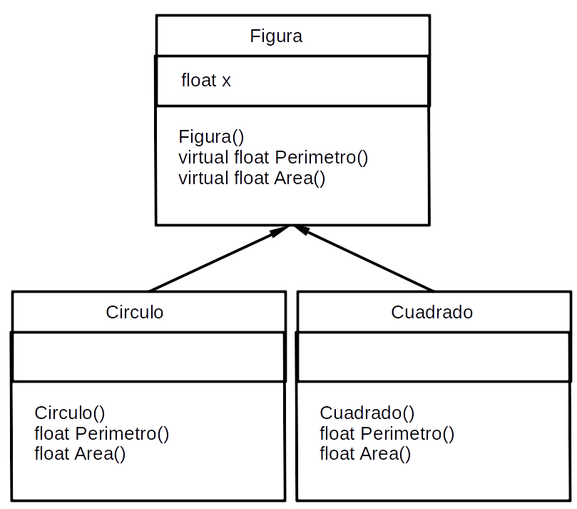

## Diagrama de Objetos




## Esquema ejemplo de POO en C++ (Encapsulamiento y herencia)

[En este archivo](figurasgeo1.cpp) se encuenta el siguiente código:

``` c++
#include <iostream>
#include <locale>

using namespace std;
const double PI = 3.141592;

class Figura{
  protected:
    float x;
  public:
    Figura(float cx=0){
       x = cx;
      }
  virtual float Perimetro() = 0;
  virtual float Area() = 0;
};

// Clases derivadas
class Circulo: public Figura{
   public:

   Circulo(float radio){
     x = radio;
   }
   float Perimetro(){
     return 2* PI * x;
   }
   float Area(){
     return PI * x * x;
   }
};

class Cuadrado: public Figura
{

 public:
  Cuadrado(float lado){
    x = lado;
  }
  float Perimetro(){
    return 4 * x;
  }
  float Area(){
    return x * x;
  }
};

int main(){
   setlocale(LC_ALL, "");

   float l, r;

   cout << "Entre el lado del cuadrado" << endl;
   cin >> l;

   cout << "Entre el radio del círculo" << endl;
   cin >> r;

   Cuadrado cuad1(l);
   Circulo  Circ1(r);

   cout << "El perimetro del circulo es:" << Circ1.Perimetro() << endl;
   cout << "El área del circulo es:" << Circ1.Area() << endl;

   cout << "El perimetro del cuadrado es:" << cuad1.Perimetro() << endl;
   cout << "El area del cuadrado es:" << cuad1.Area() << endl;
}
```

## Esquema ejemplo de POO en C++ (Polimorfismo)

[Código ejemplo](figurasgeo2.cpp) del uso del polimorfismo.

``` c++
#include <iostream>
#include <locale>

using namespace std;
const double PI = 3.141592;

class Figura{
  protected:
    float x;
  public:
    Figura(float cx=0){
       x = cx;
      }
  virtual float Perimetro() = 0;
  virtual float Area() = 0;
};

// Clases derivadas
class Circulo: public Figura{
   public:

   Circulo(float radio){
     x = radio;
   }
   float Perimetro(){
     return 2* PI * x;
   }
   float Area(){
     return PI * x * x;
   }
};

class Cuadrado: public Figura
{

 public:
  Cuadrado(float lado){
    x = lado;
  }
  float Perimetro(){
    return 4 * x;
  }
  float Area(){
    return x * x;
  }
};

int main(){

   setlocale(LC_ALL, "");

   float l, r;
   Figura *figuras[10];

   cout << "Entre el lado del cuadrado" << endl;
   cin >> l;

   cout << "Entre el radio del círculo" << endl;
   cin >> r;

   figuras[0] = new Cuadrado(l);
   figuras[1] = new Circulo(r);

   for(int i = 0; i < 2; i++){
       cout << "El perímetro de la figura " << i+1 <<
              ", es: " << figuras[i]->Perimetro() << endl;
       cout << "El área de la figura" << i+1 <<
               ", es: " << figuras[i]->Perimetro() << endl;
   }


}
```
