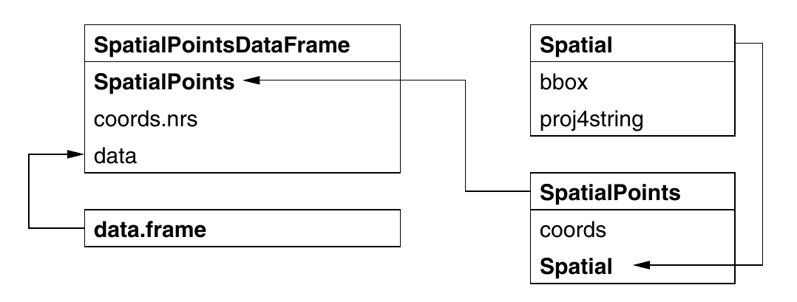
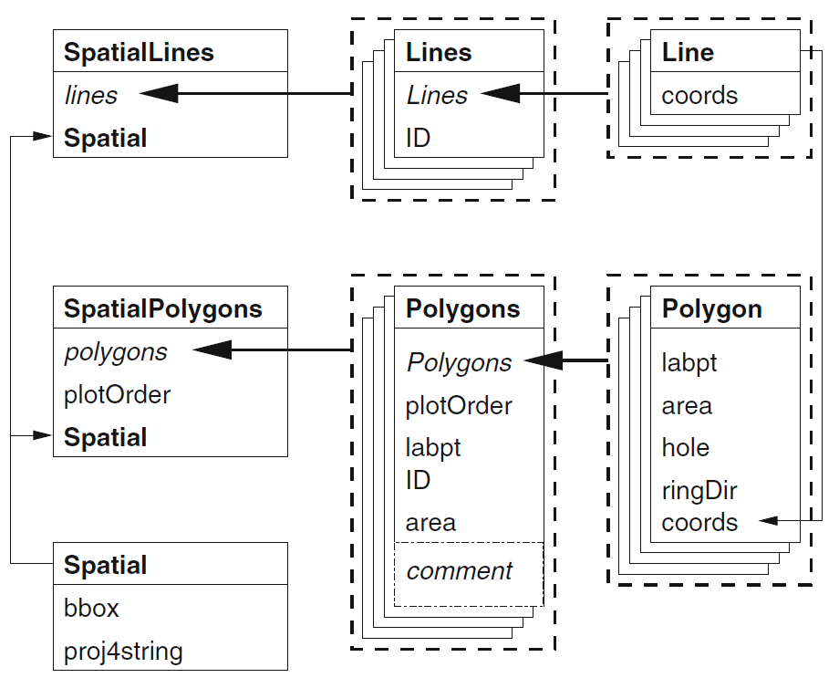

# Tipo `SpatialPoints`

Ejemplo utilizando las coordenadas de algunos lugares en el mundo donde existe un espejo del CRAN.


```{r}
# Lectura a una base de datos
CRAN_bd <- read.table("CRAN051001a.txt", header = TRUE)
CRAN_mat <- cbind(CRAN_bd$long, CRAN_bd$lat)
row.names(CRAN_mat) <- 1:nrow(CRAN_mat)
str(CRAN_mat)


# Especificaciones de la clase SpatialPoints
require(sp)
getClass("SpatialPoints")

# Construcción de la clase de tipos espaciales
sistema_proj <- CRS("+proj=longlat +ellps=WGS84")
CRAN_sp <- SpatialPoints(CRAN_mat, proj4string = sistema_proj)
# Resumen
summary(CRAN_sp)
```

## Algunos métodos asociados.

### Información principal
```{r}
# Extracción de la información de las coordenadas.
bbox(CRAN_sp)
# Extracción de la información de de la proyección.
proj4string(CRAN_sp)
```

### Subconjunto de datos
```{r}
# Índices del subconjunto
brazil <- which(CRAN_bd$loc == "Brazil")
brazil

# Coordenadas de esos índices
coordinates(CRAN_sp)[brazil, ]

# Si se extrae un subconjunto, el recalcula el marco que contiene los puntos.
summary(CRAN_sp[brazil, ])

# Se puede hacer todo el procedimiento en una sola línea:
summary(CRAN_sp[CRAN_bd$loc == "Brazil", ])
```

## Datos de puntos con una base de datos asociada.

```{r}
# Construcción de una base de puntos con base de datos asociada.
CRAN_spbd1 <- SpatialPointsDataFrame(CRAN_mat, CRAN_bd,
              proj4string = sistema_proj, match.ID = TRUE)

# La base de datos nueva se maneja muy similar a un "data.frame" estándar
CRAN_spbd1[4, ]
str(CRAN_spbd1$loc)
str(CRAN_spbd1[["loc"]])    

# Aún si la base de datos no está en el mismo orden de las coordenadas,
# pero los nombres de las filas de cada caso son coincidentes,
# el sistema armará la base de datos consistentemente.

# Base de datos en otro orden
nuevo_ord <- sample(nrow(CRAN_bd))
nuevaCRAN_bd <- CRAN_bd[nuevo_ord, ]
CRAN_spbd2 <- SpatialPointsDataFrame(CRAN_mat, nuevaCRAN_bd,
               proj4string = sistema_proj, match.ID = TRUE)

# Son la bases de datos iguales?
all.equal(CRAN_spbd2, CRAN_spbd1)

CRAN_spbd2[4, ]

```

## Estructura jerárquica de `SpatialPointsDataFrame`



```{r}
# Características de la subclase
getClass("SpatialPointsDataFrame")
```

Todas las subclases que tienen el sufijo *DataFrame* están
diseñadas para que se usen casi como los *data.frame* estándar.


```{r}
# Nombres
names(CRAN_spbd1)

# Estructura para modelación
str(model.frame(lat ~ long, data = CRAN_spbd1), give.attr = FALSE)
```

## Otras forma de construir una estrucutra de puntos con una base de datos asociada

```{r, error=TRUE}
# Si ambas bases están ordenadas, no necesitamos que las identidades de los puntos coincidan.

CRAN_bd1 <- CRAN_bd
row.names(CRAN_bd1) <- sample(c(outer(letters, letters,
                                      paste, sep = "")), nrow(CRAN_bd1))
CRAN_spbd3 <- SpatialPointsDataFrame(CRAN_mat, CRAN_bd1,
              proj4string = sistema_proj, match.ID = FALSE)
# No coinciden exactamente
all.equal(CRAN_spbd3, CRAN_spbd1)
# Pero la información está construida de manera similar.
CRAN_spbd1[4, ]
CRAN_spbd3[4, ]
# Sin embargo se genera un erros si intentamos utilizar "match.ID", y los identificadores no coinciden.
CRAN_spbd3x <- SpatialPointsDataFrame(CRAN_mat, CRAN_bd1,
              proj4string = sistema_proj, match.ID = TRUE)

```

### Conjunto de puntos secuenciales.

En algunos casos se require información de puntos que 
siguen una secuencia sin ser necesariamente una línea o polilínea, ya que
se necesita información asociada a cada punto.

```{r}
# Lectura de el trazo del viaje de una tortuga desde México hasta Japón.
bd_tortuga <- read.csv("seamap105_mod.csv")
summary(bd_tortuga)

tiempos <- as.POSIXlt(strptime(as.character(bd_tortuga$obs_date),
                                 "%m/%d/%Y %H:%M:%S"), "GMT")
bd_tortuga1 <- data.frame(bd_tortuga, tiempos = tiempos)
bd_tortuga1$lon <- ifelse(bd_tortuga1$lon < 0, 
                          bd_tortuga1$lon + 360, bd_tortuga1$lon)
esp_tortuga <- bd_tortuga1[order(bd_tortuga1$tiempos), ]
coordinates(esp_tortuga) <- c("lon", "lat")
proj4string(esp_tortuga) <- CRS("+proj=longlat +ellps=WGS84")
```
              
# Tipo `SpatialLines`

Las líneas son secuencias de puntos incluida cada una en una sola identidad.

```{r}
require(sp)
# Clase "Line"
getClass("Line")

# Clase "Lines"
getClass("Lines")

# Clase espacial para líneas
getClass("SpatialLines")
```

Ejemplo de un objeto de líneas.

```{r}
require(maps)
japon <- map("world", "japan", plot = FALSE)
sist_proy <- CRS("+proj=longlat +ellps=WGS84")

require(maptools)
LSjapon <- map2SpatialLines(japon, proj4string = sist_proy)
str(LSjapon, max.level = 2)
```

Estructura objetual del objeto para líneas y polígonos.



Ejemplo del uso del "sapply" a la estrucutra de líneas.

```{r}
sapply(slot(LSjapon, "lines"), function(x) length(slot(x,"Lines")))
```

Ejemplo con curvas de nivel

```{r}

# Construcción de curvas de nivel a partir de una raster
ls_volcan <- ContourLines2SLDF(contourLines(volcano))

# Estructura de las curvas de nivel como líneas
str(ls_volcan, max.level = 2)

# Recuperación de los elementos asociados a la base de datos de líneas.
slot(ls_volcan, "data")

# Aplicar una función para determinar el número de
# líneas de cada objeto de la base de datos de líneas
sapply(slot(ls_volcan, "lines"), function(x) length(slot(x, "Lines")))
```

Uso de líneas de costa 

```{r}
require(maptools)
sist_proj <- CRS("+proj=longlat +ellps=WGS84")
costa_Auck <- MapGen2SL("auckland_mapgen.dat", sist_proj)
summary(costa_Auck)
```


# Tipo `SpatialPolygons`

# Tipo `SpatialGrid`

# Tipo `Raster` del paquete **raster** 
